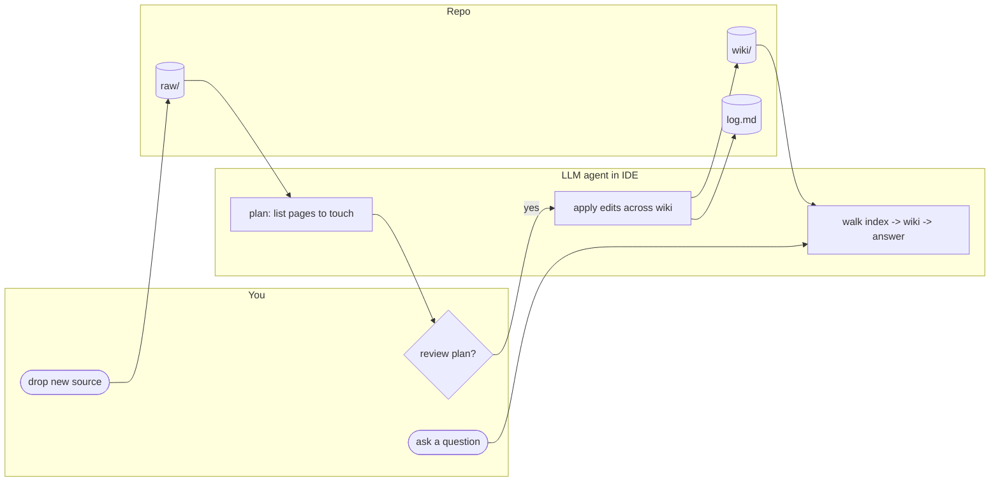
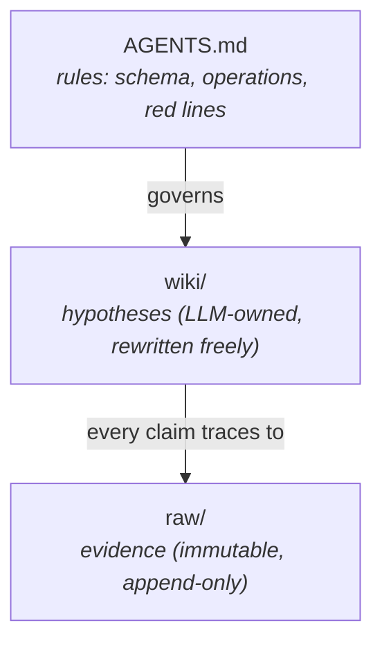

# llm-wiki-starter

> **A production-ready `AGENTS.md` schema that turns Cursor / Claude Code /
> Codex into a careful librarian for your personal markdown wiki.**

[](LICENSE)
[](https://github.com/ycaptain/llm-wiki-starter/actions/workflows/ci.yml)
[](https://github.com/ycaptain/llm-wiki-starter/actions/workflows/validate.yml)
[](https://github.com/ycaptain/llm-wiki-starter/commits/main)
[](AGENTS.md)
[](https://github.com/astral-sh/ruff)
[](https://github.com/ycaptain/llm-wiki-starter)

**TL;DR.** You drop sources into `raw/`. An LLM agent in your IDE reads
them, plans which `wiki/` pages to touch, waits for your "OK", and
writes them. A 500-line Python validator (pure stdlib) enforces the
schema on every commit. The result is a markdown second brain that
**compounds with every ingest** — the opposite of RAG, which starts
from zero on every query.

> **Not a programmer?** If you already keep notes in Obsidian (or any
> markdown editor) and feel your notes are growing wider but not
> smarter, this template gives you an AI that *reads* your sources,
> *plans* what to capture, waits for your "OK", and writes a
> structured wiki you can browse like a textbook. You stay in control
> of every change; the AI does the bookkeeping. You'll need to
> install one IDE (Cursor / Claude Code / Codex / Cline — pick any),
> paste in a starter prompt, and answer a few interview questions.
> No coding required after that. Start at
> [`_system/MANUAL.md`](_system/MANUAL.md) and skip the technical
> sections below.

Two readings for two technical audiences:

- **You build with LLM agents.** This repo is a reference
  implementation of [`AGENTS.md`](AGENTS.md) — the multi-agent contract
  format Cursor / Claude Code / Codex / Cline all read. The schema,
  the five operations (`ingest`/`query`/`lint`/`process-inbox`/`promote`),
  the red lines, and the validator are reusable parts you can lift
  into any agent project.
- **You want a personal LLM-maintained wiki.** This repo is a
  ready-to-clone template. Use the GitHub *Use this template* button,
  paste [`docs/bootstrap-prompt.md`](docs/bootstrap-prompt.md) into
  Cursor, and the agent walks you through standing up your own
  domains over a 30-minute session.



---

## Quickstart (90 seconds)

```bash
# 1. Make your own copy of the template
gh repo create your-vault --template ycaptain/llm-wiki-starter --private --clone
cd your-vault

# 2. Wire the validator (one-time; blocks red-line violations at commit)
git config core.hooksPath _system/hooks

# 3. Open in Cursor / Claude Code, paste docs/bootstrap-prompt.md into chat.
# The agent interviews you for 3-5 questions, designs your domain schema,
# and walks you through your first ingest.
```

No GitHub account? `npx degit ycaptain/llm-wiki-starter your-vault` works
too. The wiki is plain markdown + git — no service to sign up for,
no SaaS lock-in, no embedding pipeline to babysit.

**Capture device ≠ ingest device.** You can drop new sources into
`inbox/` (or directly into `domains/<X>/raw/`) from anywhere —
Obsidian Mobile, Web Clipper, voice memos transcribed later. The
**ingest** step (LLM agent planning + writing wiki pages) runs on a
desktop with a chat IDE. Mobile-heavy users live in
[Posture B of the Web Clipper config](_system/SETUP.md) — drop on
the go, `process-inbox` + `ingest` on the next desktop session.

**Working in Chinese (or another CJK language)?** The schema is
language-neutral and the wiki happily holds Chinese content. See
[`docs/CJK-WORKFLOW.md`](docs/CJK-WORKFLOW.md) for the recommended
slug / aliases / commit-message conventions.

Want to see what a populated wiki looks like before committing?
The template ships with **three example L2 domains** covering
academic reading (light), collaborative work (medium), and a
privacy-heavy schema reference (heavy). Browse the
[guided tour in `docs/EXAMPLES.md`](docs/EXAMPLES.md) for an end-
to-end `raw/` → `analysis` → `concept` → `framework` → `question`
walkthrough, and read
[`docs/EXAMPLE-DOMAINS.md`](docs/EXAMPLE-DOMAINS.md) **before your
first real ingest** — most users keep at most one example domain
and remove the rest in a single bypass commit.

---

## Why does this exist?

A vector-DB-backed RAG layer is great for "look up something I half
remember in a haystack". It's the wrong tool for the question I
actually want my second brain to answer:

> *Given everything you've read for me over the past two years,
> what's the most accurate model of X right now?*

That question needs a model that **compounds** — every new source
should make the structure denser, not just the haystack bigger. So
the LLM doesn't search your notes at query time; it incrementally
*compiles* them, page by page, into a queryable wiki you can read
like a textbook.

> The wiki is the codebase. Obsidian is the IDE. The LLM is the programmer.

---

## How it compares

| Tool                                       | Storage          | Compounds? | Open / portable?  | Cites sources by default? | Local-first? |
| ------------------------------------------ | ---------------- | ---------- | ----------------- | ------------------------- | ------------ |
| **llm-wiki-starter** (this repo)           | plain markdown + git | yes    | yes               | enforced by validator     | yes          |
| Vector RAG (LlamaIndex, LangChain, etc.)   | vector DB        | no         | partially         | optional                  | varies       |
| Notion AI                                  | proprietary DB   | partially  | no                | sometimes                 | no           |
| mem.ai                                     | proprietary DB   | partially  | no                | sometimes                 | no           |
| Reflect / Tana / Logseq AI                 | proprietary / md | partially  | partially         | no                        | varies       |
| Obsidian + Smart Connections               | markdown + index | no (retrieve-only) | yes      | no                        | yes          |
| Cursor `@docs` / Claude Projects           | session-local    | no         | no                | sometimes                 | no           |

The pattern composes: at ~500+ pages, layer embedding search (Smart
Connections, Obsidian Bases, even a small vector index) on top of the
wiki as a fallback. The wiki gives you compounded structure; embedding
search gives you fuzzy fallback. Both, not either.

---

## Three semantic layers



- **`raw/` is fact.** Clipped articles, transcribed sessions, recorded
  meetings. The LLM never edits this. Its job is to let you walk back
  to the source of any wiki claim three years from now.
- **`wiki/` is the current best model.** It gets rewritten as new raw
  arrives. Its job is to compress raw into queryable, reasonable,
  presentable structured knowledge.
- **`AGENTS.md` is the contract.** It tells the LLM where new material
  goes, which pages each ingest should touch, and what lint checks
  for. Edit AGENTS.md = edit the language you and the LLM share.

L1 (`/AGENTS.md`) is the universal contract every domain inherits.
Each L2 (`domains/<X>/AGENTS.md`) overrides or extends L1 inside its
own domain. Conflicts: L2 wins inside that domain, L1 wins everywhere
else.

---

## Five operations (the only verbs you ever run)

| Operation                  | What the LLM does                                                                                                            |
| -------------------------- | ---------------------------------------------------------------------------------------------------------------------------- |
| `ingest <path>`            | Reads the new raw source, drafts a plan of every wiki page it intends to touch, waits for your OK, then applies the edits and writes a log entry. |
| `query <question>`         | Walks `index.md` → relevant domain index → candidate pages → inline-cited answer. Non-trivial answers file back as `outputs/qa/<date>-<slug>.md` (`type: report`, *not* a wiki page). |
| `lint [--domain <X>]`      | Health-checks the wiki: orphans, broken wikilinks, stale claims, contradictions, missing cross-references. Auto-applies additive fixes only; the rest waits for your review. Also surfaces "Promotion candidates" from `outputs/qa/`. |
| `process-inbox`            | Triages un-routed material from `/inbox/` into the correct `domains/<X>/raw/<bucket>/`. Does **not** ingest — that's a separate human-gated step. |
| `promote <qa-path>`        | Lifts a Q&A artifact under `outputs/qa/` into a first-class wiki page (synthesis / concept / framework / question). Pre-flight checks + voice / citation / L2-fill / section transforms; `git mv` preserves history. |

Each operation has a canonical procedure under
[`_system/prompts/`](_system/prompts/). The validator at
[`_system/wikilint/`](_system/wikilint/) enforces the red lines on
every commit and in CI (invoke as `python -m wikilint` or `wikilint`
once `pip install -e .` has been run).

---

## Who this is not for

**This template is not designed for narrative long-form writers,
journalists, or memoirists.** If you write essays, articles, or books
that need to preserve voice, branch drafts, and stay in dialogue with
editors — this tool's compiler-style "raw → wiki" structure will work
against you. Try Scrivener, Ulysses, or Obsidian + Longform instead.
**We will not be adding support for creative writing workflows; this
is intentional scope.**

And a few more things this is *not*:

- **Not a RAG replacement** at millions-of-chunks scale. Sweet spot is
  hundreds of curated sources with high synthesis frequency.
- **Not a SaaS or hosted product.** Markdown + git, run locally with
  the LLM agent of your choice.
- **Not an autopilot.** Every ingest plans first and waits for your
  confirmation; every lint report is a dashboard, not an auto-apply.
- **Not coupled to one model vendor.** The schema and prompts are
  agent-agnostic; switch Cursor ↔ Claude Code ↔ Codex freely.
- **Not novel research.** It's a careful systematisation of Andrej
  Karpathy's [llm-wiki](https://gist.github.com/karpathy/442a6bf555914893e9891c11519de94f)
  gist into a working template — credit where it's due.

---

## What ships in the template

```
llm-wiki-starter/
├── README.md / LICENSE / CONTRIBUTING / SECURITY / CHANGELOG
├── .editorconfig / .gitignore / .gitattributes.example
├── docs/                    ← project meta documentation
│   ├── DESIGN.md            ← architecture deep dive
│   ├── bootstrap-prompt.md  ← paste-into-AI startup prompt
│   └── EXAMPLES.md          ← index of demo assets
│
├── .github/                 ← issue/PR templates + CI running wikilint
│
├── AGENTS.md                ← L1 schema (the contract — most important file)
├── index.md / log.md
├── pyproject.toml           ← packaging + tooling (ruff, mypy, pytest) config
├── .pre-commit-hooks.yaml   ← lets users adopt the validator via pre-commit
│
├── _system/
│   ├── MANUAL.md / SETUP.md / README-template.md
│   ├── prompts/             ← canonical procedure for each operation
│   ├── templates/           ← one markdown template per page type
│   ├── wikilint/            ← schema + wikilink validator (Python package)
│   │   ├── cli.py / runner.py / report.py / config.py
│   │   ├── frontmatter.py / wikilink.py / git_io.py / paths.py
│   │   └── checks/          ← one Rule class per stable AGENTS00N ID
│   ├── tests/               ← pytest suite for wikilint (~70 tests)
│   ├── scripts/             ← setup_encryption.sh (one-time git-crypt bootstrap)
│   └── hooks/pre-commit     ← stdlib-only wrapper → `python -m wikilint --staged`
│
├── outputs/                 ← operation artifacts (in git, not in wikilink graph)
│   ├── lint/<YYYY-MM-DD>.md ←   lint reports (type: report)
│   ├── snapshots/index-snapshot.md  ← machine-readable index mirror
│   └── qa/<YYYY-MM-DD>-<slug>.md ←  query Q&A archives (type: report)
│
├── integrations/            ← (optional) agent-specific UX add-ons
│
├── domains/                 ← three example L2s (see docs/EXAMPLE-DOMAINS.md
│   │                          for which to keep, adapt, or remove)
│   ├── research-papers/     ← light L2 — start here; 4-paper LLM-tutoring arc
│   ├── workspace/           ← medium — meetings/decisions/stakeholders
│   └── psychology/          ← heavy — 6-week worked father-grief arc
│                              (3 therapy + 1 psychiatry, ~25 wiki pages)
├── inbox/                   ← optional un-routed material
└── attic/                   ← deprecated / quarantined files
```

---

## Daily loop, after bootstrap

1. Drop a new source into `domains/<X>/raw/<bucket>/`.
2. `ingest domains/<X>/raw/<bucket>/<file>` in the AI chat.
3. Review the plan, thumbs-up.
4. Roughly once a week: `lint` and review the report.
5. Whenever you need to know something: `query <question>`.

That's it. No embeddings to refresh. No vector DB to manage. No
"please re-index after schema migration" rituals. Just markdown,
git, and an agent that keeps your contract.

---

## Optional integrations

`share/` is agent-neutral: a single canonical schema at
[`AGENTS.md`](AGENTS.md) is read by Cursor, Claude Code, Codex, Cline,
and any agent honouring the AGENTS.md convention. Most setups need
nothing more than that.

| Agent       | Setup                                                                 |
|-------------|-----------------------------------------------------------------------|
| Cursor      | Open the vault. `AGENTS.md` is picked up natively.                    |
| Codex CLI   | Same.                                                                 |
| Cline       | Same.                                                                 |
| Claude Code | Same, plus the optional [`integrations/claude-code/`](integrations/claude-code/) plugin for `/ingest`-style slash commands (experimental). |

See [`integrations/README.md`](integrations/README.md) for details.

---

## Privacy is the default for sensitive material

If your `raw/` will ever contain therapy notes, medical records,
private correspondence, or anything else you wouldn't post in a
GitHub Discussion thread, **treat encryption-at-rest as part of the
setup, not an afterthought**:

- **Encrypt sensitive `raw/` with [git-crypt](https://github.com/AGWA/git-crypt)**
  *before* the first ingest. Ships with an idempotent
  [`_system/scripts/setup_encryption.sh`](_system/scripts/setup_encryption.sh) and a
  [`.gitattributes.example`](.gitattributes.example) — set both up the
  same hour you clone the template. The script ships with no default
  paths (so it cannot silently encrypt anything you didn't choose);
  uncomment a line in its `ENCRYPT_PATHS` array before running.
  Walkthrough in [`_system/SETUP.md`](_system/SETUP.md) §"Privacy"
  and the hardening checklist in [`SECURITY.md`](SECURITY.md).
- **Each L2 declares its own privacy posture** in its
  `domains/<X>/AGENTS.md`. `domains/psychology/AGENTS.md` ships with
  a *conservative* default (≤3-line quote cap, pseudonymous slugs,
  encrypted-raw assumption) that you only relax for repos that will
  never leave your own machines.
- **Cold-backup remote on a different provider** (Codeberg, GitLab,
  self-hosted) — single-vendor account loss is a real risk for a
  personal second brain.

## Optional hardening

- **Templater plugin** in Obsidian wires `_system/templates/` to
  folder-specific "New note" buttons so you never paste frontmatter
  by hand.
- **Web Clipper** browser extension clips web articles straight into
  the correct `raw/articles/` bucket.

---

## Where to read next

- [`docs/DESIGN.md`](docs/DESIGN.md) — the longer essay on why each
  design decision exists, plus a step-by-step guide for designing your
  own L2 domain schemas.
- [`docs/bootstrap-prompt.md`](docs/bootstrap-prompt.md) — the
  AI-startup prompt for your first session.
- [`docs/EXAMPLES.md`](docs/EXAMPLES.md) — guided tour of the demo
  domains under [`domains/`](domains/).
- [`docs/EXAMPLE-DOMAINS.md`](docs/EXAMPLE-DOMAINS.md) — how to keep,
  delete, or adopt each of the three shipped example L2s.
- [`AGENTS.md`](AGENTS.md) — the full L1 schema (~440 lines). The
  most important file in the whole project.
- [`_system/MANUAL.md`](_system/MANUAL.md) — the user manual,
  including the cheat sheet and the FAQ (§4).

---

## Community

- **Discussions** — [GitHub Discussions](https://github.com/ycaptain/llm-wiki-starter/discussions)
  is the right place to share an L2 schema you've designed for your
  own domain, ask design questions, or post your "before & after" wiki
  state. PRs welcome too — see [`CONTRIBUTING.md`](CONTRIBUTING.md).
- **Star history** — if this is useful to you, a star helps it reach
  the next person who needs it.

[](https://star-history.com/#ycaptain/llm-wiki-starter&Date)

---

## Acknowledgements

- **Andrej Karpathy** — the
  [llm-wiki gist](https://gist.github.com/karpathy/442a6bf555914893e9891c11519de94f)
  is the architectural seed this project grew from.
- **Obsidian** and its plugin ecosystem (Dataview, Templater,
  Smart Connections) — the editor that makes the markdown-as-database
  approach actually pleasant to live in.
- **[`kepano/obsidian-skills`](https://github.com/kepano/obsidian-skills)**
  — source of the callout / block-ID / HUMAN-comment conventions
  selectively adopted in `AGENTS.md` §4.1.

The structural invariants (raw / wiki / AGENTS, the five operations,
the red lines, the frontmatter schema) are domain-agnostic and should
outlive any particular LLM provider.

---

## License

[MIT](LICENSE) © 2026 ycaptain.

<!--
Suggested GitHub repo Topics (Settings → About → topics):
  agents-md, llm, ai-agents, cursor, claude-code, codex, obsidian,
  personal-knowledge-management, second-brain, rag-alternative,
  markdown, knowledge-graph, llm-tools, pkm
-->
