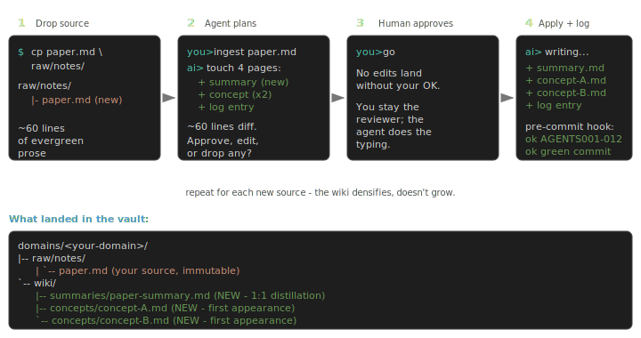

# Densa

> **An [AGENTS.md](https://agents.md)-native agent skill pack that
> compiles your sources into a queryable markdown wiki — the opposite
> of RAG.**
> Drop new material into `raw/`. An AI agent in your IDE reads it,
> drafts which `wiki/` pages to touch, waits for your OK, then writes
> the edits. Every ingest _densifies_ your second brain instead of
> growing the haystack you re-search every query.

[](LICENSE)
[](https://github.com/ycaptain/densa/actions/workflows/ci.yml)
[](AGENTS.md)
[](AGENTS.md)

One ingest cycle, end-to-end (cite:
[`examples/hello-world/`](examples/hello-world/) for the literal
files):

```mermaid
sequenceDiagram
    autonumber
    participant You
    participant Agent as AI agent (Cursor / Claude Code / Codex)
    participant Vault as Densa vault (raw / wiki / log)
    You->>Vault: drop source.md into raw/
    You->>Agent: "ingest raw/source.md"
    Agent->>Vault: read source + relevant wiki pages
    Agent->>You: planned edits (4 pages, ~60 lines diff)
    You->>Agent: approve / edit / reject
    Agent->>Vault: write summary + concept pages + log entry
    Vault->>Vault: pre-commit hook validates (AGENTS001-013)
    Vault->>You: green commit; wiki densifies
```

Image of: 1 source → 1 `summary` + 2 `concept` pages + 1 log entry.
That's the loop. Now scale it.

## Pick your path

| You want to...                                                                             | Open                                                                                                                                                       | Time                    |
| ------------------------------------------------------------------------------------------ | ---------------------------------------------------------------------------------------------------------------------------------------------------------- | ----------------------- |
| **Glance** — see what one ingest produces, no install                                      | [`examples/hello-world/`](examples/hello-world/) (source + expected wiki output + log entry)                                                               | 3 min                   |
| **Try the slash commands** — sideload the plugin into Cursor without committing to a vault | [`integrations/cursor/densa-plugin/` §Install Option B](integrations/cursor/densa-plugin/#option-b--local-sideload-works-today) (symlink + restart Cursor) | ~5 min                  |
| **Set up your own vault**                                                                  | [Quickstart](#quickstart) below → [`docs/setup.md`](docs/setup.md)                                                                                         | ~30 min to first ingest |
| **Evaluate the design**                                                                    | [`docs/design/design-rationale.md`](docs/design/design-rationale.md)                                                                                       | ~1 hr deep read         |

[`GUIDE.md`](GUIDE.md) is the day-to-day FAQ + scenarios; bookmark
it for _after_ your first ingests. [`docs/setup.md`](docs/setup.md)
covers everything from the Obsidian plugin matrix to git-crypt to
the domain decision tree. [`docs/faq.md`](docs/faq.md) answers the
"why" questions (red lines, drift, operation philosophy).

---

## Quickstart

There is one supported path. It works today, no PyPI required.

```bash
# 1. Fork ycaptain/densa on GitHub (one click), then clone your fork:
git clone git@github.com:<you>/densa.git my-vault
cd my-vault
git remote add upstream https://github.com/ycaptain/densa.git

# 2. Wire the pre-commit validator (pure stdlib, no pip install):
git config core.hooksPath _system/hooks
git config --get core.hooksPath        # verify: should print _system/hooks

# 3. Confirm the setup is healthy (hook wired, Python OK, importable):
PYTHONPATH=_system python3 -m densa doctor

# 4. Open the folder in Cursor / Claude Code / Codex / Cline, paste
#    docs/bootstrap.md into the chat. The agent interviews
#    you, drafts your first L2 schema, and walks the first ingest.
```

That's it. The agent reads [`AGENTS.md`](AGENTS.md) natively in every
major coding-agent IDE. **Stuck on setup?** `densa doctor` prints a
✓/✗ checklist with the exact fix for each problem (unwired hook, wrong
Python, unresolvable domain). Manual validation any time:

```bash
PYTHONPATH=_system python3 -m densa --all     # validate page content
PYTHONPATH=_system python3 -m densa stats     # vault health: pages, types, orphans
PYTHONPATH=_system python3 -m densa tui       # browse findings interactively (POSIX TTY)
```

**Optional IDE plugins** (slash commands + auto-triggered skills) live
under [`integrations/`](integrations/) — currently
[`claude-code/`](integrations/claude-code/) (Claude Code marketplace
manifest + slash commands) and
[`cursor/densa-plugin/`](integrations/cursor/densa-plugin/) (Cursor
plugin manifest + IDE-agnostic `SKILL.md` files). New users who want
to feel the operations before standing up a vault can take the "Try
the slash commands" path in the table above (~5 min sideload).
Both plugins are **experimental** — they're convenience surfaces on
the same operation prompts; the vault works identically without
them.

The 13 enforced rules (`AGENTS001`–`AGENTS013`) are documented at
[`docs/reference/rules-registry.md`](docs/reference/rules-registry.md);
`python3 -m densa rules` prints the live registry. Obsidian plugin
setup, encryption, disabling the hook, and the domain decision tree
all live in [`docs/setup.md`](docs/setup.md).

**Realistic time-to-first-ingest**: ~30 minutes for a one-page article,
~60 minutes for a meeting transcript whose L2 schema needs new fields.
The agent does the typing; you do the reviewing.

<sub>_Naming note: the project is **Densa**; `python3 -m densa` is the
stdlib validator that ships with it. The supported install today is
`git clone` + `git config core.hooksPath _system/hooks` above, or
`densa init` from an existing Densa install (see Alternative below).
PyPI publication (so `pipx install densa` works without first cloning)
is planned but not yet available — see the "Unreleased" entry in
[`CHANGELOG.md`](CHANGELOG.md)._</sub>

### Alternative: scaffold without cloning by hand

If you already have a working Densa clone (or `pip install -e .` in
one), `densa init <destination>` automates the steps above: it clones
upstream into `<destination>`, wires the pre-commit hook, walks
example-domain disposition, and (optionally) injects
`docs/bootstrap.md` into your AI agent.

```bash
PYTHONPATH=_system python3 -m densa init my-vault
# or, after `pip install -e .` in a Densa clone:
densa init my-vault

# then confirm the new vault is wired correctly:
cd my-vault && python3 -m densa doctor
```

Useful when you're standing up multiple vaults; for your _first_
vault the fork-and-clone path above stays compatible with the
bootstrap prompt's expectations.

### Staying in sync with upstream

Densa upstream **never touches** `domains/**` — that namespace is
yours. Upgrades evolve `AGENTS.md` (schema), `_system/densa/`
(validator), `_system/prompts/` (operations), and templates only.

```bash
git fetch upstream && git merge upstream/main
```

When a release ships a breaking schema change (new `compiled_against`
version), the merge brings a `_system/scripts/migrate_NN_<slug>.py`
that idempotently brings your existing wiki pages forward.

---

## What this is

Densa is an **AGENTS.md-native agent skill pack** — a complete L1/L2
schema, six-operation contract, and stdlib-only machine validator
that any AGENTS.md-aware IDE (Cursor, Claude Code, Codex, Cline) can
read natively to maintain a personal markdown wiki. It is a
**full, executable implementation of** Andrej Karpathy's
[llm-wiki gist](https://gist.github.com/karpathy/442a6bf555914893e9891c11519de94f) —
his ~1500-word sketch where an LLM compiles your sources into a
structured wiki that compounds, rather than retrieving raw chunks on
every query (the RAG pattern).

Karpathy described **what to build**. Densa gives you the **how**:

- A **schema** (nine page types: `summary`, `entity`, `concept`,
  `comparison`, `overview`, `synthesis`, `open-question`, `source`,
  `report` — every name comes verbatim from Karpathy's gist plus the
  `report` extension for operation artifacts).
- A **stdlib-only validator** (`python3 -m densa`) that enforces the
  schema on every commit.
- **Six operation prompts** (`ingest` / `query` / `lint` /
  `process-inbox` / `promote` / `visualize`) the agent loads on demand.
- **Migration tooling** (`python3 -m densa migrate`) for carrying an
  existing vault forward when upstream ships a breaking schema bump.
- A shipped **example domain** (`research-papers/`) plus two
  heavier showcases under `examples/showcases/`.

> [!important] `research-papers/` is **both** the shipped showcase
> and the active default L2 your fork starts with. Replace its
> contents with your own raws (or rename / delete the directory)
> per
> [`docs/setup.md` §"Choosing or replacing the default domain"](docs/setup.md#choosing-or-replacing-the-default-domain)
> before your first real ingest — don't try to "build on" the
> worked example.

If you read Karpathy's gist and thought "ok but where do I start"
— this is where. Vocabulary glossary:
[`docs/reference/karpathy-mapping.md`](docs/reference/karpathy-mapping.md).



The plan-first-then-apply gate is the same for every operation; you
never see edits land without consent. For a worked example of one
ingest cycle (source → plan → wiki diff → log entry), see
[`examples/hello-world/`](examples/hello-world/); for a week-in-the-life
narrative see
[`GUIDE.md` §"A day in the life"](GUIDE.md#a-day-in-the-life).

---

## The six operations

`ingest` / `query` / `lint` / `process-inbox` / `promote` / `visualize` are the only
verbs you ever type. Each has a canonical procedure under
[`_system/prompts/`](_system/prompts/) the agent loads on demand;
[`AGENTS.md` §"The six operations"](AGENTS.md#2-the-six-operations)
is the long-form contract (what each writes, what it forbids). The
natural-language → operation mapping lives in
[`GUIDE.md` §"Mapping natural language to operations"](GUIDE.md#mapping-natural-language-to-operations).

The validator at [`_system/densa/`](_system/densa/) enforces the
red lines on every commit and in CI:
`PYTHONPATH=_system python3 -m densa --all`.

---

## Why not just RAG?

Classic RAG (`documents → parser → chunks → vector DB → retrieve →
answer`) **never structurally crystallises** — every question
reassembles fragments at query time, leaving the LLM as a permanent
hallucination surface above the haystack. Densa compiles your
sources into structured prose **once, incrementally**, then queries
the prose. The hallucination surface is a one-time write-time event
(audited by `AGENTS001`–`AGENTS013`), not a per-query risk.

| Tool                                                                                     | Storage                    | Compounds?                    | Cites sources?             | Local-first?    |
| ---------------------------------------------------------------------------------------- | -------------------------- | ----------------------------- | -------------------------- | --------------- |
| **Densa** (this repo)                                                                    | plain markdown + git       | yes                           | enforced by validator      | yes             |
| Vector RAG (LlamaIndex / LangChain)                                                      | vector DB                  | no                            | optional                   | varies          |
| Enterprise RAG ([RAGFlow](https://github.com/infiniflow/ragflow))                        | ES + MySQL + chunk records | no (chunks re-rank per query) | read-time visual citations | yes (self-host) |
| Notion AI / mem.ai                                                                       | proprietary DB             | partially                     | sometimes                  | no              |
| [Obsidian + Smart Connections](https://github.com/brianpetro/obsidian-smart-connections) | markdown + index           | retrieve-only                 | no                         | yes             |

**The fault line.** RAG-classic (RAGFlow, vector stacks, Notion AI)
retrieves chunks at query time — fast onboarding, never consolidates,
hallucination surface on every query. Wiki-compilers (Karpathy pattern;
Densa) compile structured prose once — slower onboarding, structure
compounds, hallucination surface is a write-time event under human
review. Past ~500 pages, layer embedding search on top as fuzzy
fallback — **both, not either.** Full argument:
[`docs/design/design-rationale.md`](docs/design/design-rationale.md).

---

## Why not just `CLAUDE.md` / Memory Bank / Letta?

Densa is a **schema, not a harness**. Your coding agent (Cursor /
Claude Code / Codex / Cline / Pi / OpenCode) is replaceable; the
markdown wiki it maintains is not. Six other layers in the agent stack
look like "knowledge bases" but bind their data to one runtime —
`AGENTS.md`/Rules (instructions, not facts),
[Cline Memory Bank](https://docs.cline.bot/best-practices/memory-bank)
(state, no source-grounding),
[Codex/Pi Skills](https://developers.openai.com/codex/skills)
(procedures, not facts), session memory (transient), RAG/MCP retrieval
(query-time, never filed back), and
[Letta personal memory](https://docs.letta.com/letta-code/memory/)
(bound to one vendor harness). Densa is the seventh: markdown + git,
validated by `AGENTS001`–`AGENTS013`, browsable in any reader, survives
swapping your agent. Full taxonomy + per-layer decision tree:
[`docs/design/harness-memory-vs-llm-wiki.md`](docs/design/harness-memory-vs-llm-wiki.md).

---

## Where this sits in the ecosystem

A 2026-05 review of the wiki-compiler space (n=7 upstream projects)
sediments Densa's differentiation, all empirically unoccupied at n=7:

- **Triple agent-surface** — AGENTS.md + MCP server + plugin/SKILL.md;
  no upstream covers more than two.
- **MIT + stdlib-only Python** — the only `_system/densa/` that `cp -R`s
  into a fork with zero runtime deps (Tolaria AGPL, nashsu GPL, RAGFlow
  /Graphiti/Cognee heavy deps, olw ships SQLite + embeddings).
- **`.legacy/` schema-migration snapshot** + **public
  `AGENTS001`–`AGENTS013` rule registry** (`python3 -m densa rules`) —
  neither has an equivalent in the surveyed set.

Closest siblings: [Tolaria](https://github.com/refactoringhq/tolaria)
(types-as-lenses, refuses an enum + validator),
[`nashsu/llm_wiki`](https://github.com/nashsu/llm_wiki) (no `.legacy/`,
no `type:` enum), [`obsidian-llm-wiki-local`](https://github.com/kytmanov/obsidian-llm-wiki-local)
(closest architectural sibling; single flat vault, no L2 / AGENTS.md),
[RAGFlow](https://github.com/infiniflow/ragflow) (read-time grounding,
heavy server stack), and
[Graphiti](https://github.com/getzep/graphiti)/[Cognee](https://github.com/topoteretes/cognee)
(temporal graph DB — a different layer; v0.8 watch-list). The
row-by-row comparison and the n=7 study set are maintainer notes under
`docs/maintainers/prior-art/`; the public design rationale is in
[`docs/design/`](docs/design/README.md).

---

## Sensitive material

If your `raw/` will ever hold therapy notes, medical records, NDA
material, or anything you wouldn't post in a public thread, treat
encryption as part of setup. See [`SECURITY.md`](.github/SECURITY.md) and
[`docs/setup.md` §"Privacy — sensitive material"](docs/setup.md#privacy--sensitive-material) for
the walkthrough. The schema is language-neutral; the wiki happily
holds CJK content — see [`docs/cjk-workflow.md`](docs/cjk-workflow.md).

---

## Where to read next

Pick one based on what you're trying to do.

- **Day-to-day use** — [`GUIDE.md`](GUIDE.md). A day in the life,
  the seams between operations, mental model.
- **Setup beyond Quickstart** — [`docs/setup.md`](docs/setup.md).
  Obsidian plugins, encryption, disabling the hook, CI, domain
  decisions.
- **Conceptual FAQ** — [`docs/faq.md`](docs/faq.md). The red lines,
  scale & drift, operation philosophy.
- **Evaluating the design** —
  [`docs/design/design-rationale.md`](docs/design/design-rationale.md).
  Every load-bearing decision explained.
- **Starting your own vault from scratch** —
  [`docs/bootstrap.md`](docs/bootstrap.md).
- **Hacking on the schema / validator / prompts** —
  [`CONTRIBUTING.md`](.github/CONTRIBUTING.md).

---

## License & acknowledgements

[MIT](LICENSE) © 2026 ycaptain. Built on Andrej Karpathy's
[llm-wiki gist](https://gist.github.com/karpathy/442a6bf555914893e9891c11519de94f);
selective conventions from
[`kepano/obsidian-skills`](https://github.com/kepano/obsidian-skills).
The structural invariants — raw / wiki / AGENTS, the six operations,
the red lines, the frontmatter schema — are domain-agnostic and should
outlive any particular LLM provider.

Discussions and PRs welcome:
[GitHub Discussions](https://github.com/ycaptain/densa/discussions).

<!--
Suggested GitHub repo Topics (Settings → About → topics):
  agents-md, llm, ai-agents, cursor, claude-code, codex, obsidian,
  personal-knowledge-management, second-brain, rag-alternative,
  markdown, knowledge-graph, densa, pkm
-->
