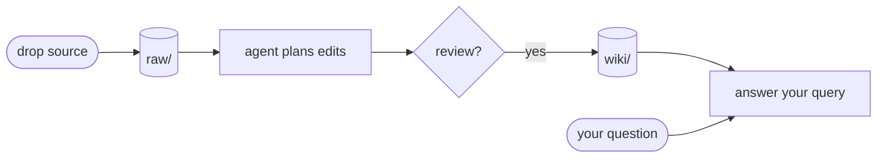

# Densa

> **Compile your sources into a queryable markdown wiki — the opposite of RAG.**
> Drop new material into `raw/`. An AI agent in your IDE reads it,
> drafts which `wiki/` pages to touch, waits for your OK, then writes
> the edits. Every ingest *densifies* your second brain instead of
> growing the haystack you re-search every query.

[](LICENSE)
[](https://github.com/ycaptain/densa/actions/workflows/ci.yml)
[](AGENTS.md)

## Pick your path

| You want to... | Open | Time |
|---|---|---|
| **Glance** — see what one ingest produces, no install | [`examples/hello-world/`](examples/hello-world/) (source + expected wiki output + log entry) | 3 min |
| **Set up your own vault** | [Quickstart](#quickstart) below → [`docs/setup.md`](docs/setup.md) | ~30 min to first ingest |
| **Evaluate the design** | [`docs/reference/design-rationale.md`](docs/reference/design-rationale.md) | ~1 hr deep read |

[`GUIDE.md`](GUIDE.md) is the day-to-day FAQ + scenarios; bookmark
it for *after* your first ingests. [`docs/setup.md`](docs/setup.md)
covers everything from the Obsidian plugin matrix to git-crypt to
the domain decision tree. [`docs/faq.md`](docs/faq.md) answers the
"why" questions (red lines, drift, operation philosophy).

---

## Quickstart

There is one supported path. It works today, no PyPI required.

```bash
# 1. Fork ycaptain/densa on GitHub (one click), then clone your fork:
git clone git@github.com:<you>/densa.git my-vault
cd my-vault
git remote add upstream https://github.com/ycaptain/densa.git

# 2. Wire the pre-commit validator (pure stdlib, no pip install):
git config core.hooksPath _system/hooks
git config --get core.hooksPath        # verify: should print _system/hooks

# 3. Open the folder in Cursor / Claude Code / Codex / Cline, paste
#    docs/bootstrap.md into the chat. The agent interviews
#    you, drafts your first L2 schema, and walks the first ingest.
```

That's it. The agent reads [`AGENTS.md`](AGENTS.md) natively in every
major coding-agent IDE. Manual validation any time:

```bash
PYTHONPATH=_system python -m densa --all
```

Claude Code users: the optional slash-command plugin lives at
[`integrations/claude-code/`](integrations/claude-code/). The 12
enforced rules (`AGENTS001`–`AGENTS012`) are documented at
[`docs/reference/rules-registry.md`](docs/reference/rules-registry.md);
`python -m densa rules` prints the live registry. Obsidian plugin
setup, encryption, disabling the hook, and the domain decision tree
all live in [`docs/setup.md`](docs/setup.md).

**Realistic time-to-first-ingest**: ~30 minutes for a one-page article,
~60 minutes for a meeting transcript whose L2 schema needs new fields.
The agent does the typing; you do the reviewing.

<sub>*Naming note: the project is **Densa**; `python -m densa` is the
stdlib validator that ships with it. The supported install today is
`git clone` + `git config core.hooksPath _system/hooks` above, or
`densa init` from an existing Densa install (see Alternative below).
PyPI publication (so `pipx install densa` works without first cloning)
is planned but not yet available — see the "Unreleased" entry in
[`CHANGELOG.md`](CHANGELOG.md).*</sub>

### Alternative: scaffold without cloning by hand

If you already have a working Densa clone (or `pip install -e .` in
one), `densa init <destination>` automates the steps above: it clones
upstream into `<destination>`, wires the pre-commit hook, walks
example-domain disposition, and (optionally) injects
`docs/bootstrap.md` into your AI agent.

```bash
PYTHONPATH=_system python -m densa init my-vault
# or, after `pip install -e .` in a Densa clone:
densa init my-vault
```

Useful when you're standing up multiple vaults; for your *first*
vault the fork-and-clone path above stays compatible with the
bootstrap prompt's expectations.

### Staying in sync with upstream

Densa upstream **never touches** `domains/**` — that namespace is
yours. Upgrades evolve `AGENTS.md` (schema), `_system/densa/`
(validator), `_system/prompts/` (operations), and templates only.

```bash
git fetch upstream && git merge upstream/main
```

When a release ships a breaking schema change (new `compiled_against`
version), the merge brings a `_system/scripts/migrate_NN_<slug>.py`
that idempotently brings your existing wiki pages forward.

---

## What this is

This repo is a **full, executable implementation of** Andrej Karpathy's
[llm-wiki gist](https://gist.github.com/karpathy/442a6bf555914893e9891c11519de94f) —
his ~1500-word sketch where an LLM compiles your sources into a
structured wiki that compounds, rather than retrieving raw chunks on
every query (the RAG pattern).

Karpathy described **what to build**. Densa gives you the **how**:

- A **schema** (nine page types: `summary`, `entity`, `concept`,
  `comparison`, `overview`, `synthesis`, `open-question`, `source`,
  `report` — every name comes verbatim from Karpathy's gist plus the
  `report` extension for operation artifacts).
- A **stdlib-only validator** (`python -m densa`) that enforces the
  schema on every commit.
- **Five operation prompts** (`ingest` / `query` / `lint` /
  `process-inbox` / `promote`) the agent loads on demand.
- **Migration tooling** (`python -m densa migrate`) for carrying an
  existing vault forward when upstream ships a breaking schema bump.
- A shipped **example domain** (`research-papers/`) plus two
  heavier showcases under `examples/showcases/`.

> [!important] `research-papers/` is **both** the shipped showcase
> and the active default L2 your fork starts with. Replace its
> contents with your own raws (or rename / delete the directory)
> per
> [`docs/setup.md` §"Choosing or replacing the default domain"](docs/setup.md#choosing-or-replacing-the-default-domain)
> before your first real ingest — don't try to "build on" the
> worked example.

If you read Karpathy's gist and thought "ok but where do I start"
— this is where. Vocabulary glossary:
[`docs/reference/karpathy-mapping.md`](docs/reference/karpathy-mapping.md).



The plan-first-then-apply gate is the same for every operation; you
never see edits land without consent. For a worked example of one
ingest cycle (source → plan → wiki diff → log entry), see
[`examples/hello-world/`](examples/hello-world/); for a week-in-the-life
narrative see
[`GUIDE.md` §"A day in the life"](GUIDE.md#a-day-in-the-life).

---

## The five operations

`ingest` / `query` / `lint` / `process-inbox` / `promote` are the only
verbs you ever type. Each has a canonical procedure under
[`_system/prompts/`](_system/prompts/) the agent loads on demand;
[`AGENTS.md` §"The five operations"](AGENTS.md#2-the-five-operations)
is the long-form contract (what each writes, what it forbids). The
natural-language → operation mapping lives in
[`GUIDE.md` §"Mapping natural language to operations"](GUIDE.md#mapping-natural-language-to-operations).

The validator at [`_system/densa/`](_system/densa/) enforces the
red lines on every commit and in CI:
`PYTHONPATH=_system python -m densa --all`.

---

## Why not just RAG?

RAG retrieves chunks every query. Densa compiles your sources into
structured prose once, incrementally — then queries the prose.

| Tool | Storage | Compounds? | Cites sources? | Local-first? |
| ---- | ------- | ---------- | -------------- | ------------ |
| **Densa** (this repo) | plain markdown + git | yes | enforced by validator | yes |
| Vector RAG (LlamaIndex / LangChain) | vector DB | no | optional | varies |
| Notion AI / mem.ai | proprietary DB | partially | sometimes | no |
| Obsidian + Smart Connections | markdown + index | retrieve-only | no | yes |

Past ~500 pages, layer embedding search on top of the wiki as fuzzy
fallback. The wiki gives you compounded structure; embedding search
gives you fuzzy recall. **Both, not either.** Detailed comparison
lives in [`docs/reference/design-rationale.md`](docs/reference/design-rationale.md).

---

## Sensitive material

If your `raw/` will ever hold therapy notes, medical records, NDA
material, or anything you wouldn't post in a public thread, treat
encryption as part of setup. See [`SECURITY.md`](SECURITY.md) and
[`docs/setup.md` §"Privacy — sensitive material"](docs/setup.md#privacy--sensitive-material) for
the walkthrough. The schema is language-neutral; the wiki happily
holds CJK content — see [`docs/cjk-workflow.md`](docs/cjk-workflow.md).

---

## Where to read next

Pick one based on what you're trying to do.

- **Day-to-day use** — [`GUIDE.md`](GUIDE.md). A day in the life,
  the seams between operations, mental model.
- **Setup beyond Quickstart** — [`docs/setup.md`](docs/setup.md).
  Obsidian plugins, encryption, disabling the hook, CI, domain
  decisions.
- **Conceptual FAQ** — [`docs/faq.md`](docs/faq.md). The red lines,
  scale & drift, operation philosophy.
- **Evaluating the design** —
  [`docs/reference/design-rationale.md`](docs/reference/design-rationale.md).
  Every load-bearing decision explained.
- **Starting your own vault from scratch** —
  [`docs/bootstrap.md`](docs/bootstrap.md).
- **Hacking on the schema / validator / prompts** —
  [`CONTRIBUTING.md`](CONTRIBUTING.md).

---

## License & acknowledgements

[MIT](LICENSE) © 2026 ycaptain. Built on Andrej Karpathy's
[llm-wiki gist](https://gist.github.com/karpathy/442a6bf555914893e9891c11519de94f);
selective conventions from
[`kepano/obsidian-skills`](https://github.com/kepano/obsidian-skills).
The structural invariants — raw / wiki / AGENTS, the five operations,
the red lines, the frontmatter schema — are domain-agnostic and should
outlive any particular LLM provider.

Discussions and PRs welcome:
[GitHub Discussions](https://github.com/ycaptain/densa/discussions).

<!--
Suggested GitHub repo Topics (Settings → About → topics):
  agents-md, llm, ai-agents, cursor, claude-code, codex, obsidian,
  personal-knowledge-management, second-brain, rag-alternative,
  markdown, knowledge-graph, densa, pkm
-->
