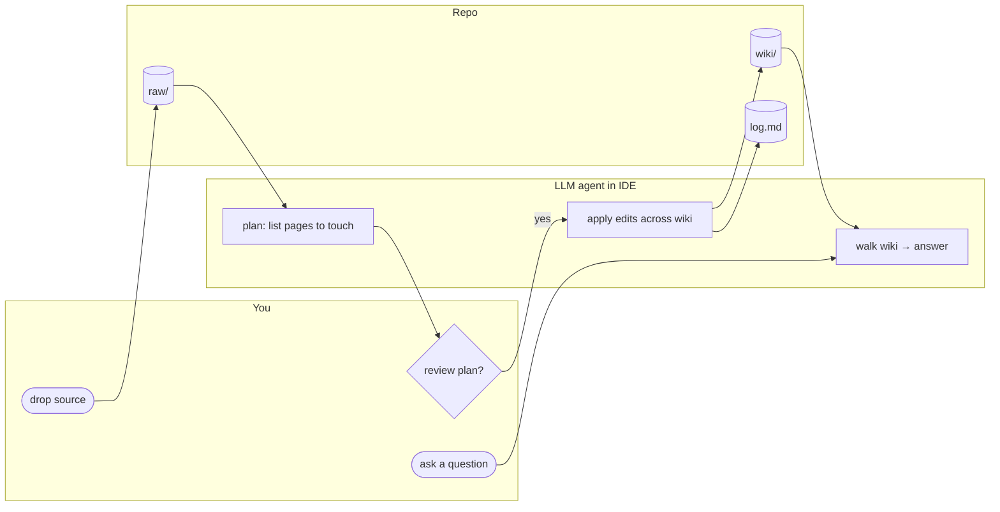
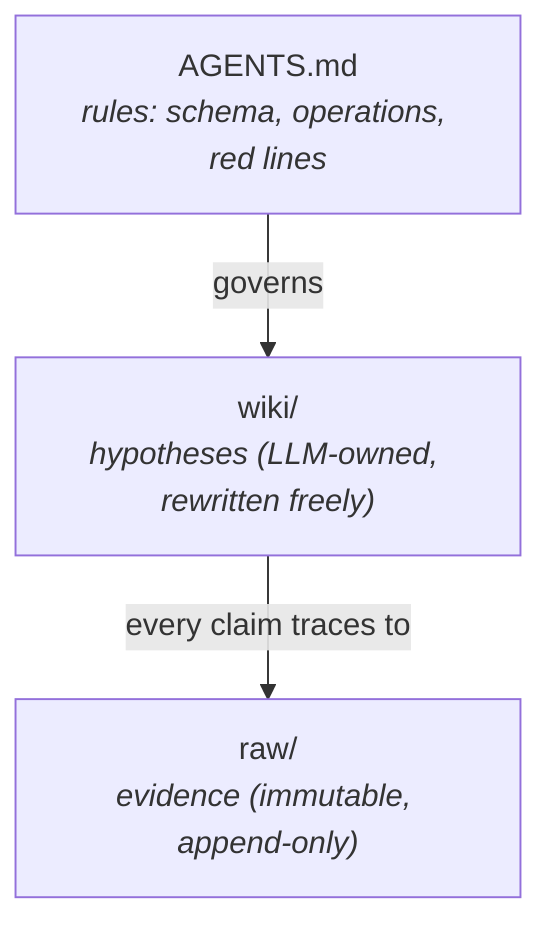

# Densa

> **Compile your sources into a queryable markdown wiki — the opposite of RAG.**
> Drop new material into `raw/`, the AI agent in your IDE reads it,
> drafts which `wiki/` pages to touch, waits for your OK, and writes
> the edits. Every ingest *densifies* your second brain instead of
> growing the haystack you re-search every query. A pure-stdlib Python
> validator keeps the schema honest on every commit.

[](LICENSE)
[](https://github.com/ycaptain/densa/actions/workflows/ci.yml)
[](AGENTS.md)
[](https://github.com/astral-sh/ruff)
[](https://github.com/ycaptain/densa)

**One sentence**: the wiki is your codebase, Obsidian is your IDE, the
LLM is your programmer. You curate the raw material, ask questions, and
review the diffs — the agent does the bookkeeping.

**Never heard of an "LLM wiki"?** That's fine. If you've ever wished a
search index over your notes could *write you a paragraph that already
answers the question*, this is the cheapest way to get there — without
a vector DB, without a SaaS, and without losing the ability to read
every file with `cat`.



---

## 🎬 See it in action

You drop a 90-minute Q2-planning transcript into
`domains/workspace/raw/meetings/`, open your IDE's AI chat (Cursor /
Claude Code / Codex / Cline …), and type one message:

> *ingest `domains/workspace/raw/meetings/2026-04-08-meeting-q2-planning.md`*

The agent loads [`_system/prompts/ingest.md`](_system/prompts/ingest.md),
reads the full transcript, then replies with a plan and waits:

> I'll touch 6 pages (~80 lines diff):
>
> - **create** `wiki/analyses/2026-04-08-meeting-q2-planning-analysis.md`
> - **update** `wiki/projects/q2-platform-migration.md` *(status, risks)*
> - **create** `wiki/decisions/microservices-split.md` *(ADR draft)*
> - **update** `wiki/entities/stakeholder-alex-cs.md` *(+1 appearance)*
> - **update** `wiki/entities/team-platform.md` *(+1 appearance)*
> - **prepend** `log.md` + `domains/workspace/log.md` *(ingest entry)*
>
> Approve, edit the list, or drop any?

You say *go ahead*. Six edits land — all cross-linked, all citing the
raw transcript. Six months later you ask *"why did we pick a phased
microservices split?"*; the agent reads
`wiki/decisions/microservices-split.md` first, not the 90-minute
transcript. That's the whole loop. The rest of this README is *how*.

---

## 🤔 Why not just RAG?

RAG searches the haystack on every query. Densa compiles the haystack
into a textbook — once, incrementally — and queries the textbook.

- **RAG retrieves chunks**; the wiki returns a page that already
  weaves the chunks together, with citations. You read prose, not
  ranked excerpts.
- **RAG starts from zero every query**; the wiki *compounds* — every
  ingest adds structure (concepts cross-link, patterns accrue
  instances, entities collect appearances). Month-12 queries read a
  denser model than month-1.
- **RAG hides its sources behind a vector index**; here every claim
  walks back to a raw file in ≤ 2 wikilink hops, enforced by the
  validator on every commit.

If your second brain ever grows past ~500 pages and the indexing layer
starts to miss, layer embedding search (Smart Connections, etc.) on top
of the wiki as fuzzy fallback. The wiki gives you compounded structure;
embedding search gives you fuzzy recall. **Both, not either.**

| Tool                                      | Storage              | Compounds? | Cites sources?        | Local-first? |
| ----------------------------------------- | -------------------- | ---------- | --------------------- | ------------ |
| **Densa** (this repo)                     | plain markdown + git | yes        | enforced by validator | yes          |
| Vector RAG (LlamaIndex / LangChain)       | vector DB            | no         | optional              | varies       |
| Notion AI / mem.ai / hosted second brains | proprietary DB       | partially  | sometimes             | no           |
| Obsidian + Smart Connections              | markdown + index     | retrieve-only | no                 | yes          |
| Cursor `@docs` / Claude Projects          | session-local        | no         | sometimes             | no           |

A longer 7-column comparison (including Reflect / Tana / Logseq AI)
lives in [`docs/DESIGN.md`](docs/DESIGN.md#how-it-compares).

---

## 🎯 Who this is (and isn't) for

**Use this if you**:

- Read papers, transcribe meetings, journal, or clip articles — and
  want a model of *what you've concluded so far*, not a search index
  over what you've read.
- Already work in an AI-pair IDE (Cursor, Claude Code, Codex, Cline).
  The template is plain markdown + git; the agent does the typing.
- Prefer markdown files over a hosted product, and *local-first* over
  *cloud-only*.

**Skip this if you**:

- Want a SaaS or a one-click app. There isn't one. You'll be running
  an AI coding agent against a folder of markdown files.
- Write essays, articles, or books — Scrivener / Ulysses / Obsidian +
  Longform are designed for the voice-and-branching shape that
  wiki-style compilers actively suppress. (Creative-writing workflows
  are deliberately out-of-scope here.)
- Have millions of chunks and want sub-second retrieval. RAG is the
  right tool at that scale; Densa's sweet spot is **hundreds of
  curated sources with high synthesis frequency**.

> **Not a programmer?** You only ever (a) drop files into `raw/` and
> (b) talk to the AI agent in your IDE's chat. No code, no terminal
> after the one-time install. Start at
> [`_system/MANUAL.md`](_system/MANUAL.md), which walks through a
> typical week of using the vault.

---

## 🚀 Quickstart

Your vault is a **personal fork** of this repo — not a one-time copy.
Forking keeps you on the upgrade train: future `densa upgrade` runs
pull schema changes upstream ships, never touching your `domains/**`.

### The standard path (works today, no PyPI required)

```bash
# 1. Fork ycaptain/densa on GitHub (one click), then:
git clone git@github.com:<you>/densa.git my-vault
cd my-vault
git remote add upstream https://github.com/ycaptain/densa.git

# 2. Wire the pre-commit validator. The hook is a pure-stdlib Python
#    shim — any system python3 (3.10+) works; no pip install required.
git config core.hooksPath _system/hooks

# 3. Open the folder in Cursor / Claude Code / Codex / Cline, then
#    paste docs/bootstrap-prompt.md into the chat. The agent
#    interviews you, drafts your first L2 schema, and walks the
#    first ingest.
```

The agent reads `AGENTS.md` natively in every major coding-agent IDE.
Claude Code can additionally use
[`integrations/claude-code/`](integrations/claude-code/) for
`/ingest`-style slash commands (experimental).

**Realistic time-to-first-ingest**: ~30 minutes for a one-page article;
~60 minutes for a meeting transcript whose L2 schema needs a few new
fields. The agent does the typing; you do the reviewing.

### The fast path (preview — published to PyPI in 0.2)

A future release will let you skip the manual `git clone` + hook-wiring
steps with a single CLI:

```bash
pipx install densa                              # planned for 0.2 on PyPI
densa init my-vault --auto-inject=auto
```

`densa init` clones upstream, sets up `upstream` as a remote, wires
the pre-commit hook, walks you through example-domain disposition,
and (with `--auto-inject`) spawns your AI agent with the bootstrap
prompt loaded. The CLI already exists inside the cloned repo today —
once `pip install -e .` runs you can invoke it locally; PyPI
publication just removes the clone-first chicken-and-egg.

### 🔄 Staying in sync with upstream

Densa upstream **never touches** `domains/**` — that namespace
belongs to your vault. Upgrades evolve `AGENTS.md` (schema),
`_system/densa/` (validator), `_system/prompts/` (operation
procedures), and templates. So merges stay clean:

```bash
densa upgrade               # fetch + diff summary + merge upstream/main
# or, if you haven't installed the CLI:
git fetch upstream && git merge upstream/main
```

When a release ships a breaking schema change (new `compiled_against`
version), the merge brings a `_system/scripts/migrate_NN_<slug>.py`
that idempotently brings your existing wiki pages forward. `densa
upgrade` surfaces new migrations after the merge; run each one, commit,
done.

### 🔁 Your first day

```text
1.  Drop a new source into     domains/<X>/raw/<bucket>/
2.  In the AI chat:            ingest <path-to-the-file>
3.  Agent drafts a plan listing every wiki page it will touch
    and waits for your OK.
4.  Approve → it applies the edits and prepends to log.md.
5.  Ask anything:              query <natural-language question>
6.  Once a week:               lint
```

No vector DB. No embedding refresh. No "please re-index after schema
migration" rituals. Just markdown, git, and a validator on every commit.

---

## The five operations

`ingest` / `query` / `lint` / `process-inbox` / `promote` are the only
verbs you ever type. Each has a canonical procedure under
[`_system/prompts/`](_system/prompts/) the agent loads on demand.

| Op | Command | What the agent does |
| -- | ------- | ------------------- |
| 📥 ingest        | `ingest <path>`              | Reads the new source, plans every wiki page it'll touch, waits for OK, applies the edits, logs. |
| 🔍 query         | `query <question>`           | Walks `index.md` → domain index → candidate pages → inline-cited answer. Files non-trivial answers as `outputs/qa/<date>-<slug>.md`. |
| 🩺 lint          | `lint [--domain <X>]`        | Health-checks the wiki (orphans, broken links, stale claims, contradictions). Auto-applies additive fixes only. |
| 📨 process-inbox | `process-inbox`              | Triages `/inbox/` into `domains/<X>/raw/<bucket>/` via `git mv`. Doesn't ingest — that's a separate step. |
| ⬆️ promote        | `promote <qa-path>`          | Lifts an evergreen Q&A from `outputs/qa/` into a first-class wiki page; `git mv` preserves history. |

The validator at [`_system/densa/`](_system/densa/) enforces the
red lines on every commit and in CI. Manual run:
`python -m densa --all` (or `densa --all` once `pip install -e .`
has been run).

---

## 🧱 How it works

Three layers, borrowed from compiled languages — `raw/` is your
source code, `wiki/` is the compiled artifact, `AGENTS.md` is the
language spec:



- **`raw/` is fact** — clipped articles, transcribed sessions,
  recorded meetings. *Never edited*; your audit trail three years
  from now. Even the LLM cannot modify these — the validator rejects
  any commit that touches them.
- **`wiki/` is the current best model** — rewritten freely as new raw
  arrives; compresses raw into queryable, structured prose with
  cross-references. Think *Wikipedia article* rather than *search
  result*.
- **`AGENTS.md` is the contract** — where new material goes, which
  pages each ingest should touch, what `lint` checks for.
  [`/AGENTS.md`](AGENTS.md) (L1) is universal; each
  `domains/<X>/AGENTS.md` (L2) extends or overrides L1 inside its
  domain. L2 wins inside its domain; L1 wins everywhere else.

**Worked example for the layers**: a 90-minute meeting transcript
lands in `domains/workspace/raw/meetings/`. The agent reads it,
produces a per-meeting analysis under `wiki/analyses/`, updates a
canonical decision page under `wiki/decisions/`, bumps each
stakeholder's "Appearances" table under `wiki/entities/`. All of
that is governed by `domains/workspace/AGENTS.md` — which declares
that meetings ship to `raw/meetings/`, that analyses are 1:1 with one
raw, and that decisions live in their own folder distinct from the
ADR text in raw.

---

## 🧪 What ships in the template

Three worked L2 domains, so you can see what a populated wiki actually
looks like before adopting:

| Domain               | Weight | What it demonstrates                                            |
| -------------------- | ------ | --------------------------------------------------------------- |
| `research-papers/`   | light  | 5-paper LLM-tutoring evidence arc (3 real RCTs + 1 review + 1 synthesised SAE stand-in) |
| `workspace/`         | medium | Q2 platform-migration arc (meetings / decisions / stakeholders) |
| `psychology/`        | heavy  | 6-week father-grief therapy + psychiatry arc (5 raws → 25 wiki pages) |

The papers in `research-papers/` are *real* (Vanzo 2024, Bastani 2024,
Kestin 2025, Kim 2025) — so you can see what the wiki looks like over
genuine primary sources. The therapy / workspace material is
*synthesised* — every clinician, every person, every meeting is
fictional, and every raw file opens with an explicit `<!-- SYNTHESISED
-->` banner. The arcs are real enough to ingest cleanly; the people
aren't real at all.

- 5-minute guided tour: [`docs/EXAMPLES.md`](docs/EXAMPLES.md).
- **Read [`docs/EXAMPLE-DOMAINS.md`](docs/EXAMPLE-DOMAINS.md) before
  your first real ingest** — most users keep one example as reference
  and remove the rest.

---

## 🔒 Sensitive material & non-English vaults

If your `raw/` will ever hold therapy notes, medical records, NDA
material, or anything else you wouldn't post in a public thread, treat
encryption as part of setup, not an afterthought.

- **Encrypt sensitive `raw/` with [git-crypt](https://github.com/AGWA/git-crypt)
  before the first ingest.**
  [`_system/scripts/setup_encryption.sh`](_system/scripts/setup_encryption.sh)
  ships encrypting **nothing by default** — you uncomment the paths you
  want protected.
- **Each L2 declares its own privacy posture** in
  `domains/<X>/AGENTS.md` (quote-length caps, slug pseudonymisation,
  encrypted-raw assumption). The psychology example ships with the
  most conservative defaults.
- **Cold-backup remote on a different provider** (Codeberg, GitLab,
  self-hosted) — single-vendor account loss is a real risk for a
  personal second brain.

Full encryption walkthrough + mobile capture + Obsidian plugin
recommendations: [`SECURITY.md`](SECURITY.md) and
[`_system/SETUP.md`](_system/SETUP.md).

The schema is language-neutral; the wiki happily holds Chinese /
Japanese / Korean content. See
[`docs/CJK-WORKFLOW.md`](docs/CJK-WORKFLOW.md) for slug / aliases /
commit-message conventions.

---

## 📚 Where to read next

Pick one based on what you're trying to do today.

- 🧭 **Evaluating the design** — [`docs/DESIGN.md`](docs/DESIGN.md).
  Every load-bearing decision explained: the L1 / L2 split, the red
  lines, how to design your own L2.
- 🌱 **Starting your own vault** —
  [`docs/bootstrap-prompt.md`](docs/bootstrap-prompt.md). Paste into
  your IDE on day one; the agent interviews you and scaffolds the L2s.
- 🪞 **Day-to-day use** — [`_system/MANUAL.md`](_system/MANUAL.md).
  A day in the life, the seams between operations, and an FAQ.
- 🤝 **Hacking on the schema / validator / prompts** —
  [`CONTRIBUTING.md`](CONTRIBUTING.md). nox sessions, the CI gate, the
  AGENTS007 commit-scope rule.

The four-file onboarding set a fresh LLM session reads ([`AGENTS.md`](AGENTS.md)
§1.1): L1 schema → the active domain's L2 → the prompt for the
operation it's running → the latest
[`outputs/snapshots/index-snapshot.md`](outputs/snapshots/index-snapshot.md).

---

## License & acknowledgements

[MIT](LICENSE) © 2026 ycaptain. Built on Andrej Karpathy's
[llm-wiki gist](https://gist.github.com/karpathy/442a6bf555914893e9891c11519de94f);
selective conventions from
[`kepano/obsidian-skills`](https://github.com/kepano/obsidian-skills).
The structural invariants — raw / wiki / AGENTS, the five operations,
the red lines, the frontmatter schema — are domain-agnostic and should
outlive any particular LLM provider.

Discussions and PRs welcome:
[GitHub Discussions](https://github.com/ycaptain/densa/discussions).

<!--
Suggested GitHub repo Topics (Settings → About → topics):
  agents-md, llm, ai-agents, cursor, claude-code, codex, obsidian,
  personal-knowledge-management, second-brain, rag-alternative,
  markdown, knowledge-graph, densa, pkm
-->
