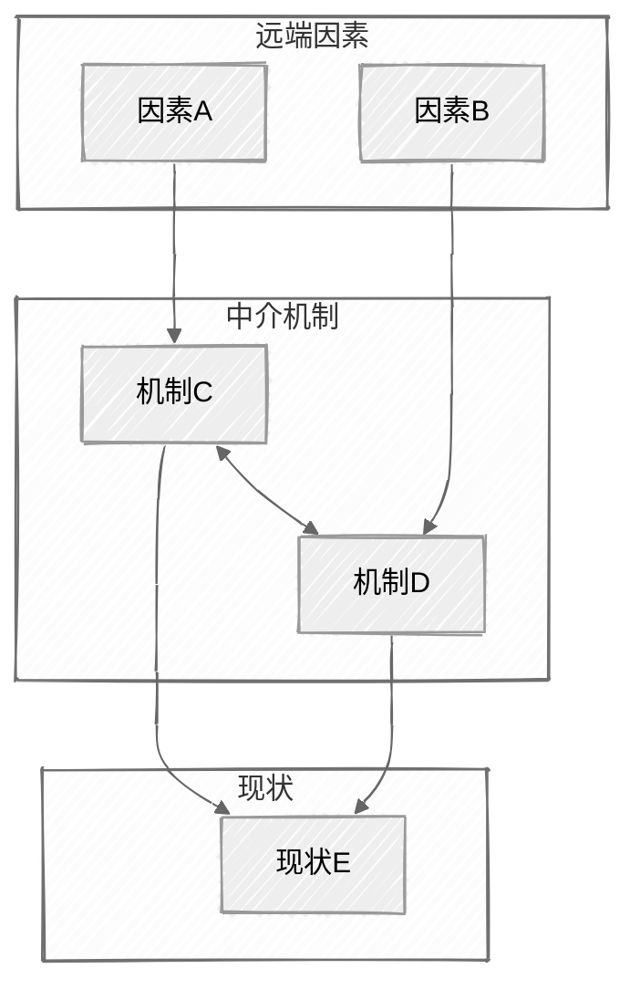
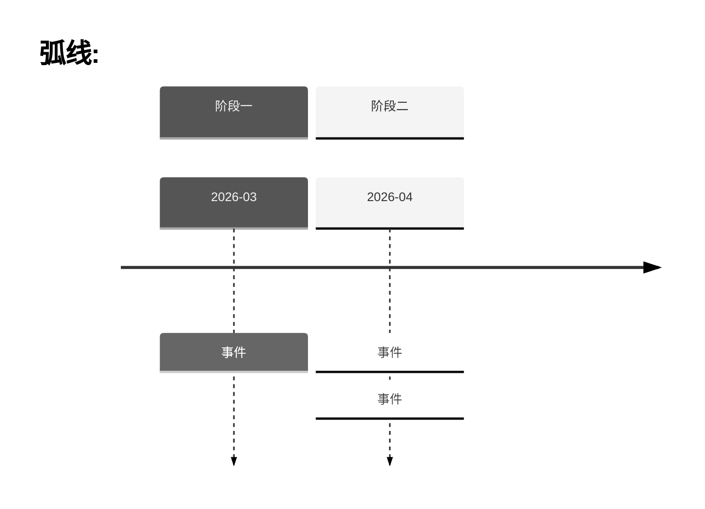
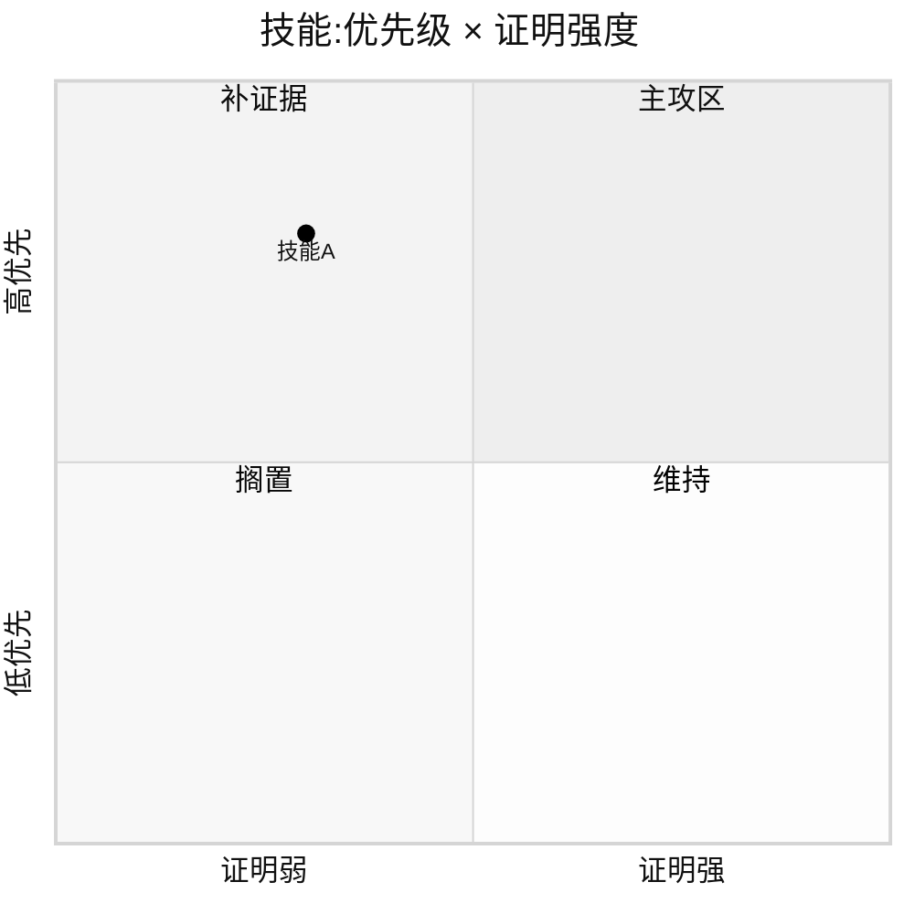

# Mermaid skeletons (handDrawn header is mandatory)

Every Mermaid chart in this vault opens with the same config header.
Copy the relevant skeleton; replace placeholder nodes. Node labels
≤12 chars (`<br/>` to wrap); ≤8 nodes horizontally.

## Layered causal DAG (多因素 → 机制 → 现状)

The canonical shape for "multiple factors with hierarchy + causality".
Feedback edges (`<-->`) are the value — make loops visible.

````markdown

````

For ≥6 nodes or crossing edges, add `%% elk %%` as the first line
inside the code block (Mermaid ELK Renderer plugin).

## Stage-arc timeline (阶段弧)

````markdown

````

## Quadrant (priority × proof, 或任意二维定位)

````markdown

````
