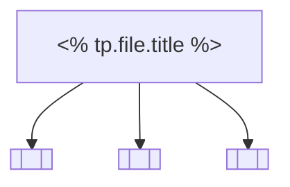

# <% tp.file.title %>

<!-- A bird's-eye view of a sub-area inside this domain. Per AGENTS.md §"Frontmatter schema"
this is the page a newcomer reads *first* to orient before drilling
into any individual [[summary]] or [[concept]].

Two flavours of overview page:
- The per-domain entry `domains/<X>/wiki/overview.md` — created once,
  updated whenever ingest adds a new wiki page. Carries the mindmap +
  Dataview blocks for the domain.
- Sub-area overviews under `domains/<X>/wiki/overviews/<sub-area>.md`
  — created when a sub-area has ≥3 anchored [[summary]] pages and
  earns its own entry point.

This template covers the sub-area flavour. The per-domain entry is
generated by `densa init` and rarely starts from this skeleton. -->

## What this sub-area is

One paragraph. Working definition + why it deserves its own overview.

## Mindmap



## Reading order

<!-- 3–7 numbered steps pointing a newcomer at the load-bearing
[[summary]] / [[concept]] pages with a time budget. -->

1. Start with [[<summary-slug>]] — 5 min. Why: …
2. Then [[<concept-slug>]] — 3 min. Why: …
3. …

## Connected pages

```dataview
TABLE WITHOUT ID
    file.link AS "Page",
    type AS "Type",
    updated AS "Updated"
FROM "domains/<your-domain>/wiki"
WHERE contains(file.tags, "<your-overview-tag>")
SORT updated DESC
```

## Open questions tracked here

- [[<open-question-slug>]] — short note

## Sources

<!-- Optional: a sub-area overview may stand on its sub-page links
alone; this section lists the [[summary]] pages most heavily braided
into the body. -->

- [[<summary-or-page>]] — what it contributes
