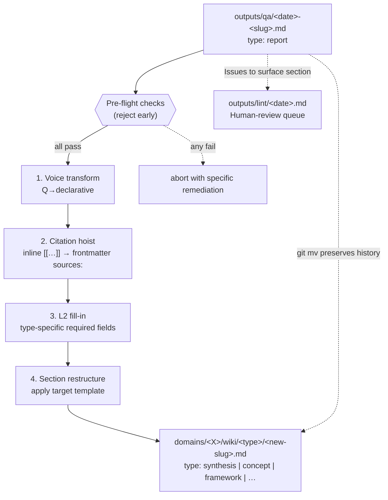
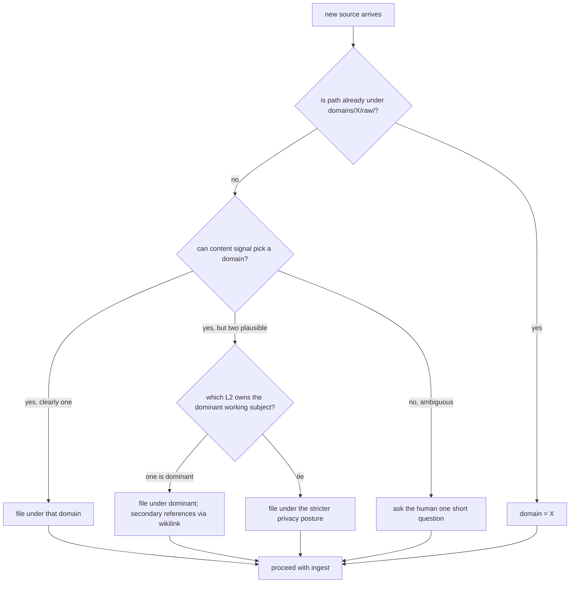

# DESIGN — why the LLM wiki looks this way

> Companion to [`README.md`](../README.md). The README shows you how
> to use the template; this file explains *why* each load-bearing
> decision exists and how to extend the schema to your own domains.

## Table of contents

- [Why this exists](#why-this-exists)
- [How it compares](#how-it-compares)
- [Who this is not for](#who-this-is-not-for)
- [The core invariant](#the-core-invariant)
- [Why L1 / L2 schema layering](#why-l1--l2-schema-layering)
- [The frontmatter contract](#the-frontmatter-contract)
- [`outputs/`: where operations write](#outputs-where-operations-write)
- [Q&A as operation artifact, not compiled knowledge](#qa-as-operation-artifact)
- [The promote operation: how Q&A becomes wiki knowledge](#the-promote-operation)
- [Red lines (and why each one is non-negotiable)](#red-lines)
- [Operation writes red line (AGENTS007)](#operation-writes-red-line-agents007)
- [Routing: where does a new source go?](#routing-where-does-a-new-source-go)
- [Engineering hooks: turning soft norms into hard rules](#engineering-hooks)
- [How to design your own L2](#how-to-design-your-own-l2)
- [Anti-patterns to avoid](#anti-patterns-to-avoid)

---

## Why this exists

A vector-DB-backed RAG layer is great for "look up something I half
remember in a haystack". It's the wrong tool for the question I
actually want my second brain to answer:

> *Given everything you've read for me over the past two years,
> what's the most accurate model of X right now?*

That question needs a model that **compounds** — every new source
should make the structure denser, not just the haystack bigger. So
the LLM doesn't search your notes at query time; it incrementally
*compiles* them, page by page, into a queryable wiki you can read
like a textbook.

> The wiki is the codebase. Obsidian is the IDE. The LLM is the programmer.

---

## How it compares

| Tool                                       | Storage              | Compounds?         | Open / portable?  | Cites sources by default? | Local-first? |
| ------------------------------------------ | -------------------- | ------------------ | ----------------- | ------------------------- | ------------ |
| **Densa** (this repo)                    | plain markdown + git | yes                | yes               | enforced by validator     | yes          |
| Vector RAG (LlamaIndex, LangChain, etc.)   | vector DB            | no                 | partially         | optional                  | varies       |
| Notion AI                                  | proprietary DB       | partially          | no                | sometimes                 | no           |
| mem.ai                                     | proprietary DB       | partially          | no                | sometimes                 | no           |
| Reflect / Tana / Logseq AI                 | proprietary / md     | partially          | partially         | no                        | varies       |
| Obsidian + Smart Connections               | markdown + index     | no (retrieve-only) | yes               | no                        | yes          |
| Cursor `@docs` / Claude Projects           | session-local        | no                 | no                | sometimes                 | no           |

The pattern composes: at ~500+ pages, layer embedding search (Smart
Connections, Obsidian Bases, even a small vector index) on top of the
wiki as a fallback. The wiki gives you compounded structure; embedding
search gives you fuzzy fallback. Both, not either.

---

## Who this is not for

**This template is not designed for narrative long-form writers,
journalists, or memoirists.** If you write essays, articles, or books
that need to preserve voice, branch drafts, and stay in dialogue with
editors — this tool's compiler-style "raw → wiki" structure will work
against you. Try Scrivener, Ulysses, or Obsidian + Longform instead.
**Creative writing workflows are intentional out-of-scope; we will
not be adding support for them.**

And a few more things this is *not*:

- **Not a RAG replacement** at millions-of-chunks scale. Sweet spot
  is hundreds of curated sources with high synthesis frequency.
- **Not a SaaS or hosted product.** Markdown + git, run locally with
  the LLM agent of your choice.
- **Not an autopilot.** Every ingest plans first and waits for your
  confirmation; every lint report is a dashboard, not an auto-apply.
- **Not coupled to one model vendor.** The schema and prompts are
  agent-agnostic; switch Cursor ↔ Claude Code ↔ Codex freely.
- **Not novel research.** It's a careful systematisation of Andrej
  Karpathy's [llm-wiki](https://gist.github.com/karpathy/442a6bf555914893e9891c11519de94f)
  gist into a working template — credit where it's due.

---

## The core invariant

Everything else in this design follows from one structural commitment:

> **`raw/` is fact (immutable, append-only).
> `wiki/` is the current best model (LLM-owned, rewritten freely).
> `AGENTS.md` is the contract between the two.**

This three-layer split is borrowed from how compiled programming
languages separate source code, compiled artifacts, and the language
specification:

| Layer       | Analogue in a compiled language |
| ----------- | ------------------------------- |
| `raw/`      | source files (you write them once and check them in) |
| `wiki/`     | compiled binary (regenerated from source) |
| `AGENTS.md` | language spec (defines what's well-formed) |

Two consequences fall out:

1. **Three-year-back integrity.** If a wiki claim turns out to be
   wrong, you can walk the wikilinks back to the raw file and see
   exactly what was said, by whom, when. The LLM can't quietly rewrite
   history because history lives in `raw/` and `raw/` is immutable.
2. **Compounding instead of replay.** Each ingest densifies the wiki.
   The next query reads a denser model, not the same raw chunks. The
   second brain compounds with use, the way a textbook does — not the
   way a search index does.

---

## Why L1 / L2 schema layering

The schema is split deliberately:

- **L1** (`/AGENTS.md`) — universal contract every domain inherits:
  - Required frontmatter (`type`, `domain`, `created`, `updated`,
    `status`).
  - The set of page types (`source`, `entity`, `concept`, `pattern`,
    `theme`, `framework`, `analysis`, `synthesis`, `protocol`,
    `experiment`, `project`, `stakeholder`, `decision`, `question`,
    `fleeting`, `correction`).
  - Sources cardinality per type (e.g. `analysis.sources` must be
    exactly 1; `synthesis.sources` must be ≥ 2).
  - The red lines (raw immutable, log append-only, no wiki deletion,
    bulk renames require human consent).
  - The five operations and their procedures.

- **L2** (`domains/<X>/AGENTS.md`) — domain-specific override:
  - Persona (what voice should the LLM adopt for this domain).
  - Folder layout under `raw/` and `wiki/`.
  - Which page types this domain uses (subset of L1's set, plus
    optional new ones).
  - Additional required frontmatter per type (e.g. an `analysis`
    in a psychology L2 might require `session_kind`,
    `analysis_lens`).
  - Domain-specific routing hints, lint rules, privacy posture.

Why this split?

1. **L2s evolve independently.** Adding a new L2 (say, a research
   tracking domain) doesn't require touching L1 or any other L2.
2. **L1 stays stable.** The universal invariants don't drift as you
   experiment with new domains; the red lines are the same everywhere.
3. **A fresh LLM session can onboard fast.** Read four files (L1, the
   L2 in scope, the prompt for the current operation, the cache index
   snapshot) and you're operating correctly. See L1 §1.1 for the
   minimal onboarding set.

---

## The frontmatter contract

Every wiki page declares:

```yaml
---
type: <one of the allowed types>
domain: <your L2 name>
created: YYYY-MM-DD
updated: YYYY-MM-DD
sources: ["[[wikilink]]", ...]
tags: [tag1, tag2]
aliases: ["alt-term", "alternate-name"]
status: active | deprecated
compiled_against: 1
last_validated: YYYY-MM-DD   # required for concept/framework/protocol/entity
---
```

The most important field is `sources`. Its semantics depend on the
type:

| `type`                    | `sources` semantics                              | Cardinality |
| ------------------------- | ------------------------------------------------ | ----------- |
| `source` / `session`      | n/a (the file itself is the source)              | empty       |
| `analysis`                | the one raw file in `raw/` this analyses         | **= 1**     |
| `synthesis`               | wiki pages and/or raw this synthesis weaves      | ≥ 2         |
| `pattern` / `theme`       | wiki pages and/or raw where pattern manifests    | ≥ 2         |
| `entity`                  | wiki pages and/or raw where entity appears       | ≥ 1         |
| `concept` / `framework`   | raw articles / canonical wiki pages              | ≥ 0 → ≥ 1   |
| `protocol` / `experiment` | raw articles + linked experiments / metric files | ≥ 1         |

Two implications you should internalise:

### `analysis.sources` length must be exactly 1

If you find yourself wanting to put two raw files into an `analysis.sources`
list, you're not writing an analysis — you're writing a synthesis. Change
`type: analysis` to `type: synthesis`, move the file from
`wiki/analyses/` to `wiki/syntheses/`, and you're good. The pre-commit
hook (`densa`) enforces this.

Why? Because an `analysis` is a 1:1 contract between a raw source and
its first-order LLM reading. Mixing sources at the analysis layer
loses the "what was actually said in *this specific* document"
property, and the wiki immediately decays into a thicket of unverifiable
generalisations.

### Wiki-to-wiki citations are first-class

A `pattern` page citing two `analysis` pages is not a "weaker" citation
than citing raw directly — it's the **correct** citation pattern.
Patterns generalise across sources; their evidence chain is:

```
pattern → analysis → raw
```

The chain still terminates at raw, just at one hop further out. Lint
flags any chain longer than 2 hops to raw, because by that point the
abstraction is at risk of having drifted from the evidence.

---

## `outputs/`: where operations write

A fourth top-level directory completes the compiler analogy:

| Layer       | Analogue in a compiled language          | Purpose                          |
| ----------- | ---------------------------------------- | -------------------------------- |
| `raw/`      | source files                             | evidence, immutable              |
| `wiki/`     | compiled binary                          | hypotheses, LLM-owned            |
| `AGENTS.md` | language spec                            | the contract                     |
| `outputs/`  | build artifacts (`target/`, `dist/`)     | runtime products, in git but ignored by the wikilink graph |

`outputs/` is in git so the audit trail of every `lint` run is intact
across machines and clones, but the wikilink resolver deliberately
ignores it. Two consequences:

- **Wiki pages MUST NOT cite `outputs/`.** Reports point at wiki
  pages; the reverse direction is forbidden by design. This keeps the
  link graph clean — lint hubs / orphans / rings are wiki properties,
  not runtime noise.
- **Stale reports are safe to delete.** When `outputs/lint/` grows
  large enough to be noisy, `git rm outputs/lint/<old>.md` removes
  them with zero downstream impact. There is no auto-rotation; user
  manages retention.

Current `outputs/` buckets:

- `outputs/lint/<YYYY-MM-DD>.md` — one lint report per run, `type: report`.
- `outputs/snapshots/index-snapshot.md` — machine-readable mirror of
  every `index.md` Dataview block. Regenerated by every `lint` run and
  consumed by fresh LLM sessions as part of the four-file onboarding set
  ([AGENTS.md §1.1](../AGENTS.md)).
- `outputs/qa/<YYYY-MM-DD>-<slug>.md` — Q&A archives filed back from
  substantive `query` runs, `type: report`. See the next section for
  why these live here and not in `wiki/syntheses/`.

Validator enforcement:

- `paths.is_outputs(path)` classifies any path under `outputs/`.
- `paths.is_output_artifact(path)` is the subset subject to the
  universal frontmatter contract (`outputs/<bucket>/<file>.md`,
  excluding the bare `outputs/README.md`).
- AGENTS003 / AGENTS004 visit those artifacts. AGENTS005 (analysis
  cardinality) skips them (reports cannot be analyses).
- AGENTS006 (wikilink resolvable) skips `outputs/` entirely.

---

## Q&A as operation artifact

<a id="qa-as-operation-artifact"></a>

The `query` operation files non-trivial answers as `type: report` Q&A
files under `outputs/qa/` rather than `wiki/syntheses/`. The trade-off
is deliberate and worth explaining.

**The problem with the older layout.** Until v0.5.0 `query` filed back
to `wiki/syntheses/<date>-<slug>.md`. Three symptoms accumulated:

1. **Schema impedance.** A Q&A is a snapshot of one conversation;
   `synthesis` requires `sources: ≥ 2` and is meant to braid multiple
   sources into a stable claim. Most Q&A files squeezed into the
   contract awkwardly — either inflating `sources` to satisfy the
   validator or silently violating it.
2. **Graph pollution.** Every Q&A page became a node in the wikilink
   graph; lint's orphan / hub / ring detectors started reporting
   transient query products as if they were structural anomalies.
3. **Retention pressure.** L1 §4 forbids deleting wiki pages, so old
   "what did the wiki say about X back in March?" archives never
   cleaned up.

**The fix.** Move Q&A out of `wiki/` entirely. `outputs/qa/<date>-<slug>.md`
gets the same artifact semantics as `outputs/lint/`: in git for the
audit trail, excluded from the wikilink graph, `sources` may be empty,
safe to `git rm` when stale. `wiki/syntheses/` returns to its narrow
purpose — explicit cross-source narratives deliberately produced
during `ingest` or promoted from a Q&A.

**The cost.** Future wiki pages cannot back-reference an old Q&A
directly (the resolver ignores `outputs/`). If a particular Q&A proves
durable — evergreen, frequently revisited, makes a stable claim that
deserves wikilink-graph membership — the path forward is `promote`
(next section), which lifts it into the wiki with a controlled
information-shape transform. The vast majority of Q&A are written
once, consumed once, and aged out; only the handful with lasting
value pay the promote cost.

The pattern echoes Yanhua's
["Karpathy knowledge base methodology" essay](https://www.yanhua.dev/blog/karpathy-knowledge-base),
which placed `outputs/qa/` next to `outputs/health/` (our lint
reports) — both runtime products of operations over the wiki, neither
part of the wiki itself. The compiler analogy in §"`outputs/`: where
operations write" applies cleanly: Q&A is to a run-time log what
`wiki/syntheses/` is to a compiled binary.

---

## The promote operation

<a id="the-promote-operation"></a>

`promote <qa-path>` is the fifth and newest canonical operation. It
upgrades a `query`-produced Q&A artifact into a first-class wiki page,
performing a *controlled information-shape transform* rather than a
bare file move.



Five design choices worth flagging:

### 1. Pre-flight rejects, never partially applies

The LLM runs every pre-flight check before touching the worktree. If
any fails (source not in `outputs/qa/`, target type not in L2's
allowed set, slug+aliases collision with existing wiki page, `sources`
cardinality below §3.1, missing L2 type-specific fields), it surfaces
the specific blocker with a remediation suggestion and aborts. A
half-promoted page is worse than no promote at all: it pollutes the
wiki link graph with malformed metadata that lint subsequently has to
flag as `human-review`.

### 2. `git mv`, not new-write + delete

The implementation is a single `git mv outputs/qa/<file>.md
domains/<X>/wiki/<type>/<new-slug>.md` followed by a rewrite of the
moved file. The alternative — write a new file and `git rm` the
source — would lose the file's history. `git log --follow` against the
promoted page traces all the way back to the original Q&A creation,
which is invaluable when reconstructing why a wiki claim looks the
way it does months later.

### 3. Information-shape transform, not text copy

A Q&A's "Question / Sub-claims / Answer" structure doesn't match how
wiki pages are read. Voice transforms the prose into declarative
knowledge; citation hoist promotes inline `[[wikilinks]]` to
frontmatter `sources:` for graph-level traceability; L2 fill-in adds
type-specific required fields (`concept.first_appeared`,
`framework.programme_status`, etc.); section restructure reorders the
body to match the target type's template. Promote produces a page
that a fresh-session LLM cannot tell apart from one written during
ingest.

### 4. 1:1 granularity by design

One Q&A becomes one wiki page per `promote` invocation. The
alternatives — 1:N split (one Q&A → multiple wiki pages) or N:1 merge
(multiple Q&A → one wiki page) — both invite the LLM to silently
restructure content the human hasn't reviewed. 1:N is achieved by
repeated `promote` calls with distinct `--slug`s; N:1 starts with
one `promote` and treats subsequent Q&A as `ingest`s touching the
new page.

### 5. lint suggests, never executes

`lint` surfaces "Promotion candidates" — Q&A files meeting heuristic
thresholds (referenced ≥ 3 times by other Q&A, sources cover ≥ 3 raw
files, > 30 days old without modification) — but it never invokes
`promote` itself. The decision to commit Q&A content into the
wiki-link graph is a human judgment call.

The full canonical procedure lives in
[`_system/prompts/promote.md`](../_system/prompts/promote.md); the
contract is pinned by
[`_system/tests/test_promote_preflight.py`](../_system/tests/test_promote_preflight.py).

---

## Red lines

These are non-negotiable in any L2:

### `raw/` is immutable

Never edit, rename, move, or delete files under any `raw/` directory.

**Why.** The wiki's epistemic integrity depends on being able to walk
any wiki claim back to a stable raw source. If raw is editable, the
LLM's own past synthesis errors can silently propagate into the
evidence base — and you've built a closed epistemic loop (the wiki
cites itself, not the world).

**Enforcement.** `densa` rejects any staged `M`/`D`/`R` against
`*/raw/*` paths in the pre-commit hook.

**Sanctioned exception.** When ASR transcription tools persistently
mis-render specific phrases (homophones, garbled code-switched English
words), an L2 may document a "Known transcription corrections" table
and authorise a one-shot sweep. See the psychology L2 example for the
mechanism. This is the **only** exception; everything else is a bug.

### `log.md` is append-only and reverse-chronological

New entries go immediately below the frontmatter / preamble (newest
first); older entries scroll down. Never rewrite past entries.

**Why.** The log is the audit trail of every ingest, query, and lint.
Rewriting it would erase the LLM-vs-human collaboration history — the
single most useful artifact when you later want to ask "why did we
decide X back in March?".

**Enforcement.** `densa` rejects staged `-` (deletion) lines in
any `log.md`, except the `---` frontmatter delimiter and a paired
`updated: YYYY-MM-DD` bump.

**Sanctioned exception.** A one-shot reorder sweep (e.g. you find an
old log that drifted into forward-chronological order) is permitted
via the `WIKI_ALLOW_LOG_REORDER=1` environment variable. The diff must
be a pure permutation (set-equal removed/added lines) plus a new
`## [YYYY-MM-DD] maintenance |` audit entry.

### No wiki page deletion

If a page is no longer canonical, set `status: deprecated`, add a
`> Superseded by [[new-page]]` line at the top, and remove it from
`index.md`. Do **not** `git rm` it.

**Why.** Wikilinks propagate. Deleting `[[xyz]]` silently breaks every
page that referenced it. The deprecation pattern keeps the link graph
intact while signalling "do not cite this page going forward".

### No bulk renames without human consent

One rename = many wikilink edits = many places where the LLM could
miss a reference. Treat slug renames as a deliberate human-approval
gate, not a silent housekeeping action.

### Every claim in a wiki page traces to ≥ 1 source

Either via `sources:` frontmatter or an inline `[[wikilink]]` to a raw
file or another wiki page that itself cites raw. Pure-fabrication
synthesis pages are the canonical failure mode; lint's
"citation-depth" check exists specifically to catch them.

### Bulk re-ingest preserves a `.legacy/` snapshot

When re-running ingest on a previously-authored wiki page (e.g. you're
re-doing analyses under a newer schema), the LLM must first
`git mv wiki/analyses/<file>.md wiki/.legacy/<file>.md` before writing
the new version. This is non-destructive and lets you compare weeks
later.

### Multi-modal sources require explicit read-bound declarations

When a `raw/` file contains images, audio, video, or any non-text
payload the LLM cannot fully read, the LLM must state in the ingest
plan exactly what it can vs. cannot extract. Silently skipping a
modality produces wiki pages that look comprehensive but have hidden
gaps.

---

## Operation writes red line (AGENTS007)

Each commit declares an *operation* via its leading commit-message
prefix, and the validator pins which paths that operation may touch.
The allow-list lives at [`AGENTS.md`](../AGENTS.md) §2.0; the canonical
machine table is `densa.config.OPERATION_WRITES`.

| Prefix                     | May write                                             |
| -------------------------- | ----------------------------------------------------- |
| `ingest(<domain>): …`      | `domains/*/wiki/**`, per-domain log, global log       |
| `query: …`                 | `outputs/qa/**`, both logs                            |
| `lint: …`                  | `outputs/**`, both logs                               |
| `process-inbox: …`         | `domains/*/raw/**` (`git mv` only), both logs         |
| `promote: …`               | `outputs/qa/**` (delete via `git mv`), `outputs/lint/**` (append Issues-to-surface), `domains/*/wiki/**`, both logs |
| *(no recognised prefix)*   | `_system/**`, `docs/**`, `integrations/**`, `outputs/**`, top-level config / task-runner files (`pyproject.toml`, `noxfile.py`, `.editorconfig`, …), AGENTS.md, README.md, CHANGELOG.md — **never `domains/**`** |

**Why.** Without this rule, the LLM can silently bundle "small fixes"
into an `ingest` commit (e.g. patch `_system/densa/` while
ingesting a session). That noise is the single hardest thing to review
six months later when you're trying to reconstruct *what one specific
ingest actually changed*. AGENTS007 keeps every commit's blast radius
matched to its operation.

**Bypass.** `WIKI_ALLOW_CROSS_SCOPE=1` skips the rule for one commit
(mirrors the `WIKI_ALLOW_LOG_REORDER` discipline). The bypass MUST be
paired with a follow-up `## [YYYY-MM-DD] maintenance | …` log entry so
the audit trail explains why the multi-scope edit was sanctioned.

---

## Routing: where does a new source go?

The routing decision tree (per L1 §5):



The key disambiguators:

- **"Dominant working subject"** — which L2's persona is best-fit for
  what the raw is *about*. A therapy session that mentions a project
  decision is dominantly therapy, not projects. A project meeting that
  briefly touches the user's emotional state is dominantly projects.
- **"Stricter privacy posture"** — when two L2s could legitimately host
  the same raw, prefer the one with the tighter privacy rules. The
  forward migration (strict → loose) is easy; the reverse migration is
  not.

The `inbox/` folder is a deliberate escape hatch: drop ambiguous files
there, then run `process-inbox` to triage them explicitly. The LLM
must not silently guess routing for an inbox file — see L1 §2.4.

---

## Engineering hooks

The red lines above are easy to *describe* and hard to *uphold*
without enforcement. The [`densa`](../_system/densa/) package
turns the soft norms into hard rules.

### Rule registry

Each rule has a stable ID (`AGENTS00N`) so users can target it with
`--select` / `--ignore` and reference it in `# noqa` comments without
fearing renumbering. The canonical table lives in
[`AGENTS.md`](../AGENTS.md) §6.1 — see that section for the
ID → rule → anchor mapping. At runtime, `python -m densa rules`
prints the table direct from the code (the single source of truth
is [`_system/densa/config.py::RULES`](../_system/densa/config.py));
both the AGENTS.md mirror and this section are documentation.

### Architecture

```
_system/densa/
├── __init__.py     — public API: lint_staged / lint_all / lint_paths / Diagnostic
├── __main__.py     — `python -m densa`
├── cli.py          — argparse: lint / rules / version subcommands
├── runner.py       — orchestration: source → rules → Report
├── config.py       — schema constants + RuleSpec registry
├── paths.py        — pure-function path classifiers
├── frontmatter.py  — YAML parsing: stdlib (default) + pyyaml (extras)
├── wikilink.py     — scan() + resolve() against a built slug index
├── git_io.py       — typed wrappers around `git diff --cached`
├── report.py       — Diagnostic, Severity, Report dataclasses
├── formatters.py   — text / JSON / GitHub Actions output
└── checks/         — one Rule class per stable ID
    ├── base.py     — FileRule / StagedRule protocols
    ├── raw_immutability.py
    ├── log_append_only.py
    ├── frontmatter_required.py
    ├── analysis_sources.py
    ├── wikilink_resolvable.py
    └── operation_writes_scope.py
```

Two rule protocols, on purpose: a `FileRule` is asked "is this *one
file* invalid?"; a `StagedRule` is asked "is this *change set* shape
invalid?". Mixing both into a single `check(...)` signature was the
hottest spot of glue code in the predecessor.

### Dependency tiers

The pre-commit hook (`_system/hooks/pre-commit`) is the path that runs
on every `git commit`, and so is **pure stdlib**: no `pip install`
required before adopting the template. The hook just sets
`PYTHONPATH` and invokes `python -m densa --staged` from the in-repo
package.

CI and local `--all` runs can opt into the `[strict]` extra
(`pip install -e ".[strict]"`) which pulls in **pyyaml** for full
YAML parsing (nested maps, anchors, multi-line strings). The default
frontmatter parser is stdlib-only and handles the subset templates
actually use.

### Tests

The `_system/tests/` suite exercises every rule with a hermetic
mini-vault fixture, plus parser, formatter, and runner integration
tests. CI runs `pytest`, `ruff`, and `mypy --strict` on every PR
touching `_system/densa/`. Bypass exists (`git commit --no-verify`)
but is a deliberate emergency exit, not a routine.

---

## How to design your own L2

When you stand up a new domain, you're answering four questions:

### 1. Persona — what voice should the LLM adopt for this domain?

Examples:

- *"You are a careful, integrative psychotherapy companion. You hold
  multiple frameworks (psychodynamic, CBT, attachment, IFS) without
  collapsing one into the other."*
- *"You are a sharp PM/architect/strategist hybrid. You compress
  meetings and decisions into a queryable graph keyed on projects,
  stakeholders, and ADRs."*
- *"You are a careful evidence-curator and N-of-1 experiment designer.
  You weigh mechanism vs effect size vs evidence quality
  (RCT > meta-analysis cohort > mechanism > anecdote)."*

The persona shapes every synthesis the LLM produces in this domain.
Spend real time getting it right — it's the most leverage-y two
paragraphs in the whole L2.

### 2. Folder layout under `raw/` and `wiki/`

What kinds of source material will you drop in (sessions? meetings?
articles? lessons? metric exports? voice memos?), and what kinds of
wiki pages will the LLM produce (entities? concepts? patterns? themes?
analyses? syntheses? protocols? experiments? decisions?)? Each
deserves its own bucket.

Start small. You can always add a bucket later by editing the L2
schema and running `lint` to surface any pages that should move.

### 3. Page types + per-type frontmatter additions

Take the L1 set as a menu, pick the ones this domain needs, and add
domain-specific required fields. Examples:

- A psychology L2: `session` pages must have `date`, `participants`,
  `mode`; `pattern` pages must have `triggers`, `first_observed`,
  `last_observed`, `severity`.
- A projects L2: `project` pages must have `project`, `status`,
  `owners`, `priority`; `decision` pages must have `decision_id`,
  `decided_on`, `status`, `supersedes`, `superseded_by`.
- A self-optimisation L2: `protocol` pages must have `area`,
  `evidence` (mechanism / observational / rct / anecdote),
  `last_revised`; `experiment` pages must have `experiment_id`,
  `hypothesis`, `outcome`, `metric_links`.

### 4. Domain-specific lint rules

What signals "this domain's wiki is drifting"? Examples:

- *"Every `pattern` must cite ≥ 2 distinct analyses or sessions, else
  it's premature abstraction → flag for downgrade."*
- *"Every active `project` must have a `decision` logged in the last
  30 days, else flag as stale."*
- *"Concepts cited in ≥ 3 protocols but evidence still tagged
  `anecdote` → flag for evidence-upgrade hunt."*

Wire these into the L2 AGENTS.md §"Domain-specific lint rules" section.
The `lint` operation reads them automatically.

### Three example domain seeds (to open the space)

| Domain idea            | Persona seed                                                   | Page types you'd want                                        |
| ---------------------- | -------------------------------------------------------------- | ------------------------------------------------------------ |
| Research-paper reading | careful science-historian, evidence-ladder discipline          | `concept`, `framework`, `synthesis`, `question`, `source`    |
| Family / relationships | warm, observant relationship-tracker; not a therapy stand-in   | `entity`, `pattern`, `theme`, `question`, `analysis`         |
| Language learning      | structured pedagogy + spaced-repetition mindset                | `concept`, `protocol`, `experiment`, `analysis` (per lesson) |

You don't have to use the example L2 (psychology) as a template — it's
heavy. A lighter L2 with three page types and one lint rule is
perfectly fine, and is often what you want for your first try.

---

## Optional layers: `projects/` and `writing/`

Two top-level directories are **opt-in scaffolding** — the bootstrap
prompt asks whether you need them, and skips both by default. Neither
is wired into the lint contract; they are pure directory conventions
plus templates.

### `projects/<slug>/`

Multi-week research / experiment workspaces that don't yet belong
in any L2's `wiki/`. Each `<slug>/` subdir is free-form:

```text
projects/<slug>/
├── README.md          ← one-paragraph thesis + status
├── hypotheses/        ← what you expect to find
├── experiments/       ← experiment write-ups (one per run)
├── notes/             ← scratch thinking, meeting summaries
└── raw/               ← project-local raw material (still immutable)
```

When a project concludes, `git mv` its conclusions into the relevant
domain's `wiki/syntheses/` (or wherever the conclusion fits). The
workspace itself can stay in `projects/<slug>/` as a historical record
or migrate to `attic/projects/<slug>/`.

Enable when: you regularly run multi-week investigations that
generate hypothesis-test cycles. Skip when: your work is single-shot
ingest / query / lint loops over already-curated raw.

### `writing/{drafts,published}/`

Output layer for blog posts, newsletters, public threads that
*consume* wiki knowledge. Drafts live in `writing/drafts/<slug>.md`
and graduate to `writing/published/<slug>.md` once shipped. Templates:
[`../_system/templates/writing-draft.md`](../_system/templates/writing-draft.md),
[`../_system/templates/writing-publication.md`](../_system/templates/writing-publication.md).

Frontmatter is **advisory**, not enforced — `writing/` is excluded
from the L1 page-type contract (the templates ship with `type:
fleeting` for compatibility with AGENTS004, but the `writing/` tree
is otherwise outside the AGENTS003-006 scope; see
`densa.config.WIKILINK_SKIP_TOP_LEVEL`). If you want post-
publication immutability, add a per-L2 lint rule for it; `share/`
v0.x does not ship one.

Enable when: you actively publish externally and want your drafts in
the same repo as the wiki they cite. Skip when: you compose in a
separate tool (Notion, Bear, Drafts.app, etc.).

### Why these are not first-class

- **No new page types.** Both layers reuse existing L1 types
  (`project`, `experiment`, `decision`, …) or accept free-form
  frontmatter. Adding bespoke types here would inflate the L1
  schema for a feature most vaults skip.
- **No new lint rules.** `projects/` and `writing/` are in the
  no-prefix write-scope allow-list (AGENTS007), so maintenance
  commits can touch them, but no AGENTS rule enforces structure.
- **No automation for project conclusion / publication moves.**
  These are deliberate human-in-the-loop decisions; a script would
  encourage premature compression of in-progress work into the wiki.

---

## Anti-patterns to avoid

| Anti-pattern                                                       | Why it hurts                                                   | Fix                                                                  |
| ------------------------------------------------------------------ | -------------------------------------------------------------- | -------------------------------------------------------------------- |
| Auto-ingesting on file drop                                        | Surprise edits across many wiki pages, no human approval gate  | Always plan first, get OK, then apply (L1 §2.1)                      |
| Editing `raw/` to "fix" a wiki claim                                | Closed epistemic loop; wiki ends up citing its own corrections | Fix the wiki page; leave raw alone                                   |
| Letting `analysis.sources` grow to length 2+                        | Confuses 1:1 analysis with cross-source synthesis              | Promote to `synthesis`; move under `wiki/syntheses/`                 |
| Letting a `pattern` page stay with 1 instance                       | Premature abstraction; pattern is really a session-level note  | Downgrade to a note inside the relevant analysis until 2nd instance  |
| Skipping `last_validated` bumps on concept / framework pages        | Pages drift silently as cited sources evolve                   | When you re-check sources, bump the timestamp (don't bump if you didn't) |
| Cloning the psychology L2 wholesale because it's there              | You inherit a lot of complexity you don't need                 | Design your L2 from the four questions above; copy *patterns*, not files |
| Using `wiki/syntheses/` as a dumping ground for second-order pages  | The `pattern` / `theme` / `concept` types exist for a reason   | If a page recurs and has stable structure, give it its own type      |
| Letting an L2 grow new page types without updating its AGENTS.md   | The contract drifts away from what the LLM is actually writing | Every new page type → L2 AGENTS.md update first, then code           |

---

## Where to go next

- Try the [bootstrap-prompt.md](bootstrap-prompt.md) flow once you've
  instantiated the template into a new directory (via GitHub "Use
  this template" or `degit`).
- Read the L1 schema in full: [`AGENTS.md`](../AGENTS.md).
- Read the example L2 to see how all of this comes together in one
  domain: [`domains/psychology/AGENTS.md`](../domains/psychology/AGENTS.md).
- Read the five canonical operation prompts under
  [`_system/prompts/`](../_system/prompts/) — they're the contracts
  the LLM actually executes against.
