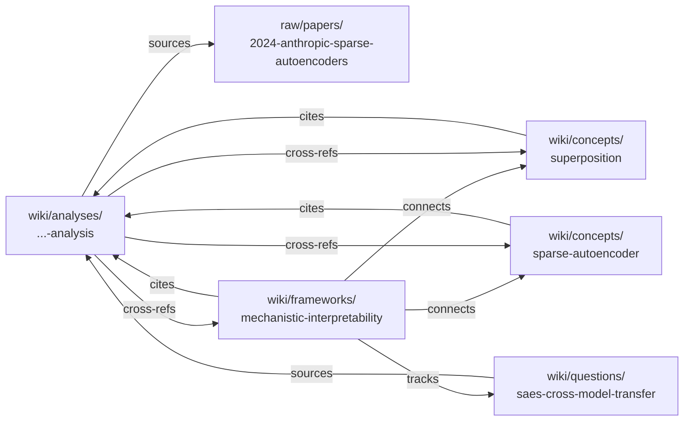

# Examples — what a populated wiki looks like

This page is the guided tour of the demo content shipped with the
template. Browse it before you start your own vault so you have a
mental picture of what the LLM agent will produce after a few ingests.

> **For "which of these demos do I keep / delete / adopt?"** see
> [`EXAMPLE-DOMAINS.md`](EXAMPLE-DOMAINS.md). This page is the *what
> it looks like* tour; that page is the *what to do with it* matrix.

## At a glance — three shipped worked examples

| Domain | Density | Anchor arc | Where to look first |
| --- | --- | --- | --- |
| [`research-papers`](../domains/research-papers/) | **Light** (6 page types) | 4-paper LLM-tutoring causal-evidence arc (2024-2025) | [`wiki/syntheses/how-to-read-this-domain.md`](../domains/research-papers/wiki/syntheses/how-to-read-this-domain.md) |
| [`workspace`](../domains/workspace/) | Medium (8 page types) | Q2 platform-migration decision arc | [`index.md`](../domains/workspace/index.md) |
| [`psychology`](../domains/psychology/) | **Heavy** (11 page types) | 6-week father-grief therapy + psychiatry arc | [`wiki/syntheses/how-to-read-this-domain.md`](../domains/psychology/wiki/syntheses/how-to-read-this-domain.md) |

All three domains ship with synthesised raw content — clearly labelled
as such inside each raw file. **None of the people, conversations,
medical records, or session transcripts are real.** They exist so you
can see what a populated wiki looks like before adopting the template.

---

## Detailed tour — `research-papers` (start here)

A **lightweight L2** (6 page types, one ingest flow, one lint rule).
The most common adoption path: keep this domain, replace the raws
with your own papers, leave the schema alone.

The domain ships **two source-flavours side-by-side**: three real
LLM-tutoring RCTs (Vanzo 2024, Bastani 2024, Kestin 2025 — extracted
from arXiv / PNAS / Nature SR) and one fully synthesised stand-in
(2024 Anthropic sparse-autoencoders). The split is deliberate — real
papers prove the wiki works on actual primary sources; the synthesised
paper lets us show the full ingest → analysis → concept → framework →
question chain on a single self-contained example.

### The single-paper chain (synthesised SAE example)

| File                                                                                                                | Why it's interesting                                                          |
| ------------------------------------------------------------------------------------------------------------------- | ----------------------------------------------------------------------------- |
| [`domains/research-papers/AGENTS.md`](../domains/research-papers/AGENTS.md)                                         | The L2 schema — persona, folder layout, page types, frontmatter, lint rules.  |
| [`domains/research-papers/index.md`](../domains/research-papers/index.md)                                           | The auto-refreshing Dataview index — what a domain's entry page looks like.   |
| [`domains/research-papers/raw/papers/2024-anthropic-sparse-autoencoders.md`](../domains/research-papers/raw/papers/2024-anthropic-sparse-autoencoders.md) | A *synthesised stand-in* for a real paper. Demonstrates raw layout.           |
| [`domains/research-papers/wiki/analyses/2024-anthropic-sparse-autoencoders-analysis.md`](../domains/research-papers/wiki/analyses/2024-anthropic-sparse-autoencoders-analysis.md) | A canonical 1:1 analysis — claim, method, evidence, limits, open questions, cross-refs. |
| [`domains/research-papers/wiki/concepts/superposition.md`](../domains/research-papers/wiki/concepts/superposition.md) | An evergreen concept page citing the analysis above as evidence.              |
| [`domains/research-papers/wiki/concepts/sparse-autoencoder.md`](../domains/research-papers/wiki/concepts/sparse-autoencoder.md) | A second concept page — shows how concepts cross-link each other.             |
| [`domains/research-papers/wiki/frameworks/mechanistic-interpretability.md`](../domains/research-papers/wiki/frameworks/mechanistic-interpretability.md) | A `type: framework` page surveying the research programme the analysis sits in. |
| [`domains/research-papers/wiki/questions/saes-cross-model-transfer.md`](../domains/research-papers/wiki/questions/saes-cross-model-transfer.md) | An open `type: question` — tracks evidence across multiple analyses over time. |

### The cross-paper synthesis (three real RCTs)

For what a multi-paper arc looks like, browse
[`domains/research-papers/wiki/syntheses/llm-tutoring-causal-evidence-2024-2025.md`](../domains/research-papers/wiki/syntheses/llm-tutoring-causal-evidence-2024-2025.md)
— it braids the Vanzo / Bastani / Kestin analyses into a single
evidence arc with shared open questions
([`llm-tutoring-cognitive-offload`](../domains/research-papers/wiki/questions/llm-tutoring-cognitive-offload.md),
[`llm-tutoring-equity-impact`](../domains/research-papers/wiki/questions/llm-tutoring-equity-impact.md)).
The [`how-to-read-this-domain`](../domains/research-papers/wiki/syntheses/how-to-read-this-domain.md)
synthesis is the 5-minute / 30-minute / 2-hour / half-day reading-path
navigator a newcomer-PhD would use.

The graph of links:



**Notice three properties of this graph that RAG-style storage cannot
give you:**

1. **Every wiki claim traces back to raw in ≤2 hops.** The analyser
   cites raw directly; second-order pages (concepts, frameworks,
   questions) cite the analysis. Lint flags chains longer than that.
2. **Concept pages are reused, not re-derived.** When the next paper
   on superposition arrives, the `superposition` concept page gets a
   new "Appearances" row; the page itself densifies rather than the
   wiki growing a new fragmented page.
3. **Open questions are first-class.** Instead of a TODO list buried
   in a single analysis, `saes-cross-model-transfer` lives in
   `wiki/questions/` and accumulates evidence rows over time.

---

---

## Detailed tour — `psychology` (heaviest example)

A **heavy L2** showing what the template can do once you push it. The
shipped worked example is a **synthesised 6-week father-grief arc**:
3 therapy sessions with Dr. Reyes + 1 psychiatry consult with Dr. Han
between 2026-04-02 and 2026-05-14, ingested into ~25 wiki pages
(analyses, patterns, themes, entities, concepts, frameworks, a
medication protocol, two long-running questions, three syntheses).
**All four raws and every clinician are fictional**; each raw file
opens with an explicit `<!-- SYNTHESISED worked-example raw — not a
real session -->` banner.

This domain exercises the L2 features other examples don't:
multi-source synthesis, ASR transcription correction, biopsychosocial
4P framing, IFS-style parts language, DSM-5-TR phenomenology mapping,
cross-clinical coordination (therapist + psychiatrist), and two
privacy postures (conservative / private-repo).

| File | Why it's interesting |
| --- | --- |
| [`domains/psychology/AGENTS.md`](../domains/psychology/AGENTS.md) | The L2 schema — read for the upper bound on L2 complexity. |
| [`domains/psychology/wiki/syntheses/how-to-read-this-domain.md`](../domains/psychology/wiki/syntheses/how-to-read-this-domain.md) | Three-audience navigator (clinician / client / evaluator) with reading paths. **Read this first** to evaluate the domain. |
| [`domains/psychology/wiki/syntheses/2026-05-14-six-week-retrospective.md`](../domains/psychology/wiki/syntheses/2026-05-14-six-week-retrospective.md) | Clinician-grade retrospective braiding all 4 analyses into one arc. |
| [`domains/psychology/wiki/syntheses/what-this-domain-demonstrates.md`](../domains/psychology/wiki/syntheses/what-this-domain-demonstrates.md) | Capability-demo: 10 schema features each with anchor-style proof pointing into specific wiki / raw locations. |
| [`domains/psychology/wiki/themes/father-grief-arc.md`](../domains/psychology/wiki/themes/father-grief-arc.md) | A `type: theme` page tracking arc evolution across 4 raws. |
| [`_system/prompts/domains/psychology-session-analysis.md`](../_system/prompts/domains/psychology-session-analysis.md) | The custom sub-prompt powering psychology analyses. |

> **If you adopt this domain for real therapy material**, read the L2's
> `Privacy posture` section first. The shipped example uses the relaxed
> `private-repo` posture; the **conservative** posture is the safer
> default for any wiki that might leave your machine.

---

## The medium-weight example — `workspace`

**[`workspace`](../domains/workspace/)** — Q2 platform-migration arc
with a planning meeting (2026-04-08), a microservices-split ADR
(2026-04-22), and an incident postmortem (2026-05-06). Demonstrates
the *cross-raw `pattern` page*
([`decision-delay-from-skipped-stakeholder`](../domains/workspace/wiki/patterns/decision-delay-from-skipped-stakeholder.md))
that surfaces only because the synthesis spans 3 raws — a single ADR
ingest would never catch it. The canonical `wiki/decisions/` page
([`microservices-split`](../domains/workspace/wiki/decisions/microservices-split.md))
sits distinct from both the raw ADR and the analysis-of-ADR — it is
the page the rest of the wiki cites when referring to "the
microservices split decision".

---

## What's *not* shipped as a demo

- **A populated `inbox/`.** The inbox flow is for un-routed material
  triage; see [`_system/prompts/process-inbox.md`](../_system/prompts/process-inbox.md).
- **A lint report.** Lint is meaningful only against a populated
  wiki at scale. After a few ingests of your own material, run
  `lint` and the report writes itself to
  `outputs/lint/<date>.md`.
- **A query trace.** Query output is highly answer-specific; we'd
  rather you generate one in your own wiki than read one we made up.

---

## Walkthrough: promoting a Q&A into a wiki synthesis

This walkthrough shows the five-step promote flow against a hypothetical
Q&A under `outputs/qa/`. Use it as the mental model for invoking
`promote` against your own Q&A archives.

### Starting state — the Q&A artifact

After `query "How do sparse autoencoders relate to superposition?"`,
the LLM filed:

`outputs/qa/2026-05-20-saes-vs-superposition.md` (excerpt):

```markdown
---
type: report
domain: research-papers
created: 2026-05-20
updated: 2026-05-20
sources: []
tags: [qa]
status: active
---

# How do sparse autoencoders relate to superposition?

## Question

How do SAEs relate to the superposition hypothesis — are they direct
implementations, partial probes, or something else?

## Sub-claims

1. Superposition predicts that features outnumber dimensions in a
   real model.
2. SAEs are an *attempted decoding* of that overcomplete basis.
3. Cross-model transfer remains open evidence.

## Answer

The [[superposition]] hypothesis claims that real models pack more
features than they have dimensions, using nonlinearity to disambiguate
overlapping representations. [[sparse-autoencoder]]s are an attempt to
*decode* that overcomplete basis: they learn an L1-sparse over-complete
dictionary against the model's activations. The Anthropic
[[2024-anthropic-sparse-autoencoders-analysis|2024 paper]] is the
canonical demonstration. Whether features transfer across model
families is still tracked as [[saes-cross-model-transfer]].

## Sources

- [[superposition]]
- [[sparse-autoencoder]]
- [[2024-anthropic-sparse-autoencoders-analysis]]
- [[saes-cross-model-transfer]]

## Issues to surface at next lint

- Spot-check: confirm the L1-coefficient figure (`λ = 5`) cited in
  [[2024-anthropic-sparse-autoencoders-analysis]] matches the raw
  paper §3.2.
```

A week later, you keep referring back to this answer when reading
new SAE papers. Time to promote.

### Step 1 — invoke and pick a target type

```
promote outputs/qa/2026-05-20-saes-vs-superposition.md --as synthesis
```

The LLM proposes `--slug saes-and-superposition` and shows a diff
preview before applying.

### Step 2 — pre-flight checks (all pass here)

- ✓ Source is in `outputs/qa/` and has `type: report`.
- ✓ `synthesis` is in the `research-papers` L2's allowed types.
- ✓ `saes-and-superposition` doesn't collide with any existing slug
  or alias.
- ✓ Body has 4 distinct `[[wikilinks]]` — well over `synthesis`'s
  ≥ 2 requirement.
- ✓ Target type `synthesis` needs no extra L2 fields beyond §3.1.

### Step 3 — information-shape transform

The LLM rewrites the file's content:

**Frontmatter — before → after:**

```diff
 ---
-type: report
+type: synthesis
 domain: research-papers
 created: 2026-05-20
 updated: 2026-05-20
-sources: []
-tags: [qa]
+sources:
+  - "[[superposition]]"
+  - "[[sparse-autoencoder]]"
+  - "[[2024-anthropic-sparse-autoencoders-analysis]]"
+  - "[[saes-cross-model-transfer]]"
+tags: [interpretability, synthesis]
+compiled_against: 1
 status: active
 ---
```

**Body — before → after (key diff):**

```diff
-# How do sparse autoencoders relate to superposition?
-
-## Question
-
-How do SAEs relate to the superposition hypothesis — are they direct
-implementations, partial probes, or something else?
-
-## Sub-claims
-
-1. Superposition predicts that features outnumber dimensions in a
-   real model.
-2. SAEs are an *attempted decoding* of that overcomplete basis.
-3. Cross-model transfer remains open evidence.
-
-## Answer
-
-The [[superposition]] hypothesis claims that real models pack more …
+# SAEs and superposition
+
+Sparse autoencoders are best understood as an *attempted decoding* of
+the overcomplete basis predicted by the [[superposition]] hypothesis.
+
+## Mechanism
+
+[[superposition]] claims that real models pack more features than they
+have dimensions, using nonlinearity to disambiguate overlapping
+representations. …
+
+## Evidence
+
+The Anthropic [[2024-anthropic-sparse-autoencoders-analysis]] is the
+canonical demonstration. …
+
+## Open questions
+
+Whether features transfer across model families is still tracked as
+[[saes-cross-model-transfer]].
```

The "Issues to surface at next lint" section does **not** copy into
the new wiki page — instead, the LLM appends it to today's
`outputs/lint/2026-05-20.md` under "Human-review queue".

### Step 4 — single commit

```
git mv outputs/qa/2026-05-20-saes-vs-superposition.md \
       domains/research-papers/wiki/syntheses/saes-and-superposition.md
git add outputs/lint/2026-05-20.md
git add domains/research-papers/log.md log.md
git commit -m "promote: saes-and-superposition ← 2026-05-20-saes-vs-superposition"
```

Both logs prepend (newest first):

```markdown
## [2026-05-20] promote | How do sparse autoencoders relate to superposition?
- From: outputs/qa/2026-05-20-saes-vs-superposition.md
- To: [[saes-and-superposition]]
- Type: synthesis
- Sources: 4 wiki (incl. 1 analysis) + 0 raw
- Reason: referenced from 3 follow-up reading sessions; claim has stabilised.
```

### Step 5 — verify history is preserved

```bash
$ git log --follow domains/research-papers/wiki/syntheses/saes-and-superposition.md
commit ab12cd3 promote: saes-and-superposition ← 2026-05-20-saes-vs-superposition
commit ef45gh6 query: how do sparse autoencoders relate to superposition?
```

The Q&A's full creation lineage is intact. If you later `git revert
ab12cd3`, the file restores to its Q&A form under `outputs/qa/` and
the new wiki page disappears — one-command rollback.

### When pre-flight rejects

If the Q&A had only cited 1 raw file inline, `promote --as synthesis`
would have aborted:

```
promote: pre-flight failed.
  synthesis requires sources ≥ 2 (per AGENTS.md §3.1).
  Your Q&A body contains 1 distinct [[wikilink]]: [[superposition]].
  Suggested fixes:
    - add another inline citation to the Q&A and re-run promote, or
    - re-target with `--as concept` (cardinality ≥ 0 allowed for evergreen concepts).
  No files were modified.
```

That's the load-bearing pattern: pre-flight rejects cheap, the wiki
never sees malformed pages.

---

## When you've outgrown the examples

Two signals:

1. Your domain has stabilised on 3+ page types beyond what any single
   shipped example uses (e.g. you're now also tracking `experiment`
   and `decision` pages alongside concepts and analyses). Time to
   read the *full* L1 schema at [`AGENTS.md`](../AGENTS.md) §3 and
   pick the types you need.
2. You're hand-editing more than ~10% of what the LLM produces.
   That's a signal the L2 persona or schema is misaligned with the
   material; revisit `domains/<X>/AGENTS.md` rather than fight the
   output.

Open a [`domain-design-help`](../.github/ISSUE_TEMPLATE/domain-design-help.md)
issue if you want a second pair of eyes on either signal.
