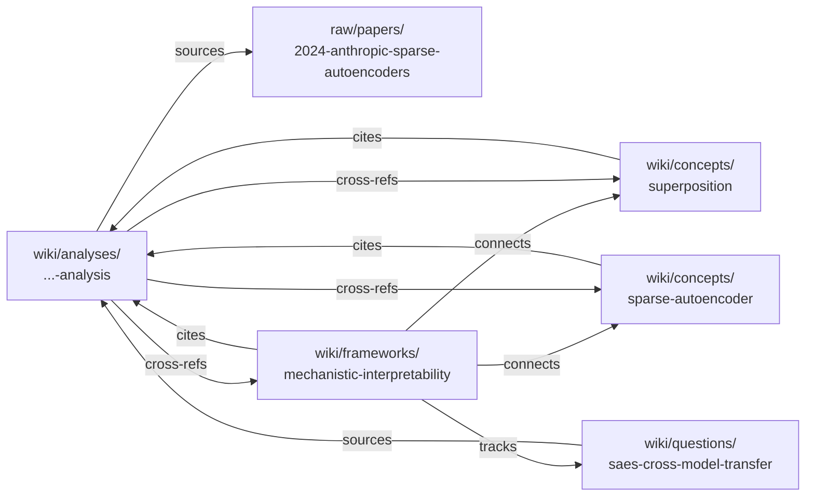

# Examples — what a populated wiki looks like

Browse this before you start your own vault so you have a mental
picture of what the LLM agent will produce after a few ingests.

> **For "which of these demos do I keep / delete / adopt?"** see
> [`EXAMPLE-DOMAINS.md`](EXAMPLE-DOMAINS.md). This page is the
> *what it looks like* tour; that page is the *what to do with it*
> matrix.

## 🧪 At a glance — three shipped worked examples

| Domain | Density | Anchor arc | Where to look first |
| --- | --- | --- | --- |
| [`research-papers`](../domains/research-papers/) | **Light** (6 page types) | 5-paper LLM-tutoring evidence arc (2024-2025) | [`wiki/syntheses/how-to-read-this-domain.md`](../domains/research-papers/wiki/syntheses/how-to-read-this-domain.md) |
| [`workspace`](../domains/workspace/) | Medium (8 page types) | Q2 platform-migration decision arc + positive-pattern retrospective | [`index.md`](../domains/workspace/index.md) |
| [`psychology`](../domains/psychology/) | **Heavy** (11 page types) | 6-week father-grief therapy + psychiatry arc | [`wiki/syntheses/how-to-read-psychology-domain.md`](../domains/psychology/wiki/syntheses/how-to-read-psychology-domain.md) |

The papers in `research-papers/` are *real* primary sources — clipped
from arXiv / PNAS / Nature SR. Everything else is *synthesised* and
clearly labelled as such inside each raw file. **None of the people,
conversations, medical records, or session transcripts are real.**
They exist so you can see what a populated wiki looks like before
adopting the template.

---

## 📄 Detailed tour — `research-papers` (start here)

A **lightweight L2** (6 page types, one ingest flow, one lint rule).
The most common adoption path: keep this domain, replace the raws with
your own papers, leave the schema alone.

The domain ships **two source-flavours side-by-side**: four real
LLM-tutoring sources (Vanzo 2024 GPT-4 homework tutoring, Bastani 2024
guardrails PNAS, Kestin 2025 active-learning Harvard, Kim 2025 ChatGPT
education review — extracted from arXiv / PNAS / Nature SR / TKL) and
one fully synthesised stand-in (2024 Anthropic sparse-autoencoders).
Real papers prove the wiki works on actual primary sources; the
synthesised paper lets us show the full ingest → analysis → concept
→ framework → question chain on a single self-contained example.

### The single-paper chain (synthesised SAE example)

| File | Why it's interesting |
| --- | --- |
| [`AGENTS.md`](../domains/research-papers/AGENTS.md) | The L2 schema — persona, layout, page types, frontmatter, lint rules. |
| [`raw/papers/2024-anthropic-sparse-autoencoders.md`](../domains/research-papers/raw/papers/2024-anthropic-sparse-autoencoders.md) | A *synthesised stand-in* for a real paper. Demonstrates raw layout. |
| [`wiki/analyses/2024-anthropic-sparse-autoencoders-analysis.md`](../domains/research-papers/wiki/analyses/2024-anthropic-sparse-autoencoders-analysis.md) | A canonical 1:1 analysis — claim, method, evidence, limits, open questions, cross-refs. |
| [`wiki/concepts/superposition.md`](../domains/research-papers/wiki/concepts/superposition.md), [`sparse-autoencoder.md`](../domains/research-papers/wiki/concepts/sparse-autoencoder.md) | Two evergreen concept pages citing the analysis and each other. |
| [`wiki/frameworks/mechanistic-interpretability.md`](../domains/research-papers/wiki/frameworks/mechanistic-interpretability.md) | A `type: framework` page surveying the research programme. |
| [`wiki/questions/saes-cross-model-transfer.md`](../domains/research-papers/wiki/questions/saes-cross-model-transfer.md) | An open `type: question` — tracks evidence across multiple analyses over time. |

### The cross-paper synthesis (real RCTs + review)

For what a multi-paper arc looks like, browse
[`wiki/syntheses/llm-tutoring-causal-evidence-2024-2025.md`](../domains/research-papers/wiki/syntheses/llm-tutoring-causal-evidence-2024-2025.md)
— it braids the Vanzo / Bastani / Kestin analyses into one evidence
arc, then layers the Kim 2025 review on top, with shared open
questions
([`llm-tutoring-cognitive-offload`](../domains/research-papers/wiki/questions/llm-tutoring-cognitive-offload.md),
[`llm-tutoring-equity-impact`](../domains/research-papers/wiki/questions/llm-tutoring-equity-impact.md)).
The [`how-to-read-this-domain`](../domains/research-papers/wiki/syntheses/how-to-read-this-domain.md)
synthesis is the 5-min / 30-min / 2-hr / half-day reading-path
navigator a newcomer-PhD would use.

The graph of links:

Three properties of this graph that RAG-style storage can't give you:

1. **Every wiki claim traces back to raw in ≤ 2 hops.** The analysis
   cites raw directly; second-order pages (concepts, frameworks,
   questions) cite the analysis. Lint flags chains longer than that.
2. **Concept pages are reused, not re-derived.** When the next paper
   on superposition arrives, the `superposition` concept page gets a
   new "Appearances" row; the page densifies rather than fragmenting
   into a new page.
3. **Open questions are first-class.** Instead of a TODO list buried
   in a single analysis, `saes-cross-model-transfer` lives in
   `wiki/questions/` and accumulates evidence rows over time.

---

## 🏢 `workspace` — medium-weight, multi-stakeholder

[`workspace`](../domains/workspace/) — Q2 platform-migration arc with
a planning meeting (2026-04-08), a microservices-split ADR
(2026-04-22), and an incident postmortem (2026-05-06). The
load-bearing demo is the *cross-raw `pattern` page*
([`decision-delay-from-skipped-stakeholder`](../domains/workspace/wiki/patterns/decision-delay-from-skipped-stakeholder.md))
that surfaces only because the synthesis spans 3 raws — a single ADR
ingest would never catch it. The canonical `wiki/decisions/` page
([`microservices-split`](../domains/workspace/wiki/decisions/microservices-split.md))
sits distinct from both the raw ADR and the analysis-of-ADR — it's
what the rest of the wiki cites when referring to "the microservices
split decision".

---

## 🩺 Detailed tour — `psychology` (heaviest example)

A **heavy L2** showing what the template can do once pushed. The
shipped example is a synthesised 6-week father-grief arc: **4 therapy
sessions with Dr. Reyes + 1 psychiatry consult with Dr. Han** between
2026-04-02 and 2026-05-14, ingested into **25 wiki pages**
(5 analyses, 3 patterns, 2 themes, 4 concepts, 3 entities, 2
frameworks, 1 medication protocol, 2 long-running questions, 3
syntheses). **All five raws and every clinician are fictional**; each
raw file opens with an explicit `<!-- SYNTHESISED worked-example raw —
not a real session -->` banner.

This domain exercises features the other examples don't: multi-source
synthesis, ASR transcription correction, biopsychosocial 4P framing,
IFS-style parts language, DSM-5-TR phenomenology mapping, cross-clinical
coordination (therapist + psychiatrist), and two privacy postures
(conservative / private-repo).

| File | Why it's interesting |
| --- | --- |
| [`AGENTS.md`](../domains/psychology/AGENTS.md) | The L2 schema — read for the upper bound on L2 complexity. |
| [`wiki/syntheses/how-to-read-psychology-domain.md`](../domains/psychology/wiki/syntheses/how-to-read-psychology-domain.md) | Three-audience navigator (clinician / client / evaluator). **Read this first** to evaluate the domain. |
| [`wiki/syntheses/2026-05-14-six-week-retrospective.md`](../domains/psychology/wiki/syntheses/2026-05-14-six-week-retrospective.md) | Clinician-grade retrospective braiding all 4 analyses into one arc. |
| [`wiki/syntheses/what-this-domain-demonstrates.md`](../domains/psychology/wiki/syntheses/what-this-domain-demonstrates.md) | Capability-demo: 10 schema features, each with anchor-style proof pointing into specific wiki / raw locations. |
| [`wiki/themes/father-grief-arc.md`](../domains/psychology/wiki/themes/father-grief-arc.md) | A `type: theme` page tracking arc evolution across 4 raws. |
| [`_system/prompts/domains/psychology-session-analysis.md`](../_system/prompts/domains/psychology-session-analysis.md) | The custom sub-prompt powering psychology analyses. |

> **If you adopt this domain for real therapy material,** read the
> L2's `Privacy posture` section first. The shipped example uses the
> relaxed `private-repo` posture; the **conservative** posture is the
> safer default for any wiki that might leave your machine.

---

## 🚫 What's *not* shipped as a demo

- **A populated `inbox/`.** The inbox flow is for un-routed material
  triage; see
  [`_system/prompts/process-inbox.md`](../_system/prompts/process-inbox.md).
- **A lint report.** Lint is meaningful only against a populated wiki
  at scale. After a few ingests, run `lint` and the report writes
  itself to `outputs/lint/<date>.md`.
- **A query trace.** Query output is highly answer-specific; we'd
  rather you generate one in your own wiki than read one we made up.
- **A worked `promote` walkthrough.** The procedure is documented
  step-by-step in
  [`_system/prompts/promote.md`](../_system/prompts/promote.md);
  reading a real Q&A → wiki diff against your own material teaches
  more than reading a fictional one.

---

## When you've outgrown the examples

Two signals:

1. Your domain has stabilised on 3+ page types beyond what any single
   shipped example uses (e.g. you now also track `experiment` and
   `decision` pages alongside concepts and analyses). Time to read
   the full L1 schema at [`AGENTS.md`](../AGENTS.md) §3 and pick the
   types you need.
2. You're hand-editing more than ~10% of what the LLM produces.
   That's a signal the L2 persona or schema is misaligned with the
   material; revisit `domains/<X>/AGENTS.md` rather than fight the
   output.

Open a [`domain-design-help`](../.github/ISSUE_TEMPLATE/domain-design-help.md)
issue if you want a second pair of eyes on either signal.
