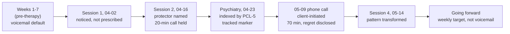

# Avoidant maternal-contact loop

> [!important] Pattern one-liner
> Behaviourally observable avoidance of phone contact with mother
> (Margaret) since the bereavement. The mechanism is **not**
> indifference; it is *system-protection* — the system being the
> set of daily routines maintained by [[inner-protector-stoic]].
> The pattern is the most clinically actionable per-week marker
> in this arc, and its loosening across sessions tracks the
> overall trajectory.

## Description

- **Pre-loss baseline**: regular phone contact (frequency
  unspecified; implied weekly or more often).
- **Post-loss state (weeks 1-7)**: mother is the *primary caller*;
  client *lets voicemail catch* most calls; tells himself he'll
  call back; doesn't. The avoidance is **specifically
  inbound-call avoidance**, not non-response — he calls back
  selectively.
- **Triggering scenario**: mother's crying / direct grief
  expression during call; client reports "I can hold it for the
  first three minutes and then it's like every muscle in my face
  is trying to be the right face and I can't"
  ([[2026-04-02-session-reyes#^[17:22]]]).
- **Post-call consequence**: client "wrecked for the rest of the
  day"; this consequence functions as **reinforcement** of the
  avoidance.

## Why the pattern self-maintains (mechanism)

- **Protector function** ([[ifs]] / [[inner-protector-stoic]]):
  the foreman's job is "keep Mark running"; an hour-long crying
  call breaks the running. The protector reads this as an
  acceptable trade: small interpersonal cost (mom upset) for
  large systemic gain (system preserved).
- **Attachment substrate**: the dismissing-attachment pattern in
  Mark's working model (inherited from the paternal lineage's
  emotional-containment style) limits his bandwidth to
  *co-regulate* affect with a distressed attachment figure.
  Calls with mother require co-regulation that he does not
  feel he has capacity for.
- **Reinforcement loop**: each avoided call → relief in the
  short term → guilt + cumulative tension in the long term →
  rationalisation ("I'll call tonight") → another avoided call.
  Classic operant pattern.
- **Partner-system interaction**: Sarah's gentle prompting
  ("have you called your mom?") is met with "tonight"
  responses; the avoidance is shielded from explicit partner
  confrontation by social-fluency cover.

## Instances

| Date | Session | Pattern state | Source |
| --- | --- | --- | --- |
| 2026-04-02 | Session 1 (Reyes) | **Heavy.** "I haven't called her in like ten days. She calls me, I let it go to voicemail and I tell myself I'll call back tonight, and then I, um. I don't." Reyes asks the client only to *notice* what happens in his body when he thinks about calling — no behavioural prescription. | [[2026-04-02-session-reyes#^[17:22]]] |
| 2026-04-16 | Session 2 (Reyes) | **First partial breach.** Client picked up Saturday call (20 min); held; decompressed for an hour afterwards. Reyes names this as "the foreman doing his job *and* letting twenty minutes through." The avoidance pattern is not broken but the protector has shown it can permit a contained breach. | [[2026-04-16-session-reyes#^[26:30]]] |
| 2026-04-23 | Psychiatry consult (Han) | **Indexed by PCL-5 = 28** with avoidance cluster dominant; Han names this as "the per-week marker" and the **12-week SSRI-decision criterion** (avoidance softening = trajectory away from PGD consolidation). Pattern self-described to Han identically to Reyes account; no contradiction. | [[2026-04-23-psychiatry-han#^[22:30]]] |
| 2026-05-14 | Session 4 (Reyes) | **Major shift.** Client **initiates** the call on 2026-05-09 (mother had not called first); 70-minute call; disclosed the fight with father, received reframe via mother's recollection (father was working toward repair). Pattern transformed from voicemail-default to client-initiated weekly cadence Reyes asks for going forward. | [[2026-05-14-session-reyes#^[02:48]]], [[2026-05-14-session-reyes#^[12:14]]] |

## Trajectory across the arc

## What released the pattern

Convergent — no single intervention "caused" the shift. The
session-4 client articulation explicitly names a chain
([[2026-05-14-session-reyes#^[12:14]]]):

1. **Somatic anchoring** in session 2 — chest band articulated;
   first Exile contact.
2. **Chair-work with the foreman** in session 3 (2026-04-30, not
   in this worked-example raw set) — protector dialogued with.
3. **Han's structural validation** — "the way you're working is
   correct" implicitly endorsed by the medication-deferral
   stance.
4. **Theo's drawing** Saturday morning (5:30 a.m.) — concrete
   external trigger; the "third figure in the family picture"
   reorganised the meaning of the avoidance.

The pattern is not a will-power problem; it is a system-state
problem. The shift required the system to have enough
cumulative evidence that the call would not break the system.

## Open question

This pattern was the primary anchor that motivated the
question page [[can-grief-be-spoken-with-mother]]. After
session 4 that question is *partially answered*; whether the
new contact cadence stabilises across the next 3-6 months is
the unresolved sub-question.

## Cross-references

- [[inner-protector-stoic]] — the part maintaining the pattern
  pre-shift and re-deploying through it post-shift.
- [[ifs]] — protector framework.
- [[complicated-grief]] — the construct for which this pattern is
  the dominant risk-factor marker in this arc.
- [[father-grief-arc]] — the theme in which this pattern is the
  most-tracked per-week variable.
- [[medication-decision-arc]] — Han's medication decision is
  partially keyed to this pattern's trajectory.
- [[can-grief-be-spoken-with-mother]] — the question this pattern
  generates and partially answers.
