# Six-week retrospective — the father-grief arc (2026-04-02 → 2026-05-14)

> [!important] For the clinician (30-second read)
> A bereavement case at six weeks of therapy: PHQ-9 = 14 unchanged
> on scale at psychiatry, but **all three behavioural marker
> patterns shifted** and the **IFS Manager part re-deployed
> rather than being overridden**. Trajectory away from
> [[complicated-grief]] / PGD consolidation, not because the
> grief is "done" but because the *avoidance cluster* — the
> per-week marker Han identified — has materially loosened.
> Zero medication initiated to date; conservative-prescribing
> stance vindicated by the in-room work landing.

> [!faq]- For the client (if you are Mark, what you might
> notice reading this)
> This is the doctor-to-doctor version of what's happened with
> you across six weeks. Read it if you want to see the case the
> way Dr. Reyes and Dr. Han would describe it to a colleague.
> The headline: you've done real work, the work is showing in
> the patterns that matter (calling Mom, telling Sarah, the
> chest band loosening), and the work is *just beginning the
> integrative phase* — not finished. Sunday-and-Monday-after-
> turning-point feeling worse is normal. The next 3-6 months are
> where integration happens. Pace is not a failure; pace is the
> point.

> [!faq]- For the open-source evaluator
> This synthesis is the **clinical-grade entry point** for the
> worked example. It demonstrates: (a) four-analysis ledger
> compounding (each analysis cited via wikilink, never
> re-paraphrased), (b) cross-clinical boundary maintained
> (psychiatry contribution kept distinct from therapy
> contribution), (c) outcome-tracking via a clearly-named
> per-week marker rather than via subjective progress claims,
> (d) trajectory framing (not "the case is going well" but "the
> trajectory is away from PGD consolidation").
> See [[what-this-domain-demonstrates]] for the explicit
> capability-list with anchors back into this synthesis.

## Arc at a glance

```mermaid
flowchart LR
    F["Father dies<br/>2026-02-04<br/>(week 0)"]
    F --> L["Logistics phase<br/>weeks 1-4<br/>functional, no contact with care"]
    L --> S["Symptom emergence<br/>weeks 3-7<br/>3:40 wakings<br/>chest band<br/>two-of-me"]
    S --> P["PCP route<br/>~week 7<br/>PHQ-9=14<br/>cardiac negative"]
    P --> T1["Session 1, Reyes<br/>2026-04-02 (wk 8)<br/>three-layer formulation"]
    T1 --> T2["Session 2, Reyes<br/>2026-04-16 (wk 10)<br/>IFS frame in<br/>foreman named<br/>cottage-cheese contact ~60s"]
    T2 --> H1["Psychiatry, Han<br/>2026-04-23 (wk 11)<br/>scales baseline<br/>no medication<br/>decisions deferred"]
    H1 --> T3["Session 3, Reyes<br/>2026-04-30 (wk 12)<br/>chair-work with foreman"]
    T3 --> M["Mother phone call<br/>2026-05-09 (wk 13)<br/>TURNING POINT<br/>guilt-charge lifted"]
    M --> T4["Session 4, Reyes<br/>2026-05-14 (wk 14)<br/>partial unburdening<br/>meaning-reconstruction"]
    T4 --> O["Open — integrative phase<br/>wk 14 onward"]
```

## The case at six weeks

A 41-year-old engineering manager presents at 8 weeks
post-bereavement with the classic
[[masked-depression]] / [[complicated-grief]] risk-cluster:

- **Sudden cardiac death of father** (no warning, no
  anticipated-grief preparation).
- **Unresolved pre-death conflict** producing a regret-loop
  ([[2026-04-02-session-reyes]] [07:14]).
- **Sustained somatic anchor** in upper chest / lower throat,
  not cardiac (PCP work-up negative).
- **Maintenance insomnia** at 3:40 a.m. every night, ~6/7
  nights, eight-week duration by session 1.
- **Avoidance-cluster behaviour** — refusing maternal calls,
  emotionally limited disclosure with partner
  ([[2026-04-02-session-reyes]] [17:22]).
- **Multi-generational paternal-lineage emotional-containment
  substrate** — the predisposing layer that makes the case
  high-risk for PGD trajectory ([[2026-04-02-session-reyes]] [07:14]).
- **PHQ-9 = 14** at both PCP and psychiatry consult; **PCL-5 =
  28** sub-threshold avoidance-cluster dominant; **GAD-7 = 9**;
  **DES-II brief WNL** ([[2026-04-23-psychiatry-han]] [14:00]).

All four [[complicated-grief]] PGD risk-trajectory markers
present at 11 weeks: sudden loss + unresolved thread + early
avoidance cluster + emotional-containment style.

## What changed across six weeks (pattern / theme / concept delta)

The clinically actionable view of the arc is **not** the PHQ-9
score (unchanged at 14 between PCP screen and 04-23
psychiatry consult; not re-measured by 05-14). The actionable
view is the per-pattern, per-theme, per-concept deltas captured
in the wiki side-effects of each ingest. Compounded across
four ingests:

| Variable | Session 1 (04-02) | Session 4 (05-14) | Delta | Anchor |
| --- | --- | --- | --- | --- |
| [[avoidant-mother-contact]] | Voicemail-default; 10+ day gap | Client-initiated 70-min call; weekly target | **Transformed** | [[2026-05-14-session-reyes]] [02:48] |
| [[somatic-grief-containment]] | "Hand closing around the bottom of my throat" — constant | "Foreman sitting on a bucket" — loosest in months | **Materially softer** | [[2026-05-14-session-reyes]] [06:30] |
| [[automaton-work-mode]] | Two-of-me at work; cost paid at home | Same at work; home-side breach with Sarah | Partial loosening at home | [[2026-05-14-session-reyes]] [12:14] |
| [[inner-protector-stoic]] | Visible only by inference, un-named | Re-deployed unprompted — *"the foreman dialled. He just dialled with new information"* | **Job-redesign** | [[2026-05-14-session-reyes]] [12:14] |
| Guilt-charge fused to grief | Dominant; "regretting something I was constitutionally incapable of doing" | Lifted; "we were both walking toward each other and the road ended early" | **Resolved (specific charge)** | [[2026-05-14-session-reyes]] [06:30] |
| Self-frame vocabulary | "I'm depressed in the can't-feel-anything way" | "Grief is love with no place to go" + own generation re: Theo | **Vocabulary expanded** | [[2026-05-14-session-reyes]] [24:00], [[2026-05-14-session-reyes]] [30:08] |
| Sleep (3:40 a.m. waking) | 6/7 nights, 8-week duration | Slight loosening; one ~5:50 wake, two drift-back-to-sleep | Beginning to shift | [[2026-05-14-session-reyes]] [16:42] |
| PCL-5 avoidance cluster | n/a (first measured at 04-23) | n/a (not re-measured by 05-14) | Pending re-measurement | — |

The most clinically informative cell is the
[[inner-protector-stoic]] row. The Manager part is not being
**overridden** by the work — that would be a fragile change.
The Manager part is being **re-deployed** with new
information, retaining the day-running function while
releasing the specific grief-containment + regret-holding
sub-function. Re-deployment is the IFS-evidence-base marker
for sustained change.

## How the turning point happened

The 2026-05-09 phone call with Mark's mother is the arc's
turning point in the strict sense — the date after which the
patterns above measurably shift. But describing the turning
point as caused by the phone call would be reductive. The
client's own session-4 articulation is the most accurate
clinical account:

The phone call became possible because the **system had
accumulated enough evidence** that the call would not break
the system. Three classes of evidence over the prior six weeks:

1. **Process-work evidence inside therapy**. Sessions 2 (IFS
   frame in, cottage-cheese ~60s Exile contact) and 3
   ([[2026-04-30-session-reyes]] — chair-work with the foreman)
   demonstrated to the Manager part — directly — that
   permitting brief affect contact in the right room did *not*
   destabilise the system. The Manager part is the audience
   for this evidence; the client's "watching self" is the
   Manager part.
2. **Structural validation from psychiatry**. Han's
   medication-deferral conversation
   ([[2026-04-23-psychiatry-han]] [22:30]) implicitly
   communicated *"the way you are working is correct."* The
   protector heard a doctor in a white coat endorse the
   route. This is a structural intervention on the Manager
   part's confidence, not a process-work intervention.
3. **A proximal cue with informational content**. Theo's
   drawing on Saturday morning ([[2026-05-14-session-reyes]] [02:48])
   placed the father into the family-pictures register at the
   *next* generation. The cue was not random; it carried
   forward-direction meaning that the cumulative process work
   had made the system ready to receive.

The mother's disclosure during the call (that the father had
been working toward repair) supplied the **external
information** that internal work alone could not generate.
Without this external information, the regret-loop's
guilt-charge would have been *contained* by ongoing protector
work but not *released*. The arc demonstrates the limits of
purely intrapsychic work in cases where the regret-loop turns
on factual information the client does not possess.

This is the structural insight worth sitting with: **the
intrapsychic work made the client capable of receiving
information that would otherwise have re-triggered the
avoidance loop**. The information was available the entire
time (the mother had been holding it); the receiving capacity
was not.

## Cross-clinical coordination

Six weeks have produced one psychiatry consult, four therapy
sessions ([[2026-04-02-session-reyes]],
[[2026-04-16-session-reyes]], [[2026-04-30-session-reyes]],
[[2026-05-14-session-reyes]]), zero medications.
The coordination practice across this period:

- **Reyes routes Mark to Han early.** First-session signposting
  of the 04-23 psychiatry consult
  ([[2026-04-02-session-reyes]] [12:08]) sets up the
  medication conversation as a *separate channel*, not a
  competing one.
- **Han references Reyes's framing.** The foreman / IFS work
  is named in Han's session as positive prognostic indicator
  ([[2026-04-23-psychiatry-han]] [33:18]) without Han doing
  process work himself.
- **Reyes asks Mark to relay session content to Han.** The
  session-2 cottage-cheese work is explicitly routed to the
  next psychiatry session
  ([[2026-04-16-session-reyes]] [26:30]) so Han's
  medication-decision-making has the data.
- **Han routes process material back to Reyes.** Reciprocal —
  Han mentions to Mark that the cottage-cheese work should be
  taken back to Reyes, not worked through in psychiatry
  ([[2026-04-23-psychiatry-han]] [33:18]).
- **Pre-scheduled decision points.** Han names the
  trazodone-decision date (2026-05-07) and the SSRI-review
  date (mid-July, ~12-week post-loss) **in writing in chart**
  with the avoidance-cluster-loosening marker for the latter.
  This is decision-architecture, not improvisation; it makes
  the decisions audit-able in advance.

The arc is a clean example of what good integrative-grief
coordination looks like in the absence of a single combined-
psychiatrist-therapist provider. The architectural cost is two
clinician relationships, two scheduling burdens, two
billing-paths; the architectural benefit is two channels of
clinical attention with strictly maintained boundaries.

## What's still open at six weeks

This is **not a closed arc.** Integrative-phase work has begun;
multi-month follow-through is required. The specific open
threads:

- **Sustained behavioural change in maternal-contact pattern.**
  One 70-minute call does not constitute pattern resolution.
  The 3-6-month follow-on cadence is the indicator that
  matters for the mid-July SSRI decision. See
  [[avoidant-mother-contact#open-question]].
- **Holding the mother's grief**, not just speaking his own
  grief to her. The 2026-05-09 call was largely Mark
  *speaking-into-distress*. Sustained capacity to hold his
  mother's grief over multiple calls is the next attachment-
  layer update. See [[can-grief-be-spoken-with-mother]].
- **Continuing-bond practice**. Reyes offered three options
  (walk, letter, truck-conversation); client to choose one,
  none, or another. The choice itself is informative —
  whichever Mark picks (or doesn't) tells the next session
  what register the integration is consolidating in.
- **The Theo conversation.** Asking Theo about the drawings.
  Pending.
- **The medication question.** Two decision points pending —
  trazodone on 2026-05-21 (rescheduled from 05-07), SSRI in
  mid-July with the avoidance-cluster marker.
- **Work-mode loosening.** Deliberately not the focal target;
  expected to attenuate as side effect of home-relational
  integration. If at 12-month post-loss the work-mode
  intensity is unchanged, that's an indication to take it up
  directly. See [[automaton-work-mode]].
- **PHQ-9 / PCL-5 re-measurement** at 05-21 psychiatry session
  (pending in this worked example). The behavioural markers
  shifted ahead of self-report scales is the expected
  sequencing; whether scales catch up over the next two
  measurements is data worth having.

## What the arc would look like if it stalled

For epistemic clarity, the *stall trajectory* — the case this
arc is *not* on — would be characterised by:

- Avoidance-cluster persistence past 6 months post-loss
  (i.e. PCL-5 still ~28, mother-contact still voicemail-default,
  partner-distance unresolved).
- Somatic-band intensity unchanged or worsened.
- IFS Manager part either *unaddressable* (refusing the
  framing) or *over-ridden* (a Firefighter taking over;
  e.g. substance escalation, work-dropout, dissociation).
- Sleep deterioration (under 4h / night sustained).
- Self-frame consolidation into an identity-disruption narrative
  ("part of me died with him" as a sustained belief, not as a
  passing description).

The arc's trajectory away from these markers is the basis for
the "trajectory away from PGD consolidation" claim — it is a
*prediction* about the next 3-6 months, not a closed result.
The 6-month re-evaluation is the moment to check the
prediction.

## Sources

- [[2026-04-02-session-reyes-analysis]] — intake formulation.
- [[2026-04-16-session-reyes-analysis]] — IFS frame
  introduction; first Exile contact.
- [[2026-04-23-psychiatry-han-analysis]] — scales baseline,
  conservative-prescribing rationale, cross-clinical boundary
  statement.
- [[2026-05-14-session-reyes-analysis]] — turning point;
  partial unburdening; meaning-reconstruction.
- [[father-grief-arc]] — theme-level arc page.
- [[medication-decision-arc]] — the parallel medication arc.

For the navigator-style entry to this arc, see
[[how-to-read-psychology-domain|psychology reading guide]].
For the explicit capability list, see
[[what-this-domain-demonstrates]].
