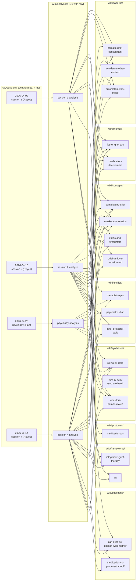

# How to read this domain — a navigator for three audiences

> [!important] If you remember one thing
> This domain is a **worked example**, not a real clinical record.
> The four raw sessions are *synthesised* (HTML-comment banner at
> the top of each raw file declares this). The schema, prompts,
> and wiki side-effects are production-grade. Read this page first
> if you arrived at the domain via curiosity rather than via a
> specific question; pick one of the three reading paths below
> based on **who you are** and **how much time you have**.

This domain is structured so three different readers can extract
maximum value: a **clinician** evaluating whether the schema
produces clinically-useful synthesis; a **client** (here,
hypothetically Mark Eldridge himself) reading his own case back;
and an **open-source evaluator** sizing up the wiki pattern for
their own adoption decision. The three paths are not
sequential — each is self-contained, but later paths build on
earlier ones if you read them in order.

## The map

Four raw sessions, four analyses, three patterns, two themes,
four concepts, two frameworks, three entities, one protocol,
two questions, three syntheses — **about 25 wiki pages from
four ingests**. The graph is what carries the cross-cutting
clinical signal a single session note cannot.

## The three reading paths

> [!faq]- Path C — Clinician (~20 minutes)
> *For a senior clinician evaluating whether the LLM-wiki
> pattern produces clinically-useful synthesis.*
>
> 1. **Read [[2026-05-14-six-week-retrospective]] in full**
>    (~8 min). This is the doctor-to-doctor entry point. It
>    cites every analysis, every pattern, every theme, every
>    concept it relies on; it does not re-paraphrase. Note
>    the trajectory framing (not "the case is going well"
>    but "the trajectory is away from PGD consolidation"
>    with the per-week marker named).
> 2. **Open one analysis end-to-end** —
>    [[2026-05-14-session-reyes-analysis]] is the densest
>    worked example (turning-point session, four lenses,
>    visible Stage-2 critique applied at end of file)
>    (~8 min). Notice that the body's lens-labelled
>    paragraphs match the frontmatter `analysis_lens`
>    exactly; that the diagnostic_signals list contains
>    only items with raw [HH:MM] anchors in body; that
>    `sources` has exactly one entry (the raw); that
>    the §"Wiki side-effects" checklist matches the actual
>    Appearances / Instances rows on the linked entity /
>    pattern / theme / concept pages.
> 3. **Spot-check the cross-clinical boundary** —
>    [[2026-04-23-psychiatry-han-analysis]] (~4 min). The
>    psychiatry analysis does *not* update pattern / theme /
>    IFS-Manager-part pages; only [[medication-arc]] +1 row
>    (mandatory), [[psychiatrist-han]] Appearances +1,
>    [[complicated-grief]] / [[masked-depression]] concept
>    instances. Compare to the therapy analyses' much
>    larger wiki side-effect footprint. The boundary is
>    architectural, not aspirational.
>
> **You now know**: how a multi-week, multi-clinician case
> compiles into ~25 wiki pages; how the schema enforces
> clinical conservatism (analysis-sources cardinality,
> diagnostic_signals raw-anchoring, cross-clinical
> boundary, Stage-2-critique-applied audit trail); and
> what the workflow looks like in practice. You have
> enough to decide whether to adopt the pattern for your
> own caseload.

> [!faq]- Path M — Client / Mark (~10 minutes)
> *Hypothetically: how would Mark himself read his own case
> back? Or: how would any client benefit from reading the
> wiki of their own arc?*
>
> 1. **Open one analysis at a time, slowly** — start with
>    [[2026-04-02-session-reyes-analysis]] (~3 min). The
>    three callouts at the top of each analysis (clinician /
>    client / evaluator) are designed so the client callout
>    is the natural entry point. Read it first. Then read
>    the TL;DR and the Key moments. The Working formulation
>    is in clinician voice; you can skim or skip it.
> 2. **Read the [[father-grief-arc]] theme page** (~3 min).
>    This is your case at theme-level, not session-level.
>    The What-changed-across-the-arc delta table is the
>    most concise account of what's shifted in six weeks.
>    The Turning point section names the 2026-05-09 phone
>    call with mother as the date around which the
>    patterns measurably changed.
> 3. **Open one concept page** —
>    [[grief-as-love-transformed]] (~3 min). This is the
>    Anderson / Neimeyer reframe Dr. Reyes named in
>    session 4. The concept page is short and is written
>    so you can read it without a clinical background.
>    The In-my-material section at the bottom links back
>    to the specific raw moments where the concept
>    showed up in your sessions.
>
> **You now know**: what your clinician's working
> formulation looks like across six weeks; the names for
> the patterns that have been operating in you; the
> reframe (grief as love transformed) Dr. Reyes offered
> in session 4. You don't need to read everything —
> the wiki is a reference, not a curriculum. Come back
> to it as questions arise.

> [!faq]- Path E — Open-source evaluator (~30 minutes)
> *For an engineer / clinician-developer / PKM hobbyist
> sizing up whether to adopt the LLM-wiki pattern, with
> psychology as the heavy-L2 demonstration.*
>
> 1. **Read [[what-this-domain-demonstrates]] in full**
>    (~10 min). It is the explicit capability list —
>    10 capabilities the worked example exercises, with
>    anchor-style proof for each. This is the page you
>    can quote in your own evaluation report.
> 2. **Read the L2 schema** at
>    [`domains/psychology/AGENTS.md`](../../AGENTS.md)
>    (~10 min). It is the production-grade L2 schema; the
>    worked example is what running the schema produces.
>    Pay particular attention to §"Required frontmatter
>    additions", §"Slug recognition rules", §"Privacy
>    posture" (the worked example uses the relaxed
>    private-repo posture; real clinical adopters MUST
>    re-evaluate per their own posture), and §"Domain-
>    specific lint rules".
> 3. **Read the v3 ingest sub-prompt** at
>    [`_system/prompts/domains/psychology-session-analysis.md`](../../../_system/prompts/domains/psychology-session-analysis.md)
>    (~5 min). The three-stage pipeline (Draft → Critique
>    → Revise) is the operational contract the analyses
>    are built under; you can see the `## Stage 2
>    critique applied` section at the bottom of each
>    analysis as the visible audit trail.
> 4. **Spot-check the validator** at
>    [`_system/densa/`](../../../_system/densa/)
>    (~5 min). The AGENTS001-AGENTS007 rule set is the
>    machine-enforced subset of the schema. Run
>    `python -m densa --all` against the worked
>    example to confirm the demonstration passes its own
>    enforcement.
>
> **You now know**: what the L2 ships, what the prompts
> demand, what the validator enforces, and what the
> output looks like end-to-end. You can decide whether to
> adopt the pattern (and which L2 to start with) with the
> evidence in front of you.

## How to extend this domain with your own real cases

This worked example uses the **private-repo (relaxed)
privacy posture** — verbatim quotes from raw allowed in
`wiki/analyses/` without strict line cap; first names + role
allowed; user's real name treated as `self`. **Before
ingesting real session material, re-read
[`domains/psychology/AGENTS.md`](../../AGENTS.md) §"Privacy
posture"** and either confirm the private-repo posture matches
your storage + sharing reality, or switch to the conservative
posture (paraphrase + ≤3 lines per quote, first-name + role,
encrypt `raw/` with `git-crypt`). The wrong-posture failure
mode (relaxed posture with a repo that gets pushed) is the
single highest-cost mistake possible in this L2.

Beyond posture, the standard ingest flow is documented in
[`domains/psychology/AGENTS.md`](../../AGENTS.md) §"Ingest
flow" and operationalised in
[`_system/prompts/domains/psychology-session-analysis.md`](../../../_system/prompts/domains/psychology-session-analysis.md).
The short version:

1. Drop the raw session under
   `domains/psychology/raw/sessions/<date>-session-<therapist-slug>.md`
   (or `<date>-psychiatry-<dr-slug>.md`).
2. Invoke `ingest domains/psychology/raw/sessions/<file>.md`.
3. The LLM produces one analysis (1:1 with raw), updates
   ~3-12 wiki side-effect pages (per session_kind +
   information density), prepends one entry each to the
   domain `log.md` and global `log.md`.
4. After every psychiatry ingest, the [[medication-arc]]
   protocol gets a row even if the substantive decision is
   "no change."

## What this domain does *not* try to do

To save you wandering paths that aren't here:

- **No formal diagnosis.** The schema's `diagnostic_signals`
  frontmatter field surfaces dimensions; it does not produce
  a DSM-5-TR coding. Coding stays with the licensed
  clinician. The schema specifically uses
  `[[possible-asd-features]]` over `[[asd]]` and tracks PGD
  *risk markers* before the DSM-5-TR 12-month gate can be
  cleared.
- **No therapy-by-LLM.** The LLM is the *bookkeeper of
  patterns* across clinician-led sessions. The clinical
  work happens with [[therapist-reyes]] /
  [[psychiatrist-han]] (or their real counterparts in an
  adopter's case), not in the wiki.
- **No automatic medication recommendations.** The
  [[medication-arc]] protocol logs decisions made by the
  prescribing clinician; the protocol does not generate
  recommendations.
- **No verbatim quoting from real session material in
  `wiki/syntheses/`.** Even under the relaxed posture,
  syntheses retain the ≤3-line soft cap per quoted excerpt,
  because syntheses braid material and long verbatim defeats
  the synthesis purpose. (The worked example honours this:
  this synthesis quotes raw at most 1-2 lines per anchor.)

## Where to go next

- **If you're a clinician**: [[2026-05-14-six-week-retrospective]]
  is the doctor-to-doctor entry point.
- **If you're a client (or imagining being one)**:
  [[father-grief-arc]] is the theme-level entry point;
  [[grief-as-love-transformed]] is the most accessible
  single concept page.
- **If you're an evaluator**: [[what-this-domain-demonstrates]]
  is the capability-list entry point; the L2 schema and
  v3 ingest prompt are the operational contracts behind it.
- **If you want the bigger architectural picture**:
  [[_system/MANUAL]] (the human-facing user manual) plus the
  L1 schema [`/AGENTS.md`](../../../AGENTS.md) tell you how
  the whole wiki pattern fits together; psychology is the
  heaviest L2 because it exercises the most surface area
  (privacy postures, ASR correction, biopsychosocial framing,
  cross-clinical boundary, multi-modal handling).
