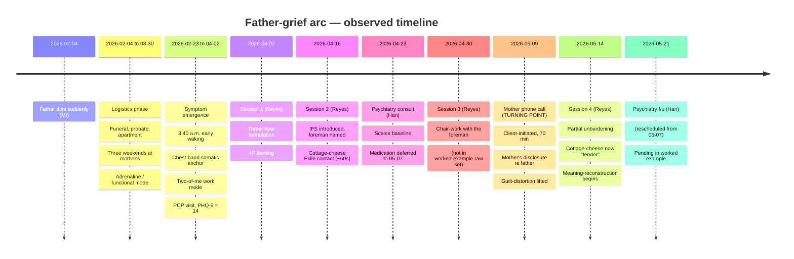

# Father-grief arc

> [!important] Arc one-liner
> The primary clinical theme of this worked example: the unfolding
> grief response to the sudden cardiac death of the client's
> father on **2026-02-04**, tracked across four documented
> clinician contacts (three therapy + one psychiatry) between
> **2026-04-02 and 2026-05-14**, with a clearly-identifiable
> turning point at **2026-05-09** (the client-initiated 70-minute
> phone call with his mother).

## Arc structure

## What changed across the arc

A pattern / theme / concept delta table — i.e. *what the wiki
side-effects across four ingests cumulatively show*:

| Variable | Session 1 (04-02) | Session 4 (05-14) | Delta |
| --- | --- | --- | --- |
| [[somatic-grief-containment]] band | Hand pressing chest down; constant | Foreman "sitting on a bucket"; loosest in months | Materially softer |
| [[avoidant-mother-contact]] | Voicemail-default; 10+ day gap | Client-initiated 70-min call; weekly target | Transformed |
| [[automaton-work-mode]] | Two-of-me visible at work; cost paid at home | Same at work; home-side breach (laundry-room with Sarah) | Partial loosening at home; work unchanged |
| [[inner-protector-stoic]] | Visible only by inference (un-named) | Re-deployed: same part, new information, dialled the call | Job-redesign achieved |
| Sleep (3:40 waking) | 6/7 nights | Slight loosening: one ~5:50 wake, two nights drift back | Moving slowly |
| Self-frame | "I'm depressed in the can't-feel-anything way" | "Grief is love with no place to go" (received from Reyes); generative re: Theo | Vocabulary expanded |
| Guilt re: father | Dominant — "regretting something I was constitutionally incapable of doing" | Lifted — story is now "we were both walking toward each other and the road ended early" | Resolved (specific charge) |
| PHQ-9 | 14 (PCP screen) | 14 at 04-23 psychiatry; not re-measured by 05-14 | Pending re-measurement |

## Turning point

**2026-05-09** — the client-initiated phone call with his mother
([[2026-05-14-session-reyes]] [02:48]). This date is *load-bearing*
for the arc:

- It is the **first behaviourally observable** breach of the
  [[avoidant-mother-contact]] pattern initiated by the client
  rather than by the mother.
- The mother's disclosure during that call (that the father had
  been planning to drive down to repair the relationship the
  week he died) provided **external information** that the
  internal work alone could not have produced.
- The integration of that information *with* the prior six weeks
  of process work produced the visible shifts catalogued above.
- The 5:30 a.m. trigger (**Theo's drawing**, with the father
  drawn as a third figure in family pictures) was the proximal
  cue that made the call happen on that specific morning. The
  drawing is not the cause; it is the cue that converted
  cumulative-readiness into action.

The turning point is **not** the resolution of the arc. It is the
shift from "the avoidance pattern is consolidating" to "the
avoidance pattern is loosening." The integrative phase
([[grief-as-love-transformed]]) has begun; it is multi-month
work, not a single-session event.

## What remains open

- **The mother's grief**. Mark has spoken *his* grief with her
  for the first time on 2026-05-09. He has not yet held *her*
  grief over multiple calls; that capacity is still under
  development. See [[can-grief-be-spoken-with-mother]].
- **Theo conversation**. The session-4 plan included asking Theo
  about the drawings. Outcome pending.
- **Continuing-bond practice choice**. Reyes offered three
  options (walk in meaningful places, letter unsent, talking
  out loud in the truck). Client to choose one, none, or
  another.
- **Medication question**. SSRI question scheduled for review
  mid-July (~12 weeks post-loss); trazodone question scheduled
  for 2026-05-21 (rescheduled from 05-07). See
  [[medication-decision-arc]] and [[medication-arc]].
- **Sustained behavioural change in maternal contact**. The
  2026-05-09 call was one call. Whether the new cadence
  stabilises over the next 3-6 months is the per-week marker
  Han identified for the mid-July SSRI decision
  ([[2026-04-23-psychiatry-han]] [22:30]).
- **Work-mode loosening**. Deliberately not the focal target
  ([[automaton-work-mode]] §"Why this pattern is not the focal
  clinical target"). Tracked passively.

## Why this arc is the worked-example flagship

This arc is documented at higher density than a typical case
because the open-source project uses it to demonstrate the
schema's clinical-grade synthesis capability. See
[[what-this-domain-demonstrates]] for the explicit capability
list. The arc was deliberately constructed to exhibit:

- A clearly-articulable per-week marker
  ([[avoidant-mother-contact]]) for trajectory tracking.
- A non-melodramatic turning point with both *internal*
  (cumulative process-work) and *external* (mother's disclosure)
  causes.
- Multi-modality framework use ([[ifs]], [[integrative-grief-therapy]])
  without collapsing into any single school.
- Cross-clinical coordination
  ([[therapist-reyes]] ↔ [[psychiatrist-han]]) with strict
  boundary maintenance.
- Diagnostic conservatism with a meaningful PGD risk-marker
  cluster ([[complicated-grief]]).
- A protector-part observed across all four sessions and
  documented as evolving rather than being eliminated
  ([[inner-protector-stoic]]).

## Cross-references

- [[2026-05-14-six-week-retrospective]] — the synthesis tying
  the arc together for the clinical reader.
- [[domains/psychology/wiki/syntheses/how-to-read-this-domain|how-to-read-this-domain]]
  — three-audience navigator.
- [[medication-decision-arc]] — the parallel psychiatric arc.
