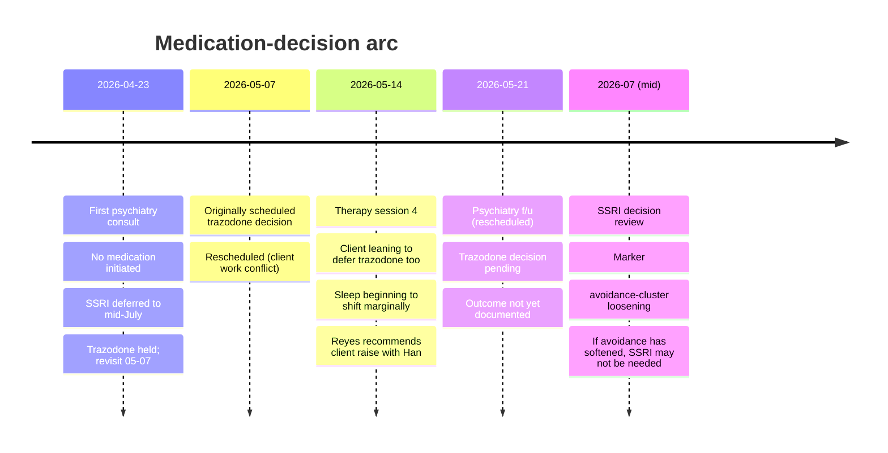

# Medication-decision arc

> [!important] Arc one-liner
> The sub-theme tracking the medication-decision conversation
> across the [[father-grief-arc]]: whether and when to initiate an
> SSRI (the antidepressant question) and / or trazodone (the
> sleep-maintenance question). Currently *no medication initiated*;
> two explicit decision points pending. The arc is the clearest
> example in this worked-example domain of **cross-clinical
> coordination** between [[therapist-reyes]] (process channel) and
> [[psychiatrist-han]] (medication channel).

## Structure

The arc has **two parallel questions**:

1. **The SSRI question** — should an antidepressant be initiated
   for the depressive presentation? *Deferred to mid-July 2026
   (~12 weeks post-loss).*
2. **The trazodone question** — should low-dose trazodone be
   started for maintenance insomnia? *Originally scheduled
   2026-05-07; rescheduled to 2026-05-21 per
   [[2026-05-14-session-reyes]] [16:42].*

The two questions are tracked **separately** by Han because they
treat different things: SSRI for the overall depressive load,
trazodone for the sleep-deprivation contribution that is partly
generating the apparent depressive load. Decoupling lets each
decision be made on its own evidence.

## Timeline

## What's load-bearing in each decision

### The SSRI question

Han's rationale for the conservative hold is laid out in
[[2026-04-23-psychiatry-han]] [22:30]:

- **At 11 weeks post-loss, active process work is underway.**
  SSRI-driven affective flattening in the first ~6 weeks of
  treatment could blunt grief-information processing during a
  window where processing is the better intervention.
- **The depressive picture is bereavement-coloured, not
  free-standing.** PHQ-9 = 14 in this context is not a free
  signal of primary MDD; it is bereavement-related depressive
  episode with complicated-grief features. The diagnostic
  ambiguity itself argues against initiating treatment that
  presumes free-standing MDD.
- **Avoidance-cluster loosening is the mid-July marker.** If by
  mid-July the [[avoidant-mother-contact]] pattern has softened
  (which the 2026-05-09 phone call already begins to indicate),
  the SSRI may not need to be on the table.

This rationale is the entry point for [[medication-vs-process-tradeoff]],
the long-arc question this arc generates.

### The trazodone question

Han's reasoning at 04-23 ([[2026-04-23-psychiatry-han]] [22:30]):

- Sleep at 5h / night for two months is **independently
  treatable** and may be a major contributor to the apparent
  depressive load.
- **Trazodone (low-dose, off-label)** specifically addresses
  *maintenance* insomnia (the 3:40 a.m. waking pattern), not
  just sleep onset.
- **CBT-I referral** as the gold-standard medium-term reach;
  trazodone as the short-term bridge to make the CBT-I work
  possible.
- Decision held for two weeks specifically to give the client
  time to discuss with Sarah and with Reyes.

By 2026-05-14 the client is leaning to defer the trazodone too,
on the rationale that sleep is beginning to shift slowly
([[2026-05-14-session-reyes]] [16:42]). Reyes endorses
deferring to Han; the actual 2026-05-21 decision is not yet in
the worked example.

## Cross-clinical coordination as a documented practice

The medication arc is also the worked-example domain's flagship
demonstration of how the process channel and psychiatric channel
**stay separate while informing each other**. Specific moves:

- **Han references Reyes's framing** of the protector-part as a
  positive prognostic indicator
  ([[2026-04-23-psychiatry-han]] [33:18]) without doing process
  work on it himself.
- **Reyes asks Mark to bring information back to Han** — for
  example, the cottage-cheese work in session 2 should be
  relayed to Han so Han's decision-making has the data
  ([[2026-04-16-session-reyes]] [26:30]).
- **Reyes also relays Han's decisions back into the therapy
  frame** — in session 4, she names Han's medication-deferral as
  one of the structural validators that made the foreman's
  re-deployment possible
  ([[2026-05-14-session-reyes]] [12:14]).
- **Neither clinician overrides the other**. When the client
  leans to defer trazodone in session 4, Reyes does not advocate
  for trazodone; she tells him to make that call with Han, with
  the data Han would want
  ([[2026-05-14-session-reyes]] [16:42]).

## What this arc demonstrates structurally

- That a **psychiatry session can produce a wiki update** (the
  [[medication-arc]] protocol row, the [[psychiatrist-han]]
  Appearances row, the diagnostic-signals fields on the
  psychiatry analysis) **without** producing a pattern / theme
  / IFS-Manager-part update — those are the therapy channel's
  side-effects.
- That the strict cross-clinical boundary is **architecturally
  enforced** by the analysis template separation (psychiatry-analysis
  vs. psychology-analysis), the [[medication-arc]] protocol's
  rule that every psychiatry session adds a row, and the
  documented norm that process material surfacing in psychiatry
  is *deferred to therapy* rather than worked through.

## Cross-references

- [[medication-arc]] — the longitudinal protocol log.
- [[psychiatrist-han]] — the clinician running this arc.
- [[therapist-reyes]] — the coordinated counterpart.
- [[father-grief-arc]] — the parent theme this sits inside.
- [[complicated-grief]] — the construct the conservative
  prescribing stance is calibrated against.
- [[medication-vs-process-tradeoff]] — the long-arc question this
  generates.
