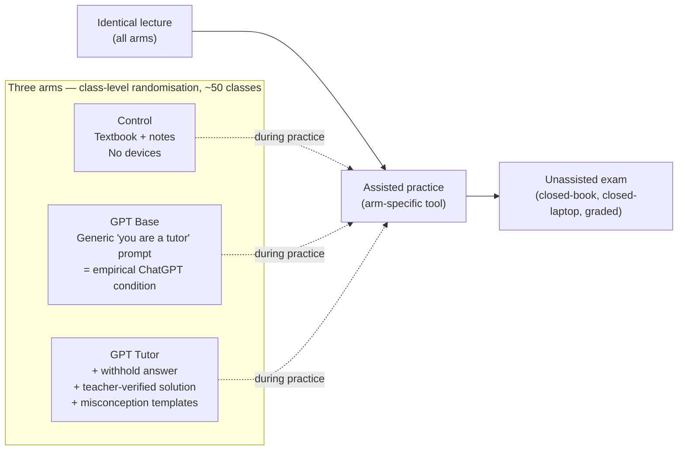
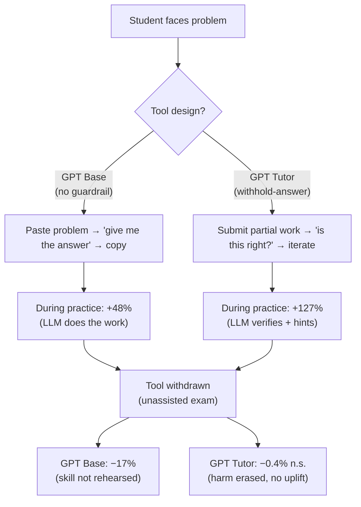

# Generative AI without guardrails can harm learning (Bastani et al. 2024) — analysis

> [!important] 30-second TL;DR
> Naive ChatGPT during math practice **measurably degrades** later
> unassisted exam performance by **−17%** (p < 0.05, pre-registered,
> N≈1,000). A guardrailed "GPT Tutor" prompt — withhold-answer +
> teacher-verified solutions + misconception templates — **erases the
> harm but delivers no positive uplift**. Students cannot detect
> the learning penalty (§3.4). The load-bearing methodological choice
> is the **unassisted exam after withdrawal**; any LLM-tutoring study
> without that probe is measuring productivity, not learning.

> [!faq]- How to read this paper (~20 min, then decide what to read in depth)
> 1. Skim the abstract and §3.2 (the unassisted-exam table) — that is
>    the single most-cited number in the entire AI-tutoring
>    literature so far.
> 2. Read §2 (Method) to internalise the three-arm design and the
>    *classroom-level* randomisation. The classroom unit (not student)
>    is what makes the spillover argument work; the unassisted exam
>    after withdrawal is what makes the learning claim work. Both are
>    deliberate methodological choices.
> 3. Read §3.3 (mechanism — interaction logs) — this is where the
>    "crutch" pattern becomes empirically visible. Without §3.3 the
>    headline number is just a black box.
> 4. Read §3.4 (awareness gap) — the most policy-relevant single
>    paragraph in the paper. Students *cannot* self-correct because
>    they cannot perceive the harm.
> 5. Skip §3.1 unless you are interested in the during-use uplift
>    (it is real but it is also the part of the story that the
>    common ChatGPT-positive narrative already knows).

## Three-arm design at a glance

The pre-registered **primary outcome is the post-withdrawal exam, not
the practice score** — measuring *skill acquisition under withdrawal*
rather than *performance during use* is the methodological innovation
the rest of the literature now has to keep up with.

## Headline numbers (the table to memorise)

| Condition  | Assisted practice (vs. control)        | Unassisted exam (vs. control)                       |
| ---------- | --------------------------------------- | ---------------------------------------------------- |
| Control    | baseline 0.284                          | baseline 0.321                                       |
| GPT Base   | **+48%** (+0.137, p < 0.01)             | **−17%** (−0.054, p < 0.05) ← the headline penalty   |
| GPT Tutor  | **+127%** (+0.361, p < 0.01)            | **−0.4%** (−0.004, n.s.) — harm erased, no uplift    |

## Claim

In a pre-registered, ~1,000-student, three-arm classroom RCT, **GPT-4
access during practice improves performance during practice but
*degrades* performance on a subsequent unassisted exam — unless the
LLM is wrapped in pedagogical guardrails that withhold direct answers
and supply teacher-verified solutions for hint scaffolding.** The
guardrail variant ("GPT Tutor") eliminates the negative skill-
acquisition effect of "GPT Base", without delivering a positive
learning effect over the no-AI control.

This paper is the strongest empirical anchor in the
[[llm-tutoring-systems]] programme for the [[cognitive-offloading]]
failure mode, and the strongest case to date for design-level
[[learning-guardrails]] as a mitigating intervention.

## Method

**Sample.** ~1,000 9th/10th/11th-grade math students across ~50
classes at a large Turkish high school, Fall 2023–24 term.
Honors-track classes excluded from the main analysis to preserve the
school's randomised class-assignment property.

**Randomisation unit.** Classroom — chosen over student-level to
absorb within-class spillover, with SEs clustered at classroom.

**Three arms.**

1. **Control** — textbook + notes; no devices.
2. **GPT Base** — chat interface seeded only with "you are a tutor"
   plus the current problem. Approximates "students using ChatGPT on
   their own" — i.e. the *empirical* condition that already exists in
   most schools.
3. **GPT Tutor** — same chat interface, but the system prompt
   additionally embeds (a) instructions to give hints not answers,
   (b) one or more **teacher-authored correct solutions** so the
   model can verify rather than hallucinate, and (c) **common student
   mistakes with feedback templates**.

**Session structure.** Identical lecture (all arms) → assisted
practice (intervention applies) → unassisted exam on conceptually
matched problems, closed-book, closed-laptop, counted toward grade.

**Pre-registered primary outcome.** Unassisted exam score. This is
the single most important design choice in the paper — measuring
**skill acquisition under withdrawal**, not performance during use.

## Evidence

**Assisted-practice gains** (§3.1, normalised score, control mean
0.284):

- GPT Base: +0.137 → **+48% relative**, p < 0.01.
- GPT Tutor: +0.361 → **+127% relative**, p < 0.01.

**Unassisted-exam effect** (§3.2, the load-bearing result, control
mean 0.321):

- **GPT Base: −0.054 → −17% relative, p < 0.05.**
- GPT Tutor: −0.004 (one order of magnitude smaller, not
  statistically significant — i.e. **the penalty is erased, but no
  positive uplift is delivered either**).

**Mechanism — usage patterns** (§3.B, "Why does GPT Base hurt
learning?"). Coded interaction logs make the "crutch" pattern
quantitative, not merely descriptive:

- GPT Base users paste the problem, request the answer, copy. This
  is the "crutch" pattern — the empirical face of
  [[cognitive-offloading]].
- GPT Tutor users submit partial work, ask narrower questions,
  request verification rather than answers.

**Superficial-conversation drift within the first session** (§3.B,
raw lines 611–617). Counting how many *first interactions across all
problems in the first session* are "superficial" (student simply
restates the question or asks for the answer):

| Condition | First-ever interaction | First interaction averaged across all problems in session 1 | Direction |
| --- | --- | --- | --- |
| **GPT Base** | **56%** superficial | **67%** superficial | ↑ — students *learn to offload* faster within one session |
| **GPT Tutor** | 42% superficial | **37%** superficial | ↓ — students *learn to engage* within one session |

This is the single most load-bearing mechanism datum in the paper:
the harm is not a steady-state property of GPT-4 access — it is a
**learned behavioural drift** the unguarded interface induces inside
a single class, which then carries into the unassisted exam. The
guardrailed prompt reverses the direction of the drift.

**Awareness gap** (§3.4). Self-rated learning is similar across arms
— students in the GPT Base arm **cannot detect** that their actual
skill has been impaired. This decouples subjective satisfaction
(which Vanzo et al. measured positively in
[[2024-vanzo-gpt4-homework-tutor-analysis|Vanzo 2024]]) from
objective retention.

**Causal status.** Pre-registered, classroom-randomised, large-N,
clustered-SEs, independently graded. This is **the highest-grade
causal evidence** in the [[llm-tutoring-systems]] programme to date.
`evidence_quality: rct`.

**Replication.** `replicated: partial`. The cognitive-offload
direction is consistent with multiple independent Khanmigo-line
findings (no-uplift on closed-form tests) and with the productivity-
vs-learning split in the broader generative-AI workplace literature.
The specific +48% / −17% / +127% triple has not been replicated in
identical conditions yet.

## Limits

- **Single school, single country, single subject.** Math at a
  Turkish high school. The same mechanism in non-quantitative
  domains (writing, languages) is empirically open.
- **Short horizon.** Four 90-minute sessions across one term. No
  multi-term follow-up. The trajectory of "crutch usage" under
  habituation is unknown.
- **GPT-4 specifically.** Later models trained with explicit
  pedagogical objectives (e.g. LearnLM) may have different base-rate
  behaviour. The paper's findings apply to "a generic frontier LLM
  with a generic tutoring prompt".
- **Guardrail cost.** The GPT Tutor prompt depends on
  teacher-authored solutions and mistake catalogues **per problem**.
  This recreates much of the content-engineering cost that LLMs were
  supposed to eliminate (a tension also visible in
  [[intelligent-tutoring-system|ITS]] history).
- **No measure of out-of-class AI use.** Control students may use
  ChatGPT on their own time, which would attenuate the control vs.
  treatment contrast.
- **Tutor gives no uplift.** This is a finding the paper itself
  highlights as surprising: a heavily engineered, expert-authored
  GPT Tutor only *matches* control on the exam. Contrast with
  [[2025-kestin-ai-tutoring-active-learning-analysis|Kestin 2025]],
  where pedagogy-aware prompting **beats** the best classroom
  condition. Reconciling the two is an open question (see
  synthesis below).

## Open questions (filed back)

- Does multi-term GPT Base use deepen or partially self-correct the
  dependency? — opens [[llm-tutoring-cognitive-offload]] as a
  long-arc question.
- Are there cheaper guardrails (e.g. fine-tuning, tool-use, RAG over
  verified curriculum) that recover GPT Tutor's safety without per-
  problem authoring? — feeds [[learning-guardrails]] body.
- Does the mechanism transfer to **open-form** tasks (essay, code,
  problem-design) where "the correct answer" is not a clean target?
- Can students be **made aware** of the trade-off through UI
  signals, and does awareness restore self-regulation?
- Why does GPT Tutor match-but-not-exceed control, while Kestin's
  pedagogy-aware tutor exceeds active learning? The most likely
  explanations: (a) the population differs (high-school vs.
  university), (b) the prompt-design depth differs (verification-
  oriented vs. fully pedagogy-aware), (c) the comparator differs
  (textbook+notes vs. best-practice classroom). Each is testable in
  follow-up.

## Wiki cross-references

- [[cognitive-offloading]] — this paper is the **primary empirical
  anchor** for the concept in this domain.
- [[learning-guardrails]] — this paper is the existence proof that
  guardrails can null out the harm; the open question is how to make
  them cheaper.
- [[llm-tutoring-systems]] — the programme; this paper defines its
  load-bearing "deploy carefully or do harm" constraint.
- [[intelligent-tutoring-system]] — the ancestor whose hint-design
  insights GPT Tutor effectively recreates.
- [[two-sigma-problem]] — relevant baseline. Note GPT Tutor does
  not deliver Bloom's 2σ uplift; it only *avoids harm*.
- [[2024-vanzo-gpt4-homework-tutor-analysis]] — positive K-12 result
  without retention testing; this paper provides the missing
  retention lens.
- [[2025-kestin-ai-tutoring-active-learning-analysis]] — the
  positive university-level counter-result that motivates the
  reconciliation question above.

## Notes

The paper's most important methodological contribution is the
**pre-registered exam-after-withdrawal design**. Any future LLM-
tutoring RCT that does not measure performance under withdrawal
should be treated as testing productivity, not learning — and read
through the lens this paper supplies. The synthesis at
[[llm-tutoring-causal-evidence-2024-2025]] uses this paper as the
fulcrum between the "performance" and "skill-acquisition" literatures.
