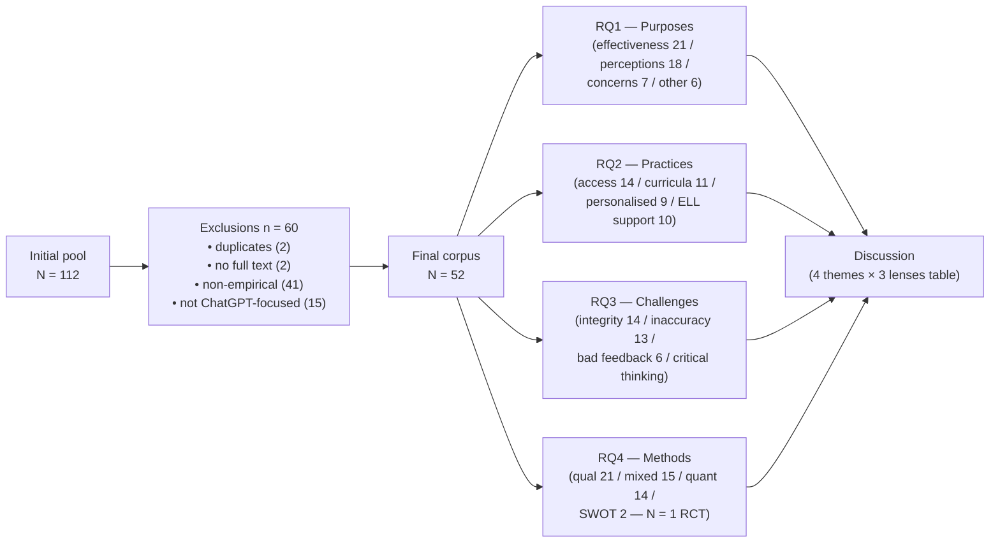

# ChatGPT in Education — a 52-study systematic review (Kim et al. 2025) — analysis

> [!important] 30-second TL;DR
> Kim et al. conduct a **qualitative content-analysis review** of
> **52 empirical articles** on ChatGPT in K-12 and higher education
> published between January 2023 and December 2024, drawn from
> ERIC + Google Scholar + seven leading edtech journals. Four
> themes anchor the literature: **personalised learning + learner
> autonomy**, **equity / accessibility (UDL)**, **pedagogical
> innovation**, and **critical AI literacy / academic integrity**.
> The single load-bearing methodological finding for downstream
> readers: of the 52 empirical studies, **only one is explicitly
> described as a Randomized Controlled Trial** (Lee et al. 2024,
> ANCOVA on a GCLA hint-based tool) — and **25% (n = 13) do not
> clearly specify their geographic context**. **Most important
> limit:** the review is **survey-of-perceptions-heavy** (n_qual =
> 21, n_quant = 14, n_mixed = 15, n_misc-SWOT = 2; only ~3
> randomised or experimental designs total) and the corpus is
> **dominated by the first two years of post-ChatGPT scholarship**,
> so the conclusions describe an *early-stage literature* rather
> than a settled evidence base — the 2024-2025 RCT wave that
> reshapes the picture ([[2024-bastani-generative-ai-guardrails-analysis|Bastani]],
> [[2025-kestin-ai-tutoring-active-learning-analysis|Kestin]]) is
> mostly **outside this corpus**.

> [!faq]- How to read this paper (~30 min)
> 1. Skim §1 (Introduction) and §2.5 (Current Study) for the four
>    framing lenses: sociocultural theory, self-determination theory,
>    accessibility/UDL, and critical AI literacy. These are the
>    interpretive backbone of §5 (Discussion) — you cannot decode
>    the Discussion without them.
> 2. Read §3 (Methodology) carefully. The screening pipeline (112 →
>    52 articles) and the two-team coding structure (language /
>    literacy vs. STEM / broader-education) are what make this a
>    *systematic* review rather than a narrative essay. Note the
>    venue selection (ERIC + Google Scholar + 7 edtech journals)
>    and the exclusion of non-peer-reviewed and non-empirical work.
> 3. Skim §4.1–4.3 (Results — purposes, practices, challenges) for
>    the **category counts**: which themes are dense in the
>    literature (access & understanding n=14; academic integrity
>    n=14) and which are thin (inaccurate feedback n=6; learner
>    autonomy n=5). The counts are the load-bearing facts —
>    individual study citations matter less here than at the
>    analysis tier.
> 4. **The critical section is §4.4** (Research Methods). The
>    methodological landscape — N = 1 RCT, n=25 designs that the
>    authors classify as "human interactions with ChatGPT" rather
>    than as experiments, 13/52 studies with unspecified geographic
>    context — is the load-bearing diagnostic for readers who care
>    about epistemic quality. Cross-check against the appendix.
> 5. Read §5 (Discussion) only as **interpretation, not findings**.
>    The four pedagogical recommendations are framework-informed
>    syntheses; they are not derivations from the data tables in
>    §4. Hold them at one remove from the empirical claims.
> 6. Skip Appendix A (Table 4 — 52-row article-by-article summary)
>    on first read unless you are using this as a source-discovery
>    tool. The categorical findings in §4 already aggregate the
>    table.
> 7. **Skip unless …** you are calibrating the corpus's coverage
>    against your own reading: the references list is useful but
>    long, and several K-12 + higher-ed RCTs in the broader
>    [[llm-tutoring-systems]] literature ([[2024-bastani-generative-ai-guardrails-analysis|Bastani PNAS]],
>    [[2025-kestin-ai-tutoring-active-learning-analysis|Kestin Harvard]])
>    do **not** appear here — likely because the search keyword was
>    "ChatGPT" specifically and / or the venues differ.

## Review pipeline and finding categories

The flowchart shows the load-bearing structure: a single empirical-
corpus funnel (112 → 52) drives four parallel research-question
analyses, which are then re-aggregated into Table 3's framework
synthesis. The diagram makes clear that **§5 (Discussion) is not
re-analysing the data — it is overlaying the four theoretical
lenses on the §4 counts**.

## Headline numbers

| Result                                              | Count / value             | Statistical anchor / note                                              |
| --------------------------------------------------- | ------------------------- | ----------------------------------------------------------------------- |
| Final corpus size                                   | **N = 52 empirical articles** | screened from 112 with 60 exclusions (duplicates / non-empirical / not ChatGPT-focused) |
| Review window                                       | Jan 2023 – Dec 2024       | first ~24 months post-public-release of ChatGPT (Nov 2022)              |
| Sources                                             | ERIC + Google Scholar + 7 edtech journals | "ChatGPT and education" keyword                                |
| Most-cited *practice* theme                         | Access & understanding (n = 14) | descriptive — count of articles classified to the theme               |
| Most-cited *challenge* theme                        | Harming academic integrity (n = 14) | tied with inaccurate / biased information (n = 13)                  |
| Methodological mix                                  | qual 21 / mixed 15 / quant 14 / misc 2 | sums to 52                                                          |
| **Studies explicitly described as RCTs**            | **1** (Lee et al. 2024)   | **← the headline methodological fact** — ANCOVA on a GCLA tool          |
| Studies using *any* experimental design             | 3                         | Celik et al. 2024; Lee et al. 2024; Rakap 2024                          |
| Studies using quasi-experimental designs            | ≥ 5                       | C. Liu et al. 2024a; Chaudhry et al. 2023; Escalante et al. 2023; Mahapatra 2024; X. Wang et al. 2024b |
| Studies with **unspecified geographic context**     | **13 (25%)**              | a primary threat to external-validity claims                             |
| Most common study design                            | "Human interactions with ChatGPT" — n = 25 (48%) | authors' own category — closer to ethnographic / perceptual than experimental |

## Claim

This review **maps the first two years of empirical ChatGPT-in-
education scholarship** (Jan 2023 – Dec 2024) onto four interpretive
lenses: sociocultural theory, self-determination theory,
accessibility / UDL, and critical AI literacy. Its load-bearing
contribution is **structural rather than causal** — it shows what
the literature *is*, not what ChatGPT *does*. The most defensible
empirical generalisations the authors extract:

1. The literature converges on ChatGPT's value for **personalised
   learning and learner autonomy** (Mahapatra 2024; Jauhiainen &
   Guerra 2023; Kakhki et al. 2024), but the strongest claims rest
   on **perception and effectiveness self-reports**, not on
   randomised retention-measured comparisons.
2. The literature also converges on **academic integrity** as the
   dominant concern (n = 14), with most studies finding current AI-
   detection tools (Turnitin, ZeroGPT, Grammarly, …) unreliable on
   paraphrased AI text (Chaudhry et al. 2023; Perkins et al. 2024).
3. The **pedagogical synthesis** in §5 — that ChatGPT should be
   used as an *advisory* tool, not as a primary information source,
   and that critical AI literacy is the precondition for productive
   classroom integration — is a position the authors *argue*,
   grounded in the four framing theories rather than derived
   exclusively from the data.

## Method

**Design.** Qualitative content analysis (Schreier 2012) — three
phases: (1) identify relevant studies, (2) develop a coding
framework, (3) identify common themes.

**Search strategy.** Two databases (ERIC primary, Google Scholar
supplementary) plus purposeful search of seven journals: *Computers
and Education*, *Journal of Educational Computing Research*, *The
Internet and Higher Education*, *Journal of Computers in Education*,
*Journal of Computing in Higher Education*, *International Journal of
Educational Research*, *Journal of Educational Research*. Keyword:
"ChatGPT and education".

**Inclusion / exclusion.** 112 articles initially → 52 after
excluding 60 for: duplicates (2), no full-text (2), non-empirical
(41 — the dominant exclusion), not peer-reviewed (0), not
explicitly ChatGPT-focused (15). The peer-review and empirical
filters are tight; the keyword is loose (English-language only,
"ChatGPT"-named tool only, January 2023 – December 2024 only).

**Coding.** Two-team iterative coding:

- **Team A** (language and literacy — ELL, feedback, writing).
- **Team B** (STEM and broader educational contexts).

Each team independently coded; teams convened for discrepancy
resolution and consensus on the coding framework. Peer debriefing
and an audit trail support trustworthiness.

**Per-article coding scheme.** (a) purpose statement; (b)
participants / context / curriculum; (c) methodology / data
collection / analysis; (d) findings. The full per-article table is
Appendix A (Table 4) in the raw — 52 rows × 4 columns.

**Theoretical scaffolding.** Sociocultural theory (Vygotsky 1978;
Thorne 2024); SDT (Deci & Ryan 2012; Ryan & Deci 2000) and CET;
UDL (Meyer et al. 2014); critical AI literacy (Mills et al. 2023;
Thomas & Lok 2015). These four lenses inform the *categorisation*
(§5.1–§5.4) but not the *coding* of individual studies; the §4
counts are derived first, then §5 overlays interpretation.

## Evidence

The "evidence" tier in a content-analysis review is **the
categorisation itself** — how many studies fall into which theme,
how confidently, with what variance — plus the **methodological
landscape** (research-design and population mix).

### §4.1 — Purpose distribution (mechanism-level fact)

Most studies pursued **effectiveness** (n = 21) or **perceptions**
(n = 18) — together 75% of the corpus. **Concerns** is a smaller
category (n = 7), suggesting the field's discourse outside
empirical journals is louder than the empirical literature actually
warrants on the concern dimension. The "**other**" category (n = 6)
contains the SWOT-style position papers — these are categorical
analyses of strengths / weaknesses / opportunities / threats and
are weaker evidentially than effectiveness or perception studies.

### §4.3 — Challenge category counts (descriptive)

The within-corpus weighting:

| Challenge theme                                | n   |
| ---------------------------------------------- | --- |
| Harming academic integrity / plagiarism        | 14  |
| Producing inaccurate / biased / made-up info   | 13  |
| Providing inaccurate feedback                  | 6   |
| Undermining students' critical thinking        | (qualitative; not enumerated as a discrete n) |

Two findings worth pulling forward into other wiki pages:

- The **awareness gap that drives [[cognitive-offloading]]** — that
  students cannot reliably detect when ChatGPT's output is wrong —
  surfaces in this review through the "inaccurate / biased
  information" theme (n = 13) and the "undermining critical
  thinking" theme, but the review **does not measure it
  experimentally** (its corpus contains no
  [[2024-bastani-generative-ai-guardrails-analysis|Bastani-style
  withdrawal-exam]] within the screened time window).
- The **counter-finding** that Gregorcic and Pendrill (2023) and
  Kortemeyer (2023) report — ChatGPT struggles at introductory
  physics, *reducing* plagiarism risk because answers are often
  wrong — is a useful corrective to the "ChatGPT is a perfect cheat
  device" narrative.

### §4.4 — Methodological landscape (the load-bearing diagnostic)

This is the section a downstream RCT-tier reader cares about most.
The relevant facts:

- **Methods mix.** Qualitative 21 / mixed 15 / quantitative 14 /
  miscellaneous-SWOT 2.
- **Design specification.** Specific research design (case study,
  experimental, cross-sectional, …) is named in only 9 of 21
  qualitative manuscripts and only 8 of 14 quantitative manuscripts
  — i.e. the **majority of the corpus does not state its design
  explicitly**. This is itself a finding about the field.
- **Experimental designs.** Three studies: Celik et al. (2024),
  Lee et al. (2024) — the only one called an RCT — and Rakap (2024).
- **Quasi-experimental designs.** At least five (C. Liu et al.
  2024a; Chaudhry et al. 2023; Escalante et al. 2023; Mahapatra
  2024; X. Wang et al. 2024b).
- **The modal design** is what the authors call **"human
  interactions with ChatGPT"** (n = 25, 48%) — ethnographic /
  perceptual studies in which researchers integrate ChatGPT into a
  setting and observe, without random assignment or counterfactual.
- **Geographic distribution.** China (4), Turkey (4), Taiwan (3),
  US (3), Germany / Spain / Korea / Vietnam (2 each), and singletons
  from many other countries. **13 studies (25%) do not specify the
  geographic context** — a significant gap for any external-
  validity argument.
- **Data sources.** ChatGPT's *own outputs* (n = 24) and surveys
  (n = 17) dominate; student assignments / test results appear in
  only 14 studies; teachers' qualitative feedback in 5; group
  interviews in 4; observations in 3.

This decomposition is what makes this review most useful for
downstream meta-research. Anyone arguing from "the literature
shows X about ChatGPT in education" needs to confront the fact
that, as of December 2024, the literature was **predominantly
qualitative / perception-based, single-site, geographically
unevenly distributed, and contained exactly one RCT**. The strong
causal claims in this domain ([[2024-bastani-generative-ai-guardrails-analysis|Bastani 2024]],
[[2025-kestin-ai-tutoring-active-learning-analysis|Kestin 2025]])
sit just *outside* this review's window or were filed in venues
not searched.

### §5 — Interpretive synthesis (Table 3)

§5's four-theme × three-lens matrix (sociocultural / SDT /
accessibility-with-critical-AI-literacy) is a **deliberate
categorical re-organisation** of the §4 findings. It is the
authors' position paper layered atop the empirical landscape.
Worth reading as such — not as a derivation but as a curated map.

**Causal status.** `evidence_quality: theoretical`. This is a
content-analysis review of others' empirical work; the review
itself contains no primary empirical data and no new
intervention. The L2 rubric assigns `theoretical` to derivations,
position papers, and reviews that synthesise prior empirics.

**Replication status.** `replicated: unknown`. Adjacent ChatGPT-in-
education systematic reviews exist (e.g., Lo 2023; Sok & Heng 2024;
others not enumerated in this wiki yet), and the directional
themes — personalisation, equity, integrity, critical literacy —
recur. But the *specific categorisation* and the specific n-counts
have not been independently verified against an overlapping
corpus.

## Limits

- **English-language and ERIC-centric.** The search is anchored on
  English-language sources via ERIC; non-English work and
  conference proceedings outside the seven journals are excluded
  by construction.
- **"ChatGPT"-keyword scope.** The review filters explicitly on
  "ChatGPT" as the named tool. Studies on GPT-4 (which is the
  *engine* behind ChatGPT) that did not name the chat product are
  potentially missed — which plausibly excludes
  [[2024-bastani-generative-ai-guardrails-analysis|Bastani et al. 2024]]
  and [[2025-kestin-ai-tutoring-active-learning-analysis|Kestin et al. 2025]]
  from the corpus. This narrows the review's evidentiary base in
  the direction that would have been most useful for K-12 and
  higher-ed causal evidence.
- **Two-year window.** January 2023 – December 2024 captures the
  *first wave* of post-public-release scholarship. The literature's
  shape changes significantly through 2025 as RCTs land; the
  review's claims are time-bounded.
- **No quantitative meta-analysis.** Effect sizes are not pooled or
  forest-plotted. Headline numbers are categorical n-counts, not
  weighted summaries.
- **Coding-team granularity.** Two teams (language / literacy vs.
  STEM / broader education) is more rigorous than a single coder,
  but the review does not report inter-coder reliability
  coefficients (κ or %-agreement) — an unusual omission for a
  systematic content analysis. The authors describe consensus-
  reaching iteratively; this is closer to qualitative-rigor norms
  than to PRISMA-style quantitative-rigor norms.
- **Position-paper layering in §5.** The Discussion's four
  pedagogical recommendations and Table 3's lens-mapping are not
  derived from the §4 data alone — they integrate the authors'
  theoretical commitments. Readers who want strictly empirical
  conclusions should stop at §4.
- **No retention or causal evidence in the corpus.** With one RCT
  (Lee et al. 2024) and no studies in the corpus running
  withdrawal-exam designs at the level
  [[2024-bastani-generative-ai-guardrails-analysis|Bastani]]
  introduced, the **cognitive-offloading question is not
  empirically resolved** by anything this review surveys.

## Open questions

- **Does the picture survive an updated review?** A 2026 replication
  with the same protocol but extended to December 2025 would
  capture Bastani, Kestin, LearnLM / Eedi, and the wave of K-12
  pilot studies — almost certainly shifting the methods mix toward
  RCT and the challenges section toward retention loss and
  pedagogical-design depth. This is the single most useful
  follow-up.
- **Why is the corpus so heavily perception-based?** Is it a
  field-maturity artifact (RCTs require 18-24 months from question
  to publication; ChatGPT was 13 months old at the review's
  midpoint) or a venue-selection artifact (the seven journals
  chosen lean qualitative-edtech)? Diagnostically relevant for
  what to expect from the 2025–2027 literature.
- **Why is ~25% of the corpus geographically unspecified?** Is
  this a peer-review-norm issue in edtech specifically, or a
  ChatGPT-paper-rush issue? Surfaces a generalisability concern
  for *any* meta-analysis built on this corpus.
- **Does the equity argument empirically hold up?** §5.2's claim
  that ChatGPT's economic barriers (paid tier + connectivity +
  device) may exacerbate inequity is plausible but **not
  directly tested by anything in the corpus**. Feeds
  [[llm-tutoring-equity-impact]].
- **Does the cognitive-offloading concern get measured?** The
  challenges section (§4.3) flags it; the corpus contains no
  empirical test under withdrawal. Feeds
  [[llm-tutoring-cognitive-offload]].
- **What is the inter-coder reliability for the four themes?** The
  review does not report κ, so the categorisation's stability is
  not externally verifiable. A useful audit replication would
  re-code a subsample blind.

## Wiki cross-references

- [[llm-tutoring-systems]] — the broader programme this review
  surveys (one of several research-programme overlays — this review
  is structurally broader than llm-tutoring, also covering
  assessment-design, lesson-planning, and AI-detection threads).
- [[cognitive-offloading]] — the failure mode the review's §4.3.2
  (inaccurate / biased information) and §5.4 (critical AI literacy)
  point at without empirically testing.
- [[learning-guardrails]] — the design strategy the GCLA tool
  (Lee et al. 2024 — the corpus's single RCT) instantiates.
- [[2024-bastani-generative-ai-guardrails-analysis]] — **not in
  this review's corpus** but the canonical
  [[cognitive-offloading|cognitive-offload]] anchor in this wiki; a
  reader who treats this review as comprehensive must be told
  Bastani is missing.
- [[2025-kestin-ai-tutoring-active-learning-analysis]] — **not in
  this review's corpus** but the canonical
  pedagogy-aware-tutor positive evidence; same caveat.
- [[2024-vanzo-gpt4-homework-tutor-analysis]] — also not in the
  corpus; the K-12 ESL homework-augmentation evidence.
- [[llm-tutoring-cognitive-offload]] — the open-question page this
  review's §4.3.2 / §5.4 *implicitly* updates but does not
  empirically constrain.
- [[llm-tutoring-equity-impact]] — the equity-policy question this
  review's §5.2 frames in framework terms (UDL, accessibility,
  economic barriers) but does not empirically test.
- [[ai-education-2024-2025-researcher-guide]] — the
  high-readability navigator a new reader should also consult
  alongside this review to fill in the post-Dec-2024 RCT wave.
- [[llm-tutoring-causal-evidence-2024-2025]] — the cross-paper
  synthesis whose "1 RCT in the systematic-review corpus"
  statistic this paper *quantifies* for the first time in this
  wiki.

## Notes

**On using this review.** The single most useful thing a downstream
researcher can do with Kim et al. (2025) is treat it as a
**map of the literature's first 24 months**, not as a settled
finding. The category counts (§4) are reliable as descriptive
statistics about the field's discourse; the interpretive synthesis
(§5) is a position paper that requires the four theoretical lenses
to follow.

**Reconciling with this wiki's existing analyses.** The three
RCTs anchored here — [[2024-vanzo-gpt4-homework-tutor-analysis|Vanzo
2024]], [[2024-bastani-generative-ai-guardrails-analysis|Bastani
2024]], and [[2025-kestin-ai-tutoring-active-learning-analysis|Kestin
2025]] — do not appear in this review's corpus. Two of the three
(Bastani PNAS, Kestin Harvard preprint) were almost certainly
filed in venues outside the seven journals searched and / or under
"GPT-4" / "generative AI" rather than "ChatGPT" headline keywords.
This is **not a critique of Kim et al.** — it is a calibration
note for readers of this wiki: the review's "1 RCT" methodological
landscape is even sparser than the broader-keyword literature
shows, because the broader-keyword work is exactly what this
review's search did not retrieve.

**On the framework synthesis (Table 3).** Sociocultural theory,
SDT, UDL, and critical AI literacy are four genuinely independent
lenses. Their joint use is principled, but readers should not treat
the four-row × three-column table as showing *empirical*
relationships. It is a curated map of which lens illuminates which
theme — a teaching aid for the field, not a structural-equation
model.
