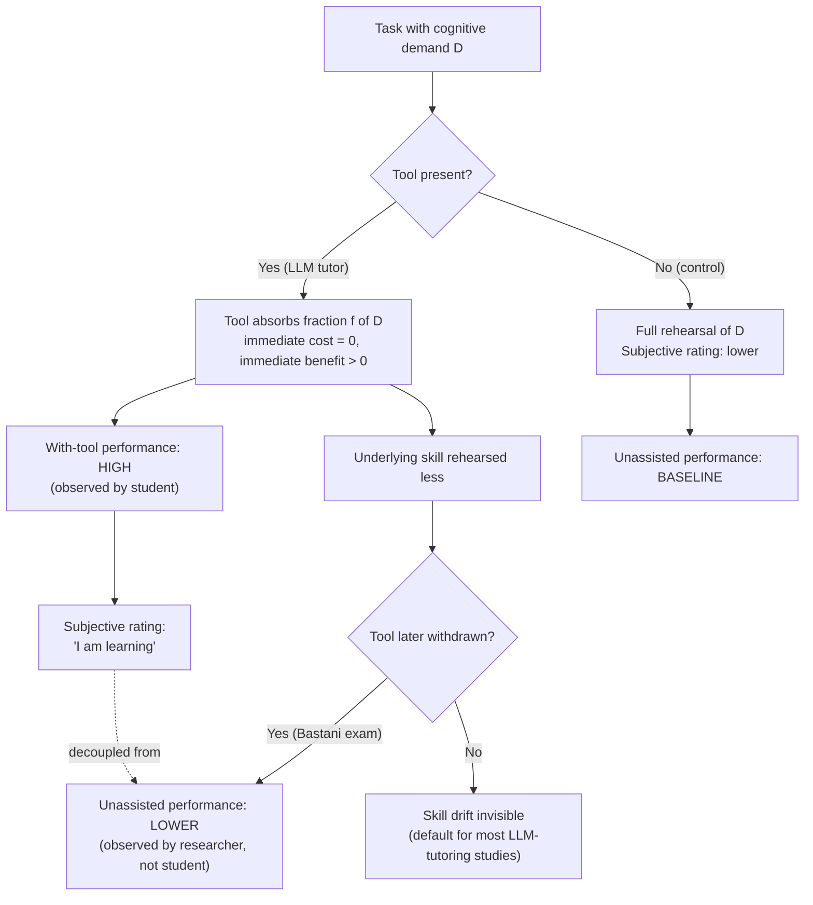

# Cognitive Offloading

The phenomenon where a learner **transfers a cognitive task to an
external tool** (a calculator, a search engine, an LLM tutor)
*instead of performing it themselves*, with the consequence that the
underlying skill is not acquired or, over time, decays. In the LLM-
tutoring literature this is the **central failure mode**: students
appear to learn more during practice with the tool, but underperform
on closed-form assessments after the tool is withdrawn.

The empirical anchor in this domain is the −17% exam-performance
penalty in
[[2024-bastani-generative-ai-guardrails-summary|Bastani et al. 2024]],
which the authors describe in mechanism-language as students
"using GPT-4 as a *crutch*".

## Mechanism (informal)

The classic decomposition (Risko & Gilbert 2016, building on
distributed-cognition theory):

1. The learner faces a task with some cognitive demand D.
2. A tool offers to absorb fraction f of D for free.
3. The learner accepts — *because the tool produces correct outputs
   most of the time*, the immediate cost is zero and the immediate
   benefit (faster, less effortful) is positive.
4. **The skill underlying D is rehearsed less.** Long-term, the
   learner's unaided capacity at D atrophies (or never develops).
5. The learner does not perceive the drift because their *with-tool*
   performance is the salient feedback signal.

The Bastani-style RCT is constructed exactly to expose step 5 —
**measure performance after the tool is withdrawn** and compare to a
control that never had the tool. That contrast surfaces the silent
skill displacement that subjective experience alone cannot detect.

The **awareness gap** (step 5) is what makes this mode insidious:
the metric the student naturally watches (with-tool performance) is
the metric that *rises*, while the metric they cannot directly see
(unaided skill) is the metric that *falls*. The
[[2024-bastani-generative-ai-guardrails-summary|Bastani-style withdrawal exam]]
is the only known way to make the falling metric visible.

## Why it matters in LLM tutoring

LLM tutors are an unusually pure case of the offloading risk:

- They can do the entire task (solve the problem, write the essay)
  if prompted.
- They produce mostly-correct outputs, so the immediate-feedback
  signal is positive — i.e. the learner has no reason to self-
  correct.
- The student's subjective rating of "how much did I learn?" is
  decoupled from actual skill acquisition (Bastani §3.4).

In contrast, a calculator can only do arithmetic — it leaves the
problem-setup and interpretation work to the student. LLMs do not
have this natural boundary. **The only thing standing between the
student and full offloading is the tool's design**, which is why
[[learning-guardrails]] becomes a load-bearing variable in the LLM
era.

## Evidence in this domain

- **[[2024-bastani-generative-ai-guardrails-summary|Bastani 2024]]
  (math, K-12):** the primary anchor. GPT Base → +48% during
  practice, **−17% on the unassisted exam vs. control**, p < 0.05.
  Interaction logs confirm the crutch pattern (paste, copy).
- **[[2024-vanzo-gpt4-homework-tutor-summary|Vanzo 2024]] (ESL,
  K-12):** positive short-term gain, **no retention test** — so
  offloading cannot be ruled in or out from this study. This is the
  single most important limit of that paper.
- **[[2025-kestin-ai-tutoring-active-learning-summary|Kestin 2025]]
  (physics, undergraduate):** positive short-term gain with a
  pedagogy-aware prompt; again no retention test, so the offloading
  question is open at the undergraduate level. The deeper
  pedagogical design *should* reduce the failure mode (active
  retrieval is built in) but the empirical test has not been run.

## Mitigations identified so far

In rough order of empirical support:

1. **Withhold-answer guardrails.** Bastani's GPT Tutor — instruct
   the model to give hints, not solutions — **eliminates** the
   negative learning effect of GPT Base while costing the per-
   problem authoring labour. See [[learning-guardrails]].
2. **Active-retrieval prompt design.** Kestin's tutor asks for
   prediction and attempt before showing solutions; the
   active-learning structure *should* reduce passive offloading,
   though the retention question is untested.
3. **UI signals about AI behaviour.** Hypothesised by Bastani et al.
   as a research direction; no RCT yet. Could students self-regulate
   if explicitly told "this is a hint, not a solution"?
4. **Awareness training.** Closing the awareness gap from Bastani
   §3.4 — telling students that during-use performance is not the
   same as learning. Untested at scale.

## Common misreadings

- **"Cognitive offloading is bad."** Not always. Offloading
  arithmetic to a calculator is fine in contexts where arithmetic
  is not the learning objective. The question is always: **which
  skill are we trying to build, and is the tool absorbing that
  specific skill?**
- **"If subjective satisfaction is positive, learning is happening."**
  The Bastani awareness gap (§3.4) directly falsifies this. Students
  rated their learning similarly across arms while their actual
  skill diverged significantly.
- **"Banning LLMs solves it."** Empirically untested at scale and
  unlikely given out-of-class access. The literature trend is toward
  *designing for protected learning*, not banning the tool.

## Relationship to other concepts

- [[learning-guardrails]] — the primary mitigation strategy in this
  domain.
- [[two-sigma-problem]] — Bloom's 2σ depended on *mastery feedback*
  and *cognitive engagement*. Offloading directly undermines both.
- [[intelligent-tutoring-system]] — ITS literature explored similar
  failure modes under the labels "gaming the system" and "shallow
  help-seeking"; the LLM literature is rediscovering these issues
  at a new scale.

## Appearances

| Date       | Page                                                              | Note                                                                                       |
| ---------- | ----------------------------------------------------------------- | ------------------------------------------------------------------------------------------ |
| 2026-05-20 | [[2024-bastani-generative-ai-guardrails-summary]]                 | Primary empirical anchor: −17% exam penalty under GPT Base; "crutch" pattern in logs        |
| 2026-05-20 | [[2024-vanzo-gpt4-homework-tutor-summary]]                        | Untested-but-relevant; positive short-term gain without a retention probe                   |
| 2026-05-20 | [[2025-kestin-ai-tutoring-active-learning-summary]]               | Pedagogy-aware design *should* mitigate; retention probe still missing                      |
| 2026-05-23 | [[2025-kim-chatgpt-education-review-tkl-summary]]                 | Systematic review of 52 empirical studies (Jan 2023–Dec 2024): the *concern* surfaces under "inaccurate / biased information" (n=13) and "undermining critical thinking", but **no study in the corpus uses a withdrawal-exam design** — confirms field-wide gap |
