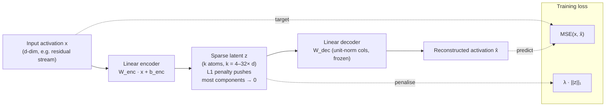

# Sparse autoencoder (SAE)

A neural-network technique for **recovering an overcomplete sparse
basis** from dense, high-dimensional activations. In interpretability
work, an SAE is trained on a language model's residual stream (or
MLP output) to find directions ("atoms") that activate sparsely and
correspond to single concepts.

## Architecture (informal)

The decoder is typically **frozen at unit-norm columns**; the encoder
is trained to minimise reconstruction error plus L1 on the latent.
The **dictionary size** (number of latent dimensions `k`) is usually
**4× — 32× the input dimension**; "overcomplete" means more atoms
than input directions, which is exactly what's needed if the input is
in [[superposition]].

## Why it works (current best guess)

If the true feature inventory is sparse — only a few features active
per token — the L1 prior aligns the learned dictionary with that
ground truth. Empirically this produces atoms that activate on
human-coherent concepts at higher rates than baselines (PCA, raw
neurons), as quantified in
[[2024-anthropic-sparse-autoencoders-summary]].

## Known failure modes

- **Dead atoms.** A fraction of atoms never activate across training
  — wasted capacity. Detection: per-atom activation frequency
  histogram. Mitigation: re-initialise dead atoms periodically, or
  add an auxiliary loss that penalises low usage.
- **Polysemantic atoms.** ~30% of atoms still activate on a mixture
  of unrelated concepts at any tested dictionary size
  ([[2024-anthropic-sparse-autoencoders-summary|Anthropic 2024 §4]]).
  This is the coverage ceiling that bounds the technique's current
  reach.
- **Feature splitting.** As dictionary size grows from 4× → 32×,
  ~30% of "compound" atoms split into multiple narrower atoms
  ([[2024-anthropic-sparse-autoencoders-summary|§3.3]]). Is this the
  true feature inventory emerging, or an artefact of the L1 prior?
  See [[saes-cross-model-transfer]] — a true inventory should
  transfer across model families more than an L1-induced one.

## Common misreadings

- **"More atoms = more interpretable."** Not monotone. Dictionary
  size widening past a certain point produces feature *splitting*
  (good, finer-grained features) but also more *dead* atoms (wasted
  capacity). The interpretability fraction trades off against
  reconstruction fidelity; there is no free lunch on the
  width axis.
- **"If atom X fires on concept C, the model uses concept C to do
  the task."** This conflates correlation with mechanism. SAE
  labelling shows what an atom *activates on*; only **steering or
  ablation** (causal interventions, e.g.
  [[2024-anthropic-sparse-autoencoders-summary|§3.2]]) can show the
  atom is at least sufficient for the behaviour. Necessity is a
  further claim that steering alone does not support.
- **"SAEs solve interpretability."** They give the *alphabet*. The
  *grammar* — how atoms compose across layers into multi-step
  computations — is the domain of circuits-level analysis, which is
  still under construction. An interpretable alphabet without a
  grammar is insufficient for the safety-verification use case.
- **"The 14% monosemanticity is a fundamental ceiling."** It is the
  fraction observed under one specific configuration (9B model,
  layer 24, 16× dictionary, L1 prior, blind labelling). Alternative
  priors (top-k, JumpReLU), wider dictionaries, and different layer
  choices all move the number — but the relative ordering
  (SAE ≫ PCA, raw neurons) is robust.

## Relationship to other techniques

- **PCA** — linear, no sparsity prior. Baseline that SAEs beat by
  ~7× on monosemantic-atom fraction
  ([[2024-anthropic-sparse-autoencoders-summary|14% vs 2.1%]]).
- **Activation patching** — orthogonal: SAEs find features, patching
  tests their causal role. Best results come from combining the two
  (find atoms with SAE, then patch them to verify necessity).
- **Circuits-level analysis** — composes atoms into multi-step
  computations. SAEs give the alphabet; circuits give the grammar.
- **Top-k / JumpReLU autoencoders** — alternative sparsity
  mechanisms that swap the L1 prior for an explicit cardinality
  constraint. May reduce L1's known shrinkage bias; empirical
  comparison ongoing.

## Appearances

| Date       | Page                                                          | Note                                                         |
| ---------- | ------------------------------------------------------------- | ------------------------------------------------------------ |
| 2026-05-19 | [[2024-anthropic-sparse-autoencoders-summary]]               | First demonstration of SAE monosemanticity at frontier scale (~14% atoms, κ = 0.71) |
