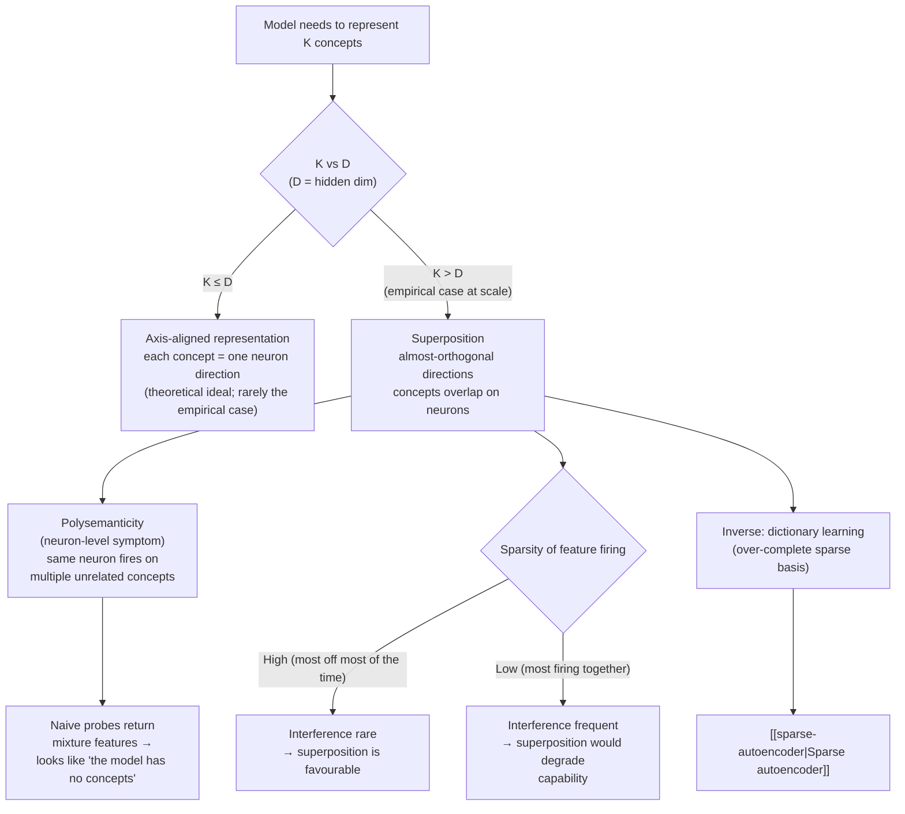

# Superposition

Large neural networks pack **more concepts than they have neurons**
by representing concepts as overlapping linear combinations of
neuron-direction vectors. The same neuron then fires on a mixture of
unrelated concepts ("polysemanticity"), which is why naive probes
return uninterpretable directions.

## Mechanism (informal)

If the model needs to represent K concepts in a D-dimensional space
where K > D, it can use **almost-orthogonal** directions (interfering
slightly with one another) and tolerate the noise. Sparsity in the
ground-truth feature firing rate makes this tradeoff favourable: most
concepts are off most of the time, so interference is rare.

The diagram makes two points the prose easily blurs: **(a)** the
neuron-level symptom (polysemanticity) is a *consequence* of the
representational choice (superposition), not the cause — fixing
polysemanticity by inspecting neurons individually cannot succeed,
which is why dictionary learning bypasses the neuron level entirely;
and **(b)** superposition is **conditional on sparsity** — it only
"works" for the network because the ground-truth feature firing is
sparse enough that interference between overlapping directions is
rare per token. Architectures or distributions that violate sparsity
would change the trade-off.

## Why it matters

Superposition is the central obstacle to **mechanistic
interpretability**: you cannot read a neural network as if each
neuron were a feature, because most neurons are mixtures. Two
research lines try to undo it:

1. **Dictionary learning** — train a sparse overcomplete basis (e.g.
   [[sparse-autoencoder]]) so that ground-truth features become axis-
   aligned in the new basis. See
   [[2024-anthropic-sparse-autoencoders-analysis]] for one instance —
   ~14% of dictionary atoms become monosemantic under blind
   labelling, vs. ~3% of raw neurons.
2. **Circuit-level analysis** — accept polysemantic neurons and
   reason about composed computations directly. See
   [[mechanistic-interpretability]].

## Common misreadings

- **"Polysemanticity is the same thing as superposition."** Closely
  related but not identical. Superposition is the *representational
  choice* (K > D directions packed into D-dim space).
  Polysemanticity is the *observable consequence at the neuron level*
  (one neuron fires on several concepts). The former predicts the
  latter; the latter alone does not prove the former.
- **"Bigger models avoid superposition."** Empirically the opposite
  trend has been observed: more parameters appear to *exploit*
  superposition more aggressively, packing finer-grained concepts.
  The K-grows-faster-than-D pattern persists at scale.
- **"Architectures with wider MLPs solve it."** Width helps but does
  not eliminate the pressure. The empirical question — does a
  K = D regime exist at frontier scale? — is open, and the
  [[2024-anthropic-sparse-autoencoders-analysis|2024 SAE evidence]]
  is consistent with K ≫ D at 9B parameters.
- **"Superposition implies the model is confused."** The opposite.
  Superposition is a *useful trick* the model has learned to expand
  effective capacity beyond its hidden dimension. The trick happens
  to be inconvenient for human interpreters, not for the model.

## Open questions

- Is superposition *necessary* for the capabilities we see, or is it
  an artefact of architecture / training? Architectures that
  discourage it (e.g. wide MLPs, sparse routing) may behave
  differently.
- How does superposition interact with the *size* of the model? More
  parameters could relax the K > D pressure, or training dynamics
  could exploit superposition more aggressively. The current evidence
  ([[2024-anthropic-sparse-autoencoders-analysis|§3.3 feature
  splitting]]) tilts toward the second answer.
- Are the features that resist clean factoring (numeric ranges,
  syntactic positions) genuinely *non-axis-aligned* in any basis, or
  is the L1 prior simply the wrong prior for them?

## Appearances

| Date       | Page                                                          | Note                                                                   |
| ---------- | ------------------------------------------------------------- | ---------------------------------------------------------------------- |
| 2026-05-19 | [[2024-anthropic-sparse-autoencoders-analysis]]               | Empirical evidence that ~14% of SAE atoms become monosemantic at scale (vs. ~3% of raw neurons), and that feature splitting under widening is consistent with the K > D model |
