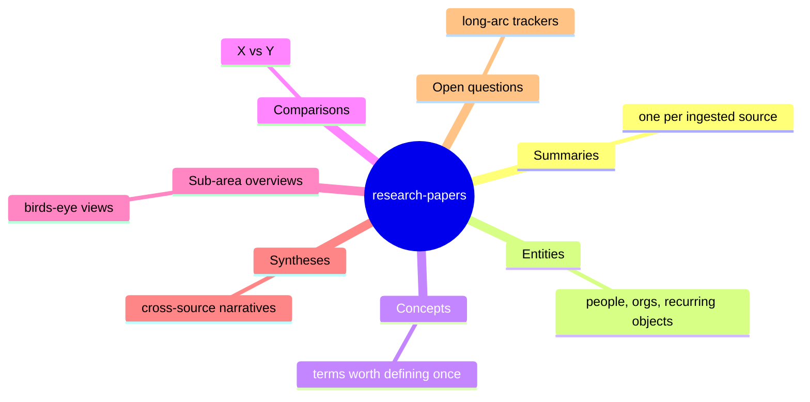

# research-papers — Overview

> [!important] If you're new here, this is the only page you need to
> start. Run `ingest` against any source under `raw/` and the agent
> will populate the buckets below.

> [!faq]- Some tables below may be empty — that's normal
> Each `## <Bucket>` section runs a Dataview query against a folder
> the agent fills over time. On a fresh fork, **`entities/`,
> `comparisons/`, and `overviews/` are typically empty** (a single
> paper doesn't yet warrant an entity or comparison; sub-area
> overviews need ≥3 anchored summaries). Empty here means *not yet
> triggered* — not *broken*. Each will populate on its own
> qualifying ingest.

## What this domain has (mindmap)



## What page do I read when?

| Situation | Read |
|---|---|
| Elevator pitch | the mindmap above |
| One source's takeaways | a page in `summaries/` (~5 min each) |
| Look up a term | a page in `concepts/` |
| Track a person / org | a page in `entities/` |
| Compare two things | a page in `comparisons/` |
| Cross-source story | a page in `syntheses/` |
| Sub-area bird's-eye | a page in `overviews/` |
| What's still open | a page in `open-questions/` |
| What I asked yesterday | `../../outputs/qa/<date>-*.md` |
| The audit trail | `log.md` |

## Summaries

```dataview
TABLE WITHOUT ID file.link AS "Page", updated AS "Updated"
FROM "domains/research-papers/wiki/summaries"
WHERE type = "summary" AND status = "active"
SORT updated DESC
```

## Concepts

```dataview
TABLE WITHOUT ID file.link AS "Page", last_validated AS "Validated"
FROM "domains/research-papers/wiki/concepts"
WHERE type = "concept" AND status = "active"
SORT last_validated DESC
```

## Entities

```dataview
TABLE WITHOUT ID file.link AS "Page", updated AS "Updated"
FROM "domains/research-papers/wiki/entities"
WHERE type = "entity" AND status = "active"
SORT updated DESC
```

## Comparisons

```dataview
TABLE WITHOUT ID file.link AS "Page", updated AS "Updated"
FROM "domains/research-papers/wiki/comparisons"
WHERE type = "comparison" AND status = "active"
SORT updated DESC
```

## Sub-area overviews

```dataview
TABLE WITHOUT ID file.link AS "Page", updated AS "Updated"
FROM "domains/research-papers/wiki/overviews"
WHERE type = "overview" AND status = "active"
SORT updated DESC
```

## Syntheses

```dataview
TABLE WITHOUT ID file.link AS "Page", updated AS "Updated"
FROM "domains/research-papers/wiki/syntheses"
WHERE type = "synthesis" AND status = "active"
SORT updated DESC
```

## Open questions

```dataview
TABLE WITHOUT ID file.link AS "Page", arc_status AS "Status", updated AS "Updated"
FROM "domains/research-papers/wiki/open-questions"
WHERE type = "open-question"
SORT updated DESC
```

## Recent activity

```dataviewjs
const log = await dv.io.load("domains/research-papers/log.md");
if (!log) {
    dv.paragraph("_log.md not yet populated._");
} else {
    const entries = log.split("\n").filter(l => l.startsWith("## ["));
    dv.list(entries.slice(0, 10));
}
```
