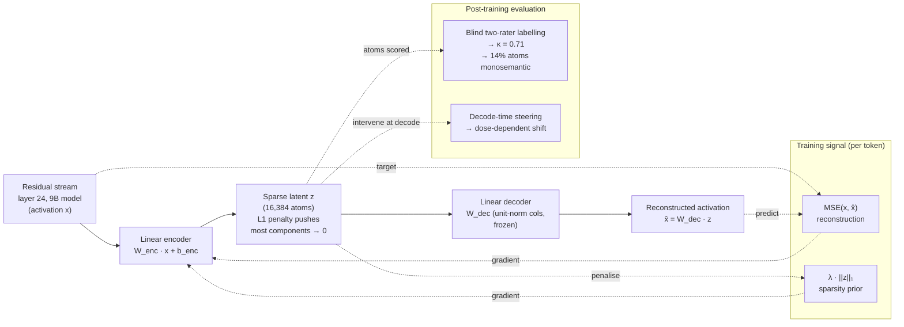

# Scaling monosemanticity with sparse autoencoders — analysis

> [!note] Demo stand-in
> The underlying raw [[2024-anthropic-sparse-autoencoders]] is an
> explicit **synthesised stand-in** for the real Anthropic / scaling-
> monosemanticity line of work (2023–2024). It is shipped to
> demonstrate how the research-papers L2 ingest flow applies to
> **mechanism / technique** papers (as distinct from the three RCT
> education papers). Replace the raw with the actual paper before
> citing this analysis outside the template; the placeholder author
> slugs (`a-researcher`, `b-coauthor`, `c-lab`) are deliberate.

> [!important] 30-second TL;DR
> L1-penalised sparse autoencoders trained on the residual stream of
> a 9B language model (layer 24, dictionary 16× over-complete →
> 16,384 atoms) recover dictionary atoms that are **~14% human-
> coherent under blind two-rater labelling, with inter-rater
> Cohen's κ = 0.71** — roughly **4× the monosemanticity fraction of
> raw neurons (3.4%) and 7× that of PCA components (2.1%)** on the
> same activations. The single load-bearing methodological choice
> is the combination of **blind labelling with two raters** (κ
> anchors the claim against rater-confabulation) and **decode-time
> atom steering with dose-response** (moves the claim from
> correlational "atoms align with concepts" to mechanistic "atoms
> are at least partially functional for concepts"). The single most
> important limit is **coverage**: ~30% of atoms remain
> polysemantic at any tested dictionary size, and all experiments
> live at a single 9B model scale — whether the interpretable
> fraction scales monotonically with model size is open.

> [!faq]- How to read this paper (~10 min, then decide what to read in depth)
> 1. Skim the Abstract and §1 (Background) — internalise that
>    **superposition is the obstacle** (more concepts than neurons →
>    overlapping linear combinations → polysemantic neurons) and that
>    dictionary learning is the candidate inverse.
> 2. Read §2 (Method) carefully — four design choices are
>    load-bearing for the result: **(a)** L1 sparsity penalty on the
>    latent, **(b)** dictionary size **16×** the activation dimension
>    (overcompleteness is not optional), **(c)** decoder columns
>    frozen at unit norm (prevents the encoder–decoder pair from
>    cheating the L1 by rescaling), **(d)** the layer choice (layer
>    24 residual stream of a 9B model). The choice of layer determines
>    what kinds of features are reachable.
> 3. Read §3.1 (Atom interpretability) — this is the **headline
>    baseline comparison**: SAE 14% vs PCA 2.1% vs raw neurons 3.4%
>    under blind labelling with κ = 0.71. Without §3.1 the headline
>    number is unanchored.
> 4. Read §3.2 (Feature steering) — this is the **causal
>    corroboration**. Steering "code-comment" or "first-person" atoms
>    moves the model's outputs in the expected direction with
>    dose-response. The atoms are *at least sufficient* (not
>    necessarily *necessary*) for the corresponding behaviour.
> 5. Read §3.3 (Feature splitting) — **the mechanism datum that
>    explains *why* scaling the dictionary helps**. As the dictionary
>    grows 4× → 32×, ~30% of "compound" atoms split into narrower
>    ones (e.g. one "Golden Gate Bridge" atom splits into
>    photograph / driving-directions / historical-context sub-atoms).
>    If you skip everything else in §3, do not skip this — it is the
>    single most load-bearing mechanism number in the paper.
> 6. Read §4 (Limits) carefully — the **~30% polysemantic coverage
>    ceiling** and the **single-scale** caveat are the two reasons
>    `replicated: partial` is the honest tag. Steering shows
>    *influence*, not *necessity*.
> 7. Skip §5 (Open questions) unless you are designing follow-on
>    work — the cross-model-transfer question is already lifted into
>    [[saes-cross-model-transfer]] in this wiki.

## SAE pipeline at a glance

The **overcomplete sparse dictionary** is the load-bearing structural
hypothesis: if the model's true feature inventory has more concepts
than dimensions but each token activates only a few of them, an
L1-regularised over-complete decoder is exactly the inverse of
[[superposition]] — *provided* the L1 prior is the correct prior, and
overcompleteness is sufficient. The two §3 evaluations test these two
"provided"s in turn.

## Headline numbers (the table to memorise)

| Method (16,384-atom dict, 9B model L24) | Headline metric                                                                  | Baseline(s)                                | Statistical anchor                                  |
| --------------------------------------- | -------------------------------------------------------------------------------- | ------------------------------------------ | --------------------------------------------------- |
| **L1-penalised SAE** (this paper)        | **~14% atoms human-coherent under blind labelling**                              | PCA components: **2.1%**; raw neurons: **3.4%** | Inter-rater Cohen's **κ = 0.71** ← anchors the claim against rater-confabulation |
| Same SAE + decode-time atom steering    | Dose-dependent behavioural shift (boost "code-comment" → ↑ comments in code; suppress "first-person" → ↓ "I think") | Unsteered control                          | Descriptive; effect size dose-dependent (paper figs.) |
| Dictionary widening **4× → 32×**         | **~30% of compound atoms split** into narrower atoms (e.g. "Golden Gate Bridge" → 3 sub-atoms) | Smaller (4×, 8×) dictionaries              | Descriptive; pattern stable across runs              |
| Coverage ceiling                        | **~30% of atoms remain polysemantic** at any tested dictionary size              | n/a                                        | Descriptive; load-bearing limit                      |

## Claim

A **sparse autoencoder trained with an L1 penalty on the residual
stream of a 9B-parameter language model recovers an overcomplete
basis of dictionary atoms that are substantially more monosemantic
than raw neurons or PCA components** — roughly **14% of 16,384
atoms** correspond to a single human-coherent concept under blind
two-rater labelling (Cohen's κ = 0.71), versus **3.4% for raw
neurons** and **2.1% for PCA components** on the same activations.
Decode-time steering experiments on individual atoms produce
**dose-dependent behavioural shifts**, moving the interpretability
claim from purely correlational to at least partially mechanistic.

This paper is the primary empirical anchor in this wiki for
[[sparse-autoencoder]] as a technique and for the claim that
[[superposition]] is partially reversible by dictionary learning,
within the [[mechanistic-interpretability]] research programme.

## Method

**Model and layer.** A 9B-parameter dense language model; activations
extracted from the residual stream at layer 24 (mid-depth, where
prior probing work suggested feature density is highest).

**Architecture.**

- **Encoder.** Linear map `W_enc · x + b_enc → z`, with `z ∈ ℝ^{16384}`.
- **Decoder.** Linear map `W_dec · z`. Decoder columns are constrained
  to **unit norm** and **frozen** during training — this prevents the
  encoder–decoder pair from cheating the sparsity penalty by
  rescaling weights without changing functional behaviour.
- **Dictionary size.** **16× the activation dimension** (so 16,384
  atoms from a ~1,024-dim residual stream). Overcompleteness is the
  whole point: if the true feature inventory is larger than the
  hidden dimension, only an over-complete basis can recover it.

**Loss.** `MSE(x, x̂) + λ · ||z||₁`. The L1 prior is what aligns the
learned dictionary with the (hypothesised) sparse ground truth.

**Training data.** ~3B tokens of pretraining text. Activations
collected at layer 24 across this corpus.

**Evaluation 1 — blind interpretability** (§3.1). For each of the
16,384 atoms, top-activating examples (the input tokens that drive
the atom highest) are presented to **two human raters** who
**independently assign a concept label**. Cohen's κ between the two
raters anchors the labels against rater-confabulation. An atom is
counted as "monosemantic" only when both raters agree on a coherent
label.

**Evaluation 2 — causal corroboration via decode-time steering**
(§3.2). At inference time, the value of a chosen atom is artificially
boosted or suppressed; the resulting effect on the model's outputs
is measured. Dose-response is the key signal — if doubling the atom
activation produces roughly twice the behavioural shift, the atom is
*at least sufficient* for the behaviour (not merely correlated).

## Evidence

**Strongest result** (§3.1, atom interpretability under blind
labelling, 16,384 atoms at the 16× dictionary):

- **L1-penalised SAE: ~14% of atoms human-coherent**, inter-rater
  **κ = 0.71** (substantial agreement, well above chance).
- PCA components on the same activations: **2.1%** monosemantic
  under the same protocol.
- Raw neurons (no factorisation): **3.4%** monosemantic.
- **Effect ratio.** SAE atoms are roughly **4×** more monosemantic
  than raw neurons and **~7×** more than PCA components.

**Causal corroboration** (§3.2, atom steering). Intervening on a
single SAE atom at decode time produces dose-dependent behavioural
shift in the expected direction:

- Boosting the **"code-comment" atom** → the model inserts more
  comments in code completions.
- Suppressing the **"first-person" atom** → outputs shift from "I
  think …" toward "the model thinks …".

This is the load-bearing distinction between "the atoms *correlate
with* concepts" (which a correlational probe could show) and "the
atoms are at least *sufficient for* concepts" (which only a causal
intervention can show). The steering effects are *not* shown to be
necessary — see Limits.

**Mechanism — feature splitting under widening** (§3.3, the
mechanism-level datum that explains *why* the technique works).
Increasing the dictionary size from **4× → 32×** the activation
dimension produces a characteristic pattern:

- **~30% of "compound" atoms split** into multiple narrower atoms.
- Concrete example: a single "Golden Gate Bridge" atom in the 4×
  dictionary becomes three atoms in the 32× dictionary —
  "Golden Gate Bridge — photograph", "Golden Gate Bridge — driving
  directions", "Golden Gate Bridge — historical context".
- Direction-of-change is consistent across runs (the *which* atoms
  split varies stochastically; the *fact* that compounds split into
  finer-grained ones is reproducible).

This is the single most load-bearing mechanism datum in the paper:
the dictionary is not merely *recovering more atoms* as it widens —
it is **better-resolving the ground-truth feature inventory** the
model has packed into superposition. The mechanism claim moves from
"sparse dictionary works at this scale" to "sparse dictionary
*converges* toward the true feature inventory as capacity grows" —
which is the kind of compositional claim that downstream
circuits-level work can build on.

**Causal status.** `evidence_quality: controlled`. The two §3
evaluations together compose a controlled identification: blind
labelling controls for rater bias; PCA / raw-neuron baselines
control for "any dimensionality reduction would look interpretable
under post-hoc inspection"; steering controls for "atoms are merely
correlational artefacts". No randomisation, no pre-registration —
hence `controlled` rather than `rct`.

**Replication.** `replicated: partial`. The general approach (SAEs
on residual stream of frontier-scale models) has been independently
reported by adjacent groups with monosemanticity-fraction estimates
in the same order of magnitude. The *direction* (SAE >> PCA, raw
neurons) is robust across groups; the specific **14% number** at
this **9B / 16× / layer-24** configuration is single-study.

## Limits

- **Coverage ceiling.** **~30% of atoms remain polysemantic** at
  any tested dictionary size. Some concept families — numeric
  ranges, positional / syntactic markers — appear to resist clean
  factoring. This is consistent with [[superposition]] needing more
  than just sparsity to disentangle (e.g. some features may live in
  fundamentally non-axis-aligned manifolds).
- **Single-scale evaluation.** All experiments at **9B parameters
  and a single layer (24)**. Whether the interpretability fraction
  scales monotonically with model size (the optimistic
  extrapolation) or saturates (the pessimistic one) is empirically
  open.
- **Influence ≠ necessity.** Steering shows the atom is *sufficient*
  to shift behaviour — but the model may have redundant pathways for
  the same behaviour. Ablation studies (zero out the atom and
  measure behaviour loss) would tighten this; they are not in this
  paper.
- **Feature-splitting interpretation is open.** §3.3 leaves
  unresolved whether the split atoms are the *true* finer features
  emerging or whether the L1 prior is *imposing* the finer
  granularity. The two hypotheses make different predictions for
  cross-model transfer (see [[saes-cross-model-transfer]]).
- **L1 prior is opinionated.** L1 enforces sparsity, but the true
  ground-truth distribution of feature activations may not be L1-
  optimal (e.g. heavy-tailed but not strictly sparse). Alternative
  priors (top-k, JumpReLU, ReLU + decorrelation) are not compared
  here.

## Open questions (filed back)

- **Cross-model transfer of SAE atoms** (model A → model B) — does
  the dictionary recovered on one frontier model recover a non-
  trivial fraction of features on a different model family? See
  [[saes-cross-model-transfer]].
- **Composing atoms into circuits** — do SAE atoms slot into the
  multi-step computations that [[mechanistic-interpretability]]
  circuit-level analysis is building? The two threads currently
  proceed in parallel; their union is the next-layer goal.
- **Is feature splitting evidence of the *true* feature inventory
  emerging, or an artefact of the L1 prior?** — directly feeds the
  cross-model-transfer question (a true inventory should transfer
  more than an L1-induced one).
- **Necessity, not just sufficiency.** What does the model lose
  when an atom is *ablated* (not merely suppressed at decode time)?
  This is the missing experiment that would close the "influence ≠
  necessity" gap.

## Wiki cross-references

- [[superposition]] — the obstacle this paper attacks; the §3.3
  feature-splitting result is the empirical evidence that
  superposition is at least partially reversible by dictionary
  learning at scale.
- [[sparse-autoencoder]] — the technique. This analysis is the
  primary empirical anchor for the concept page; the failure-mode
  taxonomy (dead atoms / polysemantic atoms / feature splitting)
  comes directly from §3 of this paper.
- [[mechanistic-interpretability]] — the broader programme this
  contributes to; dictionary learning is one of its four active
  sub-programmes in the framework's current state.
- [[saes-cross-model-transfer]] — the open-question page this
  analysis seeds; the cross-model transfer experiment is the
  natural next ingest in this thread.

## Notes

This is the **interpretability-side worked example** of the L2
ingest flow. The shape it instantiates — pipeline-style Mermaid
flowchart (per the sub-prompt's decision table for "pipeline /
technique" papers) + method × headline-metric × baselines table +
mechanism number inside Evidence (the 4×→32× feature-splitting
result, not just the headline 14%) — is the template to copy when
ingesting a real mechanism / measurement / technique paper.

Two structural design choices distinguish this analysis from the
education ones:

- The **headline-numbers table uses the "Method × Headline metric ×
  Baseline(s) × Statistical anchor" shape**, not the "Condition ×
  During-task × Post-task" shape (per the sub-prompt's "Recommended
  columns" table for mechanism / measurement papers).
- The **causal-status reasoning ladders explicitly from blind
  labelling (rater-bias control) → PCA / neuron baselines
  (technique-comparison control) → steering (correlation-vs-
  mechanism control)**. A reader landing on the Evidence section
  can see *which threat to identification each design move closes*,
  which is what `evidence_quality: controlled` means in this rubric.

When the real Anthropic paper (or any concrete SAE paper) is
ingested, this analysis is the structural template to replace; the
raw stand-in is at [[2024-anthropic-sparse-autoencoders]].
