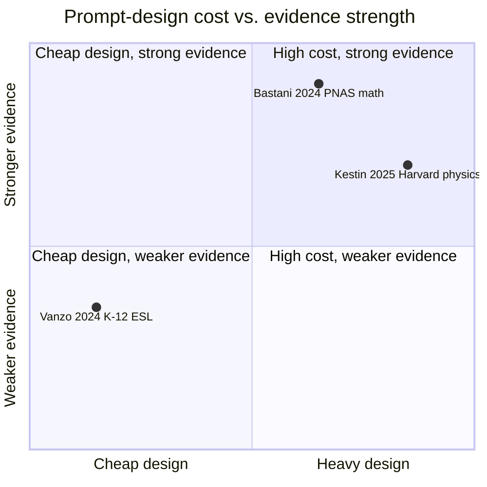

# GPT-4 as a homework tutor (Vanzo et al. 2024) — analysis

> [!important] 30-second TL;DR
> A **minimal-engineering** GPT-4 homework tutor (one teacher-supplied
> topic line, no fine-tuning, no per-problem authoring) produced a
> **statistically significant grammar-learning gain** and high
> engagement in an Italian ESL high-school RCT (4 classes). The
> result is positioned as one of the first in-field RCTs of an LLM
> tutor in **K-12 non-CS** subjects. **The load-bearing
> methodological gap:** **no retention test under withdrawal**, so
> the [[cognitive-offloading|cognitive-offload]] failure mode
> surfaced by
> [[2024-bastani-generative-ai-guardrails-summary|Bastani et al. 2024]]
> is neither ruled in nor out by this study alone. The
> paper's own §4.3.2 OLS also shows the treatment effect is **largely
> engagement-mediated** (treatment coefficient becomes n.s. once
> `words_typed` is included) — i.e. the gain is consistent with "more
> time on task", not "better pedagogy per minute".

> [!faq]- How to read this paper (~15 min)
> 1. Read the abstract and §2 (Method). The headline design
>    feature is **how little engineering** the intervention required
>    — one teacher-written topic line, no fine-tuning, no
>    retrieval — which is the *opposite* end of the cost spectrum
>    from Bastani's GPT Tutor or Kestin's pedagogy-aware tutor.
> 2. Read §3.1 (learning outcomes) and §3.3 (continuation intent —
>    "every student who would still be at the school next year said
>    they wanted to keep using it"). These are the two strongest
>    findings.
> 3. **Read §4 (Limits) carefully.** The "no retention test"
>    limitation is the single most important sentence in the paper
>    for downstream interpretation. Read this paper **only after**
>    [[2024-bastani-generative-ai-guardrails-summary|Bastani 2024]]
>    so you understand why the missing retention test is load-
>    bearing rather than a minor methodological note.
> 4. Skip the satisfaction-survey breakdown unless you specifically
>    care about subjective outcomes — the engagement / satisfaction
>    layer is well-replicated in adjacent EdTech work and not the
>    causal claim that pushes the literature.

## Where this paper sits in the cost / evidence trade-off

Vanzo's contribution is **the cheap-design corner**: a positive
short-term effect with almost no authoring labour. Whether the
effect survives retention testing is the question this paper hands
off to Bastani-style follow-on work.

## Headline numbers (the table to memorise)

Vanzo's headline is positional rather than effect-size-driven (the
quadrantChart above does the positioning work). The numbers that
actually load-bear for downstream reading live in the §4.2.3 /
§4.3 secondary findings — they are the reason a careful reader does
not over-read the primary grammar gain.

| Outcome / measurement                                          | Direction / magnitude                                | Statistical anchor                                                  | What it actually means                                                                  |
| -------------------------------------------------------------- | ---------------------------------------------------- | ------------------------------------------------------------------- | ---------------------------------------------------------------------------------------- |
| Grammar gain (§3.1, **headline**)                              | treatment > control                                  | statistically significant; magnitude single-study (4 classes)        | the title result — read alongside the **no-retention-test** caveat                       |
| Continuation intent (§3.3)                                     | ≈ **100%** of stay-next-year treatment students wanted to keep using | descriptive (population: students still at the school next year)    | unusually strong stickiness; pushes back on "LLMs will kill homework"                    |
| Words typed under treatment (§4.3.2)                           | treatment ≫ control                                  | **d = 1.421, p < 0.001** on `words_typed`                            | identifies the engagement-mediation pathway                                              |
| **Treatment effect after controlling for `words_typed` (§4.3.2)** | **becomes non-significant**                       | **coef = −0.446, p = 0.666**                                         | the load-bearing mediation result — gain is consistent with "more time on task", not "better pedagogy per minute" (contrast with Kestin) |
| Weaker-students-benefit-more (§4.3.1)                          | strong negative correlation between pre-score and gain in treatment arm | **R = −0.777, p < 0.001** (vs R = −0.628 in control)                | the most policy-relevant sub-population finding; **opposite sign** from Prather 2024 / Cipriano & Alves 2024 in CS — directly feeds [[llm-tutoring-equity-impact]] |
| Self-rated confidence (§4.2.3)                                 | **decreased** in treatment arm                       | direction reported; paper itself cannot distinguish calibration improvement from learned helplessness | the "easy to miss" finding; no objective re-assessment was paired with the survey         |
| Hallucination rate (§4.3.3)                                    | very low                                             | **4 / 1,549 ≈ 0.26%** errors by manual review of all flagged convos | bounds one deployment worry for *this* model + *this* prompting + *this* subject         |

Bold rows are the two findings a Vanzo reader most commonly misses
— the §4.3.2 engagement-mediation OLS (which moves the
interpretation from "AI pedagogically helped" to "AI got the kid to
work longer") and the §4.3.1 weaker-students-benefit-more inversion
(which sits in tension with the CS-tutoring literature). A
downstream synthesis that quotes only the headline grammar gain
without these two rows is misrepresenting the paper.

## Claim

A minimally engineered GPT-4 homework tutor — defined by a single
teacher-supplied topic prompt with no fine-tuning — produces a
**statistically significant grammar-learning gain** and substantially
higher engagement in an Italian high-school ESL classroom, compared
to traditional homework. The paper is positioned as one of the first
in-field RCTs of a state-of-the-art LLM tutor in **K-12 non-CS**
subjects, a context where empirical evidence is thin.

This advances the [[llm-tutoring-systems]] research programme by
demonstrating that the [[two-sigma-problem|2-Sigma Problem]] is at
least *partially attackable* with off-the-shelf LLMs and lightweight
prompting — no per-problem expert authoring required.

## Method

**Sample.** Four classes at a single Italian public high school;
within-school randomisation at the class level. Treatment-arm
students replace traditional homework with interactive GPT-4 sessions
seeded with a teacher-written topic prompt; control continues with
business-as-usual homework.

**Intervention design choices.** Non-disruptive (fits existing
homework workflow), context-aware (teacher specifies objectives),
adaptable (covers grammar drills through short essays), and
**minimalistic** — no fine-tuning, no retrieval, no per-problem
expert authoring. This is the opposite end of the engineering-cost
spectrum from Bastani et al.'s GPT Tutor (see
[[2024-bastani-generative-ai-guardrails-summary]]), which spent
significant per-problem teacher labour on hint scaffolding.

**Measurement.** Pre/post tests (teacher-designed, independently
scored), engagement metrics (session duration, completion,
voluntary follow-up), exit satisfaction survey including a
willingness-to-continue item.

## Evidence

**Strongest result** (§3.1): the treatment arm shows a statistically
significant improvement in **grammar gains** over control. Other
sub-skills (vocabulary, reading) trend positive but with weaker
effects.

**Engagement and stickiness** (§3.3): every student who would still
be at the school the following year said they wanted to continue
using the tool. This is unusually strong on a *willingness-to-
continue* measure and pushes back on the "LLMs will kill homework"
narrative.

**Causal status.** The class-level randomisation supports causal
interpretation within the school; the small sample size (four
classes) means effect-size point estimates should be treated as
provisional. `evidence_quality: rct`.

**Replication.** `replicated: partial`. The direction (positive
learning gain with well-designed LLM homework tutors) is consistent
with positive results in
[[2025-kestin-ai-tutoring-active-learning-summary|Kestin 2025]] and
with Khanmigo-line pilots; but the specific grammar-gain magnitude
is single-study and the K-12 ESL context has not yet been
independently replicated.

### Secondary findings (longitudinal + sub-population)

The paper's own §4.2.3 and §4.3 contain three nuance findings that
materially shape how the headline grammar gain should be read:

- **Self-rated confidence *decreased* in the treatment group**
  (§4.2.3, raw lines 609–615). The authors interpret this as
  plausible calibration ("the students were mildly overconfident in
  their ability to begin with") rather than learned helplessness,
  but **explicitly note they did not re-assess objective ability in
  the final questionnaire**, so the calibration-vs-discouragement
  question is empirically open from this study alone. This is the
  single most easily missed finding in the paper.
- **Weaker students benefit more, not less** (§4.3.1, raw lines
  624–636). A strong negative correlation between initial score and
  learning gains in the treatment arm (**R = −0.777, p < 0.001**;
  cf. R = −0.628 in control). This is the *opposite* direction
  reported by Prather et al. 2024 and Cipriano and Alves 2024 in CS
  tutoring, and is the single most policy-relevant
  sub-population finding here — it directly bears on
  [[llm-tutoring-equity-impact]].
- **The treatment effect is largely engagement-mediated** (§4.3.2,
  raw lines 656–664). Treatment-group students typed substantially
  more (`d = 1.421, p < 0.001` on `words_typed`); once
  `words_typed` is added as a covariate, the treatment-condition
  coefficient becomes **non-significant** (`coef = −0.446,
  p = 0.666`). I.e. the grammar gain is consistent with the LLM
  *increasing time-on-task* rather than the LLM *teaching better
  per minute of engagement*. Kestin 2025 reaches the opposite
  conclusion (more learning *in less time*); the two papers
  differ exactly on this mediation.
- **Hallucination rate well under 1%** (§4.3.3, raw lines 666–695).
  Of 1,549 tutor questions across the experiment, the authors
  identified **4 actual errors** (≈ 0.26%) by manual review of all
  flagged conversations, and the tutor "never doubled down on its
  errors". This is one of the few in-field hallucination-rate
  measurements at this granularity in the K-12 LLM-tutoring
  literature, and it bounds — for *this* model + *this* prompting
  + *this* subject — one of the most-cited deployment worries.
  External validity beyond grammar tutoring is unestablished.

## Limits

- **Single school, single language.** External validity unestablished;
  the paper does not claim it.
- **Short duration.** Weeks, not a term. **No skill-retention test**
  after withdrawal — so the cognitive-offload failure mode surfaced
  by [[2024-bastani-generative-ai-guardrails-summary|Bastani et al.]]
  is not ruled in or out from this study alone. This is the
  load-bearing methodological gap.
- **No teacher-as-control arm.** Comparison is GPT-4-augmented
  homework versus business-as-usual homework, not LLM versus human
  tutor.
- **Engagement-vs-feedback confound, partially settled in the
  paper's own favour.** §4.3.2 OLS suggests the treatment effect
  is **largely engagement-mediated** (treatment coefficient becomes
  n.s. once `words_typed` is included). The grammar gain is
  consistent with "more time on task", not necessarily "better
  pedagogy per minute" — an important caveat the wiki's
  headline-result row in the cross-paper synthesis must not paper
  over. Contrast with
  [[2025-kestin-ai-tutoring-active-learning-summary|Kestin 2025]],
  which finds **higher learning gain in *less* time**.
- **Self-reported confidence decreased in the treatment arm**
  (§4.2.3), and the paper itself acknowledges it cannot tell
  whether this is calibration improvement or learned
  helplessness — no objective re-assessment was conducted.
  Interpretation: the engagement finding ("students want to
  continue") and the confidence finding (it dropped) are *not*
  contradictory, but they are also not the same metric.

## Open questions (filed back)

- Do the grammar gains survive **withdrawal of the tool**? — feeds
  [[llm-tutoring-cognitive-offload]].
- Is the effect specific to GPT-4, or does the prompting strategy
  transfer to smaller/cheaper models? — relevant to
  [[llm-tutoring-equity-impact]] (cost-of-access).
- How does this scale to lower-resource schools where laptops and
  reliable internet are not given? — also
  [[llm-tutoring-equity-impact]].
- **Does the §4.2.3 confidence drop reflect calibration
  improvement (good — students now know what they don't know) or
  the early stage of learned helplessness (bad — students defer
  to the tool)?** The paper cannot distinguish; settling this
  would need an objective ability re-test paired with the
  confidence questionnaire.
- **Is the §4.3.1 "weaker students benefit more" result robust
  across CS and non-CS subjects?** Vanzo finds R = −0.777 in
  K-12 ESL; Prather 2024 and Cipriano & Alves 2024 find the
  opposite direction in CS. This contradiction is one of the
  cleanest open empirical questions in the cross-domain LLM-
  tutoring equity literature — directly feeds
  [[llm-tutoring-equity-impact]].

## Wiki cross-references

- [[two-sigma-problem]] — the parent problem this paper attacks at
  the homework end of the curriculum.
- [[intelligent-tutoring-system]] — the prior-art ancestor whose
  content-prep cost LLMs aim to eliminate.
- [[llm-tutoring-systems]] — the broader research programme this
  contributes to.
- [[2024-bastani-generative-ai-guardrails-summary]] — the
  cautionary contrast: when GPT-4 is offered without guardrails in a
  similar K-12 setting, performance during use can mask reduced
  retention.
- [[2025-kestin-ai-tutoring-active-learning-summary]] — the
  positive higher-education contrast where pedagogy-aware prompting
  beats the best classroom condition.

## Notes

The most policy-relevant feature of this paper is the **minimal
authoring cost**. If the gain truly arises from a teacher-supplied
topic line alone, the cost-benefit of deployment is very different
from the Bastani-Tutor arm (heavy per-problem authoring) or from
Kestin's bespoke physics tutor (heavy pedagogy-design authoring).
The synthesis at
[[llm-tutoring-causal-evidence-2024-2025]] places this on the
"cheap-design / partial-evidence" corner of the trade-off space.
