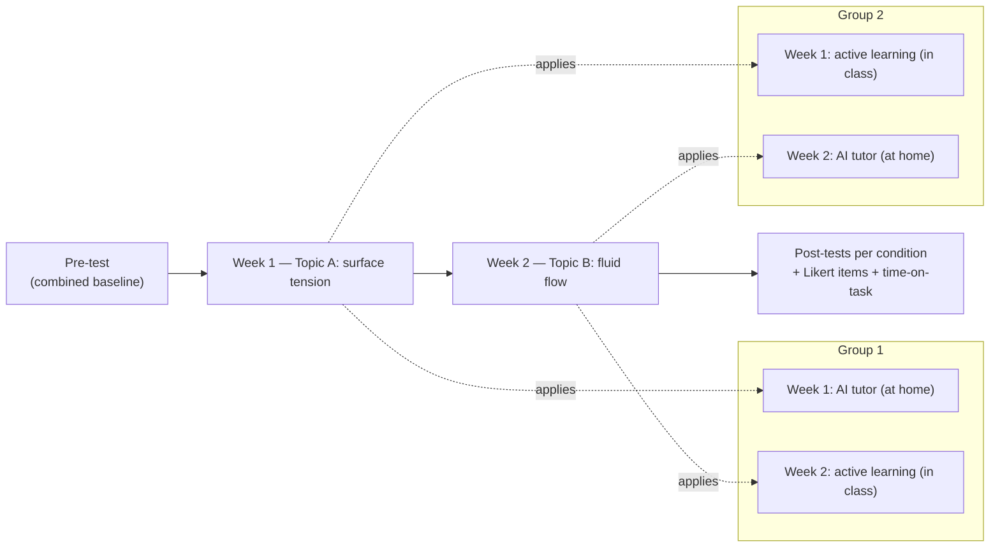

# AI tutoring vs. active learning at Harvard (Kestin et al. 2025) — analysis

> [!important] 30-second TL;DR
> In a **within-subject crossover RCT** (N=194 Harvard undergraduate
> physics), a **pedagogy-aware GPT-4 tutor** produced **higher
> learning gains in less time** than a *best-practice active-learning
> classroom* taught by the same instructors (post-test medians
> **4.5/6 vs. 3.5/6**, Mann-Whitney **z = −5.6, p < 10⁻⁸**, median
> AI time-on-task ≈ 49 min vs. 60 min in-class). Students also
> rated the AI condition higher on **engagement** and **motivation**
> (both p < 0.001); enjoyment and growth-mindset alignment were
> *comparable* across conditions (n.s.) — a more honest stance than
> "higher across the board". It is the strongest evidence yet that
> an LLM tutor can **exceed**, not just match, current best classroom
> practice — **provided** the prompt encodes the same pedagogical
> discipline (active learning + cognitive-load management + growth-
> mindset framing) the comparator classroom uses. **What it does not
> yet show:** retention under withdrawal, which is the
> [[2024-bastani-generative-ai-guardrails-summary|Bastani-style]]
> probe still missing at university level.

> [!faq]- How to read this paper (~25 min)
> 1. Skim the abstract and Fig. 1 (post-test distributions per
>    condition). The two distributions barely overlap; this is the
>    visual that does the rhetorical work.
> 2. Read §2 (Method) carefully — the **within-subject crossover**
>    is the load-bearing methodological choice. Each student is
>    their own control on a different topic, which gives unusual
>    statistical power at N=194 and rules out between-subject
>    confounds that plague class-level K-12 RCTs.
> 3. Read the AI-tutor system-prompt description in §2 — what makes
>    this tutor "pedagogy-aware" is not the model (it is plain
>    GPT-4) but four design choices: active-learning prompts,
>    cognitive-load management, hint scaffolding, growth-mindset
>    framing. These are testable, transferable design moves.
> 4. Read §3.2 (time-on-task) — the AI wins on *learning per minute*,
>    not just learning per session. This is the headline implication
>    for scaling.
> 5. **Stop and ask: what is missing?** The paper does not measure
>    retention under withdrawal. Re-read §4 (Limits) with this in
>    mind. The honest position is "current strongest positive
>    evidence, but the Bastani-style retention test has not been run
>    at university level yet".

## The crossover design at a glance

Each student is their own control: order effects (week 1 vs. 2) and
topic effects (surface tension vs. fluid flow) are balanced across
groups, so a single design simultaneously controls for selection,
topic, and order. This is rare in education RCTs and is the main
reason a N=194 study can carry this much weight.

## Headline numbers

| Outcome                       | AI tutor                                                          | Active learning                              | Statistical anchor                                |
| ----------------------------- | ----------------------------------------------------------------- | -------------------------------------------- | ------------------------------------------------- |
| Post-test median (Wks 1+2)    | **4.5 / 6** (N = 142)                                              | **3.5 / 6** (N = 174)                        | Mann-Whitney rank-sum **z = −5.6, p < 10⁻⁸** ← the headline |
| Pre-test baseline             | M = 2.75 (combined, N = 316) — matched                            | matched                                      | n/a                                                |
| Subgroup robustness (FCI)     | AI > active learning for FCI < 40% and FCI > 40% subpopulations   | comparator                                   | both subgroups **p < 0.001**                       |
| Time-on-task (median)         | **49 min** (≈ 70% of AI students under 60 min)                     | 60 min in-class                              | descriptive (Fig. 2)                               |
| Engagement (Likert)           | higher                                                            | comparator                                   | dependent t-test **p < 0.001**                     |
| Motivation (Likert)           | higher                                                            | comparator                                   | dependent t-test **p < 0.001**                     |
| Enjoyment (Likert)            | n.s.                                                              | comparator                                   | **not significant**                                |
| Growth-mindset alignment      | n.s.                                                              | comparator                                   | **not significant**                                |

## Claim

In a **within-subject crossover RCT** (N=194) in an undergraduate
physics course at Harvard, a pedagogy-aware GPT-4 tutor produces
**higher learning gains in less time** than the *best-practice
active-learning classroom* taught by the same instructors. Median
post-test scores were 4.5/6 (AI) versus 3.5/6 (active learning),
Mann-Whitney z = −5.6, p < 10⁻⁸. Students also reported higher
**engagement** and **motivation** with the AI condition (both
p < 0.001), but the conditions were **comparable on enjoyment and
growth-mindset** (n.s.) — the AI does not feel "more fun"; it does
feel "more learning is happening".

This is the strongest evidence yet that an LLM tutor can **exceed**,
not just match, current best classroom practice — provided the
prompt encodes the same pedagogical discipline as the comparator
classroom. It is the positive counterweight to
[[2024-bastani-generative-ai-guardrails-summary|Bastani et al. 2024]],
whose carefully designed GPT Tutor only *matched* control.

## Method

**Sample.** N=194 undergraduates, one Harvard physics course. The
authors argue the cohort is broadly representative of a range of
institutions, but the study is single-site.

**Design — crossover within-subject.** Each student experiences
**both** conditions on different topics in consecutive weeks:

- Week 1: Group 1 → AI tutor (at home); Group 2 → active learning
  (in class). Topic: surface tension.
- Week 2: groups swap; topic: fluid flow.

Crossover is the methodologically distinctive choice — each student
is their own control, eliminating between-subject confounds that
plague between-group designs in K-12 RCTs (cf. the class-level
randomisation in
[[2024-bastani-generative-ai-guardrails-summary|Bastani 2024]]).

**The AI tutor.** Custom GPT-4 web app whose system prompt embeds:

- **Active-learning prompts** — model asks students to predict,
  attempt, retrieve **before** seeing worked solutions.
- **Cognitive-load management** — chunked exposition; one concept
  at a time; progressive disclosure.
- **Hint scaffolding** — graduated hints; answer withheld unless
  the student opts in. (Mechanically similar to GPT Tutor's
  guardrails in
  [[2024-bastani-generative-ai-guardrails-summary|Bastani 2024]],
  but more deeply pedagogically structured.)
- **Growth-mindset framing** — feedback emphasises effort and
  learning trajectory.

**The active-learning comparator.** Best-practice classroom run by
the same instructors — peer instruction, predict-observe-explain,
in-class problem solving. **Not** passive lecture. This is what
makes the win impressive: the AI beats not a straw-man baseline but
the current empirical ceiling for one-instructor-many-students
teaching.

**Measurement.** Pre-test (baseline; combined across groups),
post-test (per condition), four Likert items on engagement /
enjoyment / motivation / growth mindset, plus time-on-task.

## Evidence

**Learning gains** (§3.1, raw "Learning Gains"). AI condition median
post-test **4.5/6 (N=142)** vs. active-learning median **3.5/6
(N=174)**; pre-test baseline matched at **M = 2.75, N = 316**, ruling
out selection effects. Two-sample rank-sum (Mann-Whitney) test:
**z = −5.6, p < 10⁻⁸**. The median learning gain for the AI group
was **over double** the median learning gain for the active-learning
group.

**Subgroup robustness** (§"Results", raw lines 497–509). Splitting
by FCI (Force Concept Inventory) pre-instruction score — below 40%
vs. above 40%, spanning the typical 30%–50% institutional range —
**both subgroups show AI > active learning at p < 0.001**. The
result is therefore not carried by a single ability stratum, and the
authors argue (cautiously) that it should generalise beyond the
Harvard cohort.

**Time-on-task** (§3.2, "Time on task"). AI median **49 min** vs.
in-class 60 min; **70%** of AI students spent < 60 min on task,
**30%** spent more. The AI lesson is therefore *less* wall-clock
time on average for *higher* learning gain — a **double improvement**:
more learned, faster.

**Subjective experience** (§3.3, "Student perception of learning
experiences"). Dependent t-tests on four Likert items:

| Item              | Direction          | Anchor              |
| ----------------- | ------------------ | ------------------- |
| Engagement        | AI **higher**       | p < 0.001           |
| Motivation        | AI **higher**       | p < 0.001           |
| Enjoyment         | **comparable**      | **not significant** |
| Growth mindset    | **comparable**      | **not significant** |

The honest reading is: students felt *more engaged and motivated*
with the AI, but *not* more entertained, nor did they shift toward
a growth-mindset stance more than active learning already produces.
This narrower claim is also the most defensible one against the
"novelty effect" critique below.

**Causal status.** `evidence_quality: rct`. Within-subject crossover
is unusually statistically powerful for a sample this size. Order
and topic effects are balanced across groups. Independent grading.

**Replication.** `replicated: no` (single-site, single-course,
two-topic). The direction is consistent with LearnLM/Eedi 2025
human-in-the-loop results, but the specific "AI beats active
learning" comparison has not been independently replicated.

## Limits

- **Single institution.** Harvard physics undergraduates; the paper
  argues representativeness but cannot prove it. Replication at
  state schools, community colleges, and non-elite institutions is
  necessary before generalising.
- **Two topics only.** Surface tension and fluid flow are
  conceptually clean. Abstract-mathematical topics, open-ended
  domains (writing, philosophy), and skill-based domains are
  untested.
- **Short horizon.** Two weeks. **No retention-at-distance
  follow-up**, so the
  [[2024-bastani-generative-ai-guardrails-summary|Bastani-style cognitive-offload critique]]
  cannot be ruled out from this study alone. This is the most
  important methodological gap and the load-bearing reason
  `replicated: no` is the honest tag.
- **No "naive AI" arm.** Comparator is active learning, not GPT
  Base. We cannot decompose the win into "AI vs. classroom" versus
  "pedagogy-aware prompt vs. naive prompt".
- **Instructor effects.** Same instructors designed both conditions.
  Whether the prompt transfers to instructors who did not author it
  is an open transfer question.
- **Novelty effect.** A two-week intervention with a new tool
  cannot distinguish learning gain from novelty enthusiasm.
  Replication after habituation is needed.

## Open questions (filed back)

- **Retention under withdrawal.** Does the gain survive 1, 3, 12
  months later? — directly feeds
  [[llm-tutoring-cognitive-offload]] and is the bridge to a clean
  Bastani-style design at higher-education level.
- **Pedagogy decomposition.** What is the *minimum* scaffolding that
  recovers the effect? Could a cheaper, smaller model with the same
  prompt do as well?
- **Cross-domain.** Does pedagogy-aware prompting win in writing,
  history, philosophy, where "the correct answer" is not a clean
  target?
- **Cost-of-deployment.** The prompt was authored by experienced
  physics-education researchers. How does this transfer to schools
  that cannot do that authoring? — feeds
  [[llm-tutoring-equity-impact]].
- **Reconciliation with Bastani 2024.** Why does pedagogy-aware
  prompting *exceed* the comparator here, while Bastani's GPT
  Tutor only *matched* control? — see synthesis at
  [[llm-tutoring-causal-evidence-2024-2025]].

## Wiki cross-references

- [[two-sigma-problem]] — this paper is the **strongest claim to
  date** that a scalable system can begin to approach Bloom's 2σ
  uplift, at least within this single-institution single-topic
  setting.
- [[learning-guardrails]] — the AI's prompt embeds guardrails as one
  *component* of a deeper pedagogical design; this paper is the
  positive existence proof that guardrails plus pedagogy can be net
  beneficial, not just net neutral.
- [[intelligent-tutoring-system]] — the ITS ancestor of the
  pedagogy-aware design.
- [[llm-tutoring-systems]] — the broader programme this contributes
  to; this paper is the current positive-evidence high-water mark.
- [[2024-bastani-generative-ai-guardrails-summary]] — the
  cautionary contrast; reconciliation is the most important open
  question.
- [[2024-vanzo-gpt4-homework-tutor-summary]] — the cheap-design /
  K-12 partial-evidence corner of the trade-off space.
- [[cognitive-offloading]] — the failure mode that the design
  appears to mitigate but does not directly test under withdrawal.

## Notes

Read together with
[[2024-bastani-generative-ai-guardrails-summary|Bastani 2024]],
this paper supports a sharper hypothesis than either alone:
**the variable that matters is pedagogical design depth, not LLM
access.** Bastani's GPT Tutor (verification-oriented guardrails)
*avoids* harm; Kestin's pedagogy-aware tutor (active learning +
cognitive-load + growth mindset) *delivers uplift*. The natural
next experiment is a head-to-head between these two design tiers,
held constant on subject, sample, and retention horizon.
