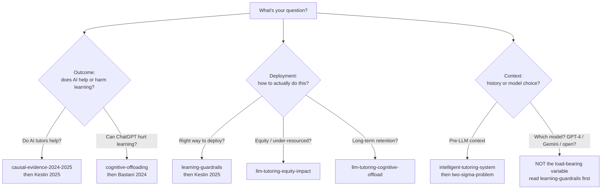

# Researcher's guide — AI in education, 2024-2025

> A **high-readability navigator** for researchers entering the AI-
> tutoring literature for the first time. Designed to be skim-read
> in ~10 minutes and then used as a launchpad into the deeper wiki
> pages. The 30-second summary below is the most important paragraph
> in this domain — if you read nothing else, read that.

## 30-second summary

In 2024-2025, three classroom RCTs gave the AI-tutoring field its
first **causal** evidence base. Read together they say:

1. **Naive use of ChatGPT during practice can measurably harm
   learning**, even when it improves performance during use
   ([[2024-bastani-generative-ai-guardrails-analysis|Bastani et al. 2024, PNAS]]
   — −17% on the unassisted exam vs. control).
2. **Pedagogically guardrailed LLM tutors avoid that harm**, and
   well-designed ones can **exceed even best-practice active
   classroom teaching**
   ([[2025-kestin-ai-tutoring-active-learning-analysis|Kestin et al. 2025, *Scientific Reports*]]
   — higher learning gains in less time).
3. **Design depth dominates model strength.** All three RCTs use
   GPT-4; the variance in outcomes is driven by **how the tool is
   wrapped**, not by which frontier model is loaded.

## Why this guide exists

Most newcomers to AI-in-education hit one of two failure modes:

- They read *a* positive paper, generalise it to "LLMs work for
  education", and miss the
  [[cognitive-offloading|cognitive-offload]] failure mode.
- They read *a* negative paper (or a "ChatGPT cheating in schools"
  news cycle), generalise to "LLMs harm learning", and miss the
  conditions under which they robustly help.

The literature in this domain is structured to **resist both
failures**. This guide walks you to the answer to your question
without forcing you to read everything cover to cover.

## Navigate by question

The decision tree below routes you to the right starting page based
on what you came here to find out. Each leaf is a 2-3 page reading
path — the textual unfolding follows immediately below.

### "Do AI tutors actually help students learn?"
- Start: [[llm-tutoring-causal-evidence-2024-2025]] (the headline
  picture).
- Then:
  [[2025-kestin-ai-tutoring-active-learning-analysis|Kestin 2025]]
  (strongest positive RCT) and
  [[2024-bastani-generative-ai-guardrails-analysis|Bastani 2024]]
  (strongest negative RCT).

### "Does giving students ChatGPT cause cheating / hurt learning?"
- Start: [[cognitive-offloading]] (the mechanism).
- Then:
  [[2024-bastani-generative-ai-guardrails-analysis|Bastani 2024]]
  (the empirical anchor: yes, naive use harms; guardrails fix it).

### "What's the right way to deploy an LLM tutor in a real classroom?"
- Start: [[learning-guardrails]] (the design patterns).
- Then:
  [[2025-kestin-ai-tutoring-active-learning-analysis|Kestin 2025]]
  for the positive existence proof.
- Cost reality check:
  [[2024-bastani-generative-ai-guardrails-analysis|Bastani 2024]] —
  the guardrails that work require per-problem teacher authoring.

### "What's the historical context — did people try this before LLMs?"
- Start: [[intelligent-tutoring-system]] (pre-LLM ancestor).
- Then: [[two-sigma-problem]] (the motivating problem from 1984
  that the entire programme exists to attack).

### "What's the equity story — does this help under-resourced schools?"
- Start: [[llm-tutoring-equity-impact]] (the open question).
- The honest current answer: **it depends sharply on deployment
  quality, and deployment quality currently correlates with
  resources** — so the technology *could* widen inequality even
  while raising the absolute floor.

### "What's known about long-term retention?"
- Start: [[llm-tutoring-cognitive-offload]] (the long-arc question).
- The honest current answer: **within-term harm is documented for
  naive deployments; multi-term retention is essentially blank for
  every design tier**. This is the most important empirical gap.

### "What model should I use? GPT-4? Gemini? A smaller open one?"
- This is **not** the variable the current evidence supports as
  load-bearing. All three RCTs use GPT-4 and report differences
  driven by prompt-and-curriculum design. Read
  [[learning-guardrails]] and
  [[llm-tutoring-causal-evidence-2024-2025]] first.

## Navigate by paper (one-line summaries)

- **[[2024-vanzo-gpt4-homework-tutor-analysis|Vanzo, Pal Chowdhury, Sachan — ETH Zürich, 2024]]**
  (arXiv:2409.15981) — first in-field RCT of GPT-4 homework
  tutoring in K-12 non-CS subjects. Positive grammar gain, no
  retention test.
- **[[2024-bastani-generative-ai-guardrails-analysis|Bastani et al. — Wharton + UPenn + Turkey high school, 2024]]**
  (PNAS, 10.1073/pnas.2422633122) — pre-registered, ~1000 students.
  Naive AI **harms** retention (−17%); pedagogical guardrails
  neutralise the harm. **The single most important paper to read in
  this domain right now.**
- **[[2025-kestin-ai-tutoring-active-learning-analysis|Kestin, Miller et al. — Harvard physics, 2025]]**
  (Sci Rep, 10.1038/s41598-025-97652-6) — pedagogy-aware GPT-4 tutor
  exceeds active-learning classroom on matched post-tests, with less
  time on task. Current positive-evidence high-water mark.

## Methodological strength comparison

The three papers vary along axes that materially affect how to
weight their findings:

- **Pre-registration.** Bastani is pre-registered with a designated
  primary outcome (the unassisted exam). Kestin uses a within-
  subject crossover design with matched pre/post tests. Vanzo is a
  classical class-level RCT without pre-registration mentioned in
  the paper.
- **Sample size.** Bastani (~1,000) >> Kestin (N=194) > Vanzo
  (4 classes). Vanzo's effect-size estimates should be treated as
  provisional.
- **Comparator.** Bastani uses a no-AI textbook control *and* a
  no-guardrails AI arm — strongest design for separating "AI
  access" from "AI design". Kestin uses **best-practice active
  learning** as the comparator — strongest design for showing the
  AI is not winning against a straw-man baseline. Vanzo uses
  business-as-usual homework, which is the weakest comparator (low
  bar to beat).
- **Measurement horizon.** Only Bastani measures **performance
  after the tool is withdrawn** — the single most important
  measurement choice in the entire literature. Vanzo and Kestin do
  not.
- **Replication status.** All three are single-site. Vanzo and
  Bastani's directions are echoed by adjacent literature; Kestin's
  positive ceiling is currently unique.

## Common misreadings to avoid

- **"LLMs are personalised tutoring at scale."** Not yet. Bloom's
  [[two-sigma-problem|2σ effect]] requires *retained skill*; current
  RCTs mostly measure during-use performance.
- **"Just give every student ChatGPT and let them go."** The
  Bastani −17% result directly falsifies this for the default
  ChatGPT configuration.
- **"AI tutors fail to help students learn."** Also wrong — the
  Kestin design exceeds a strong comparator. The conditional truth
  is that **design depth matters, and the cheap default is
  dangerous**.
- **"Newer / bigger model = better tutor."** Not supported by the
  evidence. All three studies use GPT-4 and report different
  outcomes driven by prompt design.
- **"Students will tell you whether the tool is helping them."**
  Bastani §3.4 shows students *cannot detect* the learning penalty
  from naive AI use; self-report is decoupled from skill.
- **"Replicated by industry pilots."** Khanmigo and similar
  industry pilots have produced mixed/null results on closed-form
  tests — consistent with the "naive design ≈ neutral or harmful"
  pattern. Industry endorsement is not the same as causal evidence.

## What this guide deliberately does not cover

- **Generative AI as a content-creation tool for teachers** (lesson
  planning, quiz generation). Different programme; different
  evidence base.
- **Plagiarism detection / "is this student essay AI-written"**.
  Different programme.
- **AI in administration / grading**. Out of scope.
- **Speculative / non-empirical pieces** on AI's role in education.
  This guide tracks the causal-evidence base.
- **LearnLM / Eedi 2025 and Khanmigo pilots.** Important and
  partially read in the meta-analysis at
  [[llm-tutoring-causal-evidence-2024-2025]], but not yet ingested
  as their own analyses. Each is a candidate for the next ingest
  pass.

## Next steps in this domain

- **Reading priority for newcomers:** this page →
  [[llm-tutoring-causal-evidence-2024-2025]] →
  [[2024-bastani-generative-ai-guardrails-analysis]] →
  [[2025-kestin-ai-tutoring-active-learning-analysis]] →
  [[2024-vanzo-gpt4-homework-tutor-analysis]].
- **If you want depth on a single concept:**
  [[cognitive-offloading]] for the failure mode,
  [[learning-guardrails]] for the mitigation,
  [[two-sigma-problem]] for the motivating target.
- **If you're considering deploying a tool:** read
  [[learning-guardrails]] and [[cognitive-offloading]] first; then
  [[llm-tutoring-equity-impact]] for the policy lens.
- **If you're considering doing a follow-on study:** the "What
  should be tested next" section of
  [[llm-tutoring-causal-evidence-2024-2025]] lists five concrete
  open-RCT proposals.

## Page metadata for queries

This guide cites three raw papers and two synthesis-tier wiki pages
in its `sources` list, satisfying the `synthesis` cardinality (≥2)
in the L1 schema (§3.1). Updates should bump `updated:` and rerun
lint to refresh the index snapshot.
