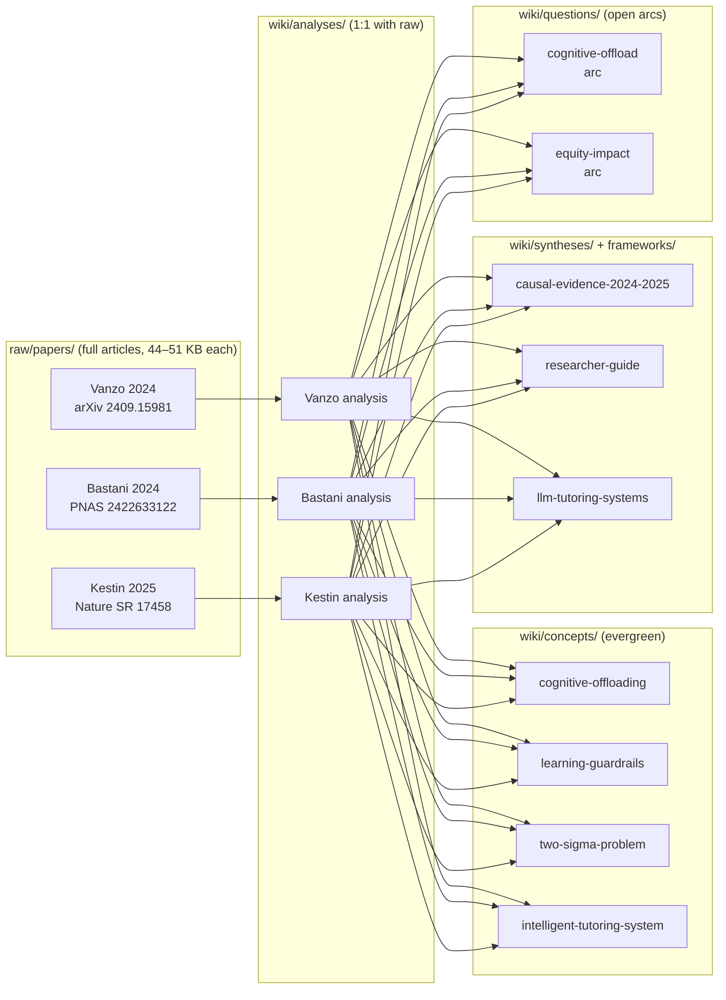

# How to read this domain — a navigator for new PhD students and researchers

> [!important] If you remember one thing
> This domain is a **worked example** of how the LLM-wiki pattern
> compresses an entire research literature into a navigable graph.
> Three classroom RCTs on LLM tutoring (Vanzo 2024 ETH / Bastani
> 2024 PNAS / Kestin 2025 *Nature Scientific Reports*) were
> ingested as full primary sources. Each ingest produced one
> `analysis` page bound 1:1 to the raw paper, plus updates to
> shared `concept`, `framework`, `question`, and `synthesis`
> pages. You can re-trace any wiki claim back to a specific
> section of a specific raw paper in under 60 seconds.

This page exists because the depth of the wiki is *not* obvious
on first contact — the natural failure mode is to bounce off the
domain `index.md`, read one analysis end-to-end, and miss the
graph structure that gives the wiki its compounding value. Use the
time-budgeted paths below in order; each one builds on the
previous.

## A map of what's here

Three raw papers, three analyses, four concepts, two syntheses,
one framework, two questions — **about 15 wiki pages from three
ingests**. The graph is what carries the cross-cutting signal a
single reading note cannot.

## The four reading paths

> [!faq]- Path A — 5 minutes (the elevator pitch)
>
> 1. Read this callout (≤30 s).
> 2. Read the **30-second summary** at the top of
>    [[ai-education-2024-2025-researcher-guide#30-second summary]]
>    (≤90 s). It gives you the three-paper headline + the one
>    methodological pivot (post-withdrawal exam) the field now
>    has to keep up with.
> 3. Look at the **mechanism Mermaid diagram** in
>    [[cognitive-offloading#Mechanism (informal)]] (≤90 s).
>    You'll see the with-tool/without-tool asymmetry that explains
>    why naïve LLM access can *harm* learning while feeling
>    helpful.
> 4. Skim the **Common misreadings to avoid** section of
>    [[ai-education-2024-2025-researcher-guide#Common misreadings to avoid]]
>    (≤90 s). This is the cheap-but-load-bearing immunisation
>    against the standard hot-take failure modes.
>
> **Three-paper minimum fact set** (read once, quote forever):
>
> | Axis | Vanzo 2024 (K-12 ESL) | Bastani 2024 (K-12 math) | Kestin 2025 (Harvard physics) |
> | --- | --- | --- | --- |
> | Sample × site | 4 classes, 1 school | ~1,000 students, 1 school | N=194, 1 course |
> | Key design choice | minimal prompt (one topic line) | pre-reg + withdrawal exam | within-subject crossover |
> | Headline result | +grammar gain, +engagement (engagement-mediated) | naive AI **−17%** retention; guardrails neutralise | AI **>** active-learning (post-test **4.5 vs 3.5**, less time) |
> | Retention probe under withdrawal | **no** | **yes** (load-bearing) | **no** |
> | `evidence_quality` / `replicated` | rct / partial | rct / partial | rct / no |
>
> **You now know**: (a) naïve ChatGPT in a math classroom *measurably
> harmed* unassisted-exam performance by −17% in a pre-registered
> RCT, (b) pedagogy-aware AI tutors can *exceed* best-practice
> active-learning classrooms, (c) which variable matters is
> **design depth**, not model strength, and (d) **only one of the
> three studies actually probed retention under withdrawal** — that
> asymmetry is the single most important methodological fact to
> carry forward when reading any new AI-tutoring paper.

> [!faq]- Path B — 30 minutes (one paper, fully)
>
> Path A first, then read **one analysis end-to-end** —
> [[2024-bastani-generative-ai-guardrails-analysis]] is the
> recommended choice because it is the densest worked example
> (TL;DR + How-to-read + Mermaid + headline table + Claim + Method
> + Evidence + Limits + Open questions + Wiki cross-references,
> all in one ~12 KB page).
>
> Time budget while reading:
>
> 1. ~3 min — TL;DR callout + How-to-read callout. These two
>    callouts are the *epistemic interface*: they tell you what
>    sections of the *raw paper* would be load-bearing if you went
>    deeper.
> 2. ~5 min — Mechanism diagram + headline-numbers table. Notice
>    that every cell in the table carries its statistical anchor
>    (`p < 0.05`, `n.s.`, etc.). The bolded number is the
>    load-bearing one.
> 3. ~10 min — Claim → Method → Evidence sections. These are the
>    paper's spine; once you read them you can quote the study
>    without misrepresenting it.
> 4. ~7 min — Limits + Open questions. The Limits section names
>    what the study does *not* show; the Open questions section
>    feeds [[llm-tutoring-cognitive-offload]] (the long-arc
>    question page tracking this thread across papers).
> 5. ~5 min — Wiki cross-references. Click through to
>    [[cognitive-offloading]] or [[learning-guardrails]] and notice
>    that each concept page has an **Appearances** table at the
>    bottom — the audit trail of every analysis that touched the
>    concept.
>
> **You now know**: the full mechanism, the exact effect sizes
> (+48% / −17% / +127% / −0.4% n.s.), the awareness gap (§3.4 of
> the raw paper), and where this paper sits in the wider graph.

> [!faq]- Path C — 2 hours (the three-paper picture)
>
> Path B first, then read the other two analyses
> ([[2025-kestin-ai-tutoring-active-learning-analysis]] and
> [[2024-vanzo-gpt4-homework-tutor-analysis]]) and the
> cross-paper synthesis at
> [[llm-tutoring-causal-evidence-2024-2025]].
>
> Reading order matters:
>
> 1. **Bastani** (~20 min) — the negative anchor, the single
>    paper to memorise. Read this first because the
>    *post-withdrawal exam design* is the methodological
>    yardstick by which you'll judge the other two.
> 2. **Kestin** (~25 min) — the positive ceiling, a within-subject
>    crossover where a pedagogy-aware GPT-4 tutor *exceeds*
>    best-practice active-learning. Notice that Kestin does **not**
>    run a Bastani-style withdrawal probe — keep this gap in mind.
> 3. **Vanzo** (~15 min) — the cheap-design corner of the
>    cost/evidence trade-off (one teacher-supplied topic line, no
>    fine-tuning). See the quadrant chart in
>    [[2024-vanzo-gpt4-homework-tutor-analysis#Where this paper sits in the cost / evidence trade-off]].
> 4. **Cross-paper synthesis** (~30 min) —
>    [[llm-tutoring-causal-evidence-2024-2025]] braids the three
>    into "what we now know" and "what we don't". The two
>    open-arc questions ([[llm-tutoring-cognitive-offload]],
>    [[llm-tutoring-equity-impact]]) are the next places empirical
>    evidence has to land. Read the synthesis's **"What should be
>    tested next"** section — it is a ready-made list of
>    research-shaped holes.
> 5. **Framework** (~10 min) —
>    [[llm-tutoring-systems]] — see how the three analyses populate
>    the *Connected analyses* / *Sub-programmes* table at the
>    bottom. This is the unit at which the literature compounds.
> 6. **Concept follow-through** (~20 min) — open
>    [[cognitive-offloading]] and [[learning-guardrails]] in full.
>    The concept pages are where mechanism-language is canonicalised
>    so every analysis can link to the same definition.
>
> **You now know**: enough to write a literature-review paragraph
> citing all three papers without misrepresenting any of them,
> and to identify where the next empirical move sits.

> [!faq]- Path D — half a day (you're going to do research here)
>
> Path C first, then **read the raw papers themselves** alongside
> their analyses, using the analyses' section anchors as a
> reading guide.
>
> The point of this path is to **falsify the wiki**:
>
> 1. Open [[2024-bastani-generative-ai-guardrails-pnas]] (the
>    actual paper text) side-by-side with
>    [[2024-bastani-generative-ai-guardrails-analysis]] (the wiki
>    analysis). Pick three claims from the analysis (the −17%
>    headline, the 56%→67% superficial-conversation drift in §3.B,
>    the awareness-gap finding in §3.4) and verify each against
>    the corresponding section of the raw. The raw file
>    deliberately retains the paper's section structure so
>    section-anchor citations resolve cleanly.
> 2. Repeat for **Vanzo** (note the §4.2.3 confidence drop and the
>    §4.3.2 engagement-mediation OLS — both are easy to miss in
>    summaries and both are now expanded in
>    [[2024-vanzo-gpt4-homework-tutor-analysis#Secondary findings (longitudinal + sub-population)]])
>    and **Kestin** (note the explicit list of seven best-practice
>    pedagogical principles in the Discussion §"Designing successful
>    student-AI interactions" — all seven are now itemised in
>    [[learning-guardrails#Cluster 2 — Kestin's seven pedagogical best practices (delivery of uplift)]],
>    with the load-bearing observation that **(vi) targeted timely
>    feedback** and **(vii) self-pacing** are structurally
>    unavailable in a typical classroom).
> 3. **Find one place where the wiki is too confident or too
>    hedged** and write down the discrepancy. The wiki is meant
>    to compound human + LLM review; this is exactly the loop the
>    L2 sub-prompt
>    ([_system/prompts/domains/research-papers-paper-analysis.md](../../../_system/prompts/domains/research-papers-paper-analysis.md))
>    expects.
> 4. **Pick the open question you find most empirically tractable**
>    in [[llm-tutoring-cognitive-offload]] or
>    [[llm-tutoring-equity-impact]] and write down the
>    minimum-viable study design that would settle it. The wiki
>    is meant to be a launchpad for new RCTs, not a destination.
>
> **You now know**: the literature, its open questions, and where
> your own contribution could fit. You have also stress-tested
> the wiki itself — the next ingest should be cheaper for you
> because the graph is bigger.

## How to extend this wiki with your own papers

Once you internalise the four paths above, the next move is to
**add a paper of your own**. The procedure is encoded in the L2
sub-prompt
[`_system/prompts/domains/research-papers-paper-analysis.md`](../../../_system/prompts/domains/research-papers-paper-analysis.md);
the short version:

1. Drop the paper into `domains/research-papers/raw/papers/<slug>.md`
   as a markdown extraction of the actual full article (not a
   summary — see the three current raws as worked examples of the
   target shape).
2. Invoke `ingest domains/research-papers/raw/papers/<slug>.md`.
   The LLM produces:
   - **One** new `analysis` page at
     `wiki/analyses/<slug>-analysis.md` (1:1 with raw), with
     30-second TL;DR + How-to-read callout + Mermaid diagram +
     headline-numbers table + Claim / Method / Evidence / Limits /
     Open questions / Cross-references.
   - **Appended Appearances rows** on every concept page the new
     paper touches (e.g.
     [[cognitive-offloading#Appearances]] gets a new row).
   - **A new "Connected analyses" row** on
     [[llm-tutoring-systems]] (or whichever framework the paper
     belongs to).
   - **A new "Evidence so far" row** on any existing question page
     this paper updates (e.g.
     [[llm-tutoring-cognitive-offload#Evidence so far]] gets a row
     if the new paper carries a retention-under-withdrawal probe).
   - **Possibly a new `synthesis` page** if the new paper closes
     or reframes a thread that spans ≥2 prior analyses.
3. Domain `log.md` and global `log.md` each get a one-line entry
   recording the ingest. The graph has grown by ~5–10 nodes.

The *compounding* property is the point: paper N+1 takes less work
to ingest than paper N because the concept / framework / question
pages it would touch already exist. By paper 10 the wiki carries
more cross-cutting signal than any single literature review.

## What this domain does *not* try to do

To save you wandering paths that aren't here:

- **No author entity pages.** Authors live in
  `analysis.authors` frontmatter, queryable by Dataview. Read the
  domain [`AGENTS.md`](../../AGENTS.md) (L2 schema) for the
  rationale.
- **No "to read" queue inside `inbox/`.** Unread papers go directly
  into `raw/papers/`; the *unread papers* lint finding is the
  queue (see L2 lint rules in
  [`AGENTS.md`](../../AGENTS.md#Domain-specific lint rules)).
- **No verbatim quoting from copyrighted papers.** All wiki pages
  paraphrase + cite a section anchor (e.g.
  `[[2024-bastani-...-pnas#Main Results]]`); your own private
  reading notes inside `raw/notes/` are the place for verbatim
  excerpts.
- **No content about ChatGPT-as-content-creation-tool, plagiarism
  detection, or AI in grading / administration.** The
  causal-evidence base for those programmes lives elsewhere — see
  [[ai-education-2024-2025-researcher-guide#What this guide deliberately does not cover]]
  for the explicit scope boundaries.

## Where to go next

- **If you're a first-time researcher in AI education:**
  [[ai-education-2024-2025-researcher-guide]] is the right
  follow-on; it is structured as "navigate by question" so you
  can jump to whichever sub-question motivated your visit.
- **If you're evaluating the wiki as a tool for your own
  domain:** read the global [`AGENTS.md`](../../../AGENTS.md) (L1
  schema) and the domain [`AGENTS.md`](../../AGENTS.md) (L2
  schema) to see the contract that produced everything you just
  read. The L2 sub-prompt
  [`_system/prompts/domains/research-papers-paper-analysis.md`](../../../_system/prompts/domains/research-papers-paper-analysis.md)
  is the executable procedure that turns one raw paper into the
  cluster of wiki pages above.
- **If you want the deeper PKM design philosophy:**
  [`_system/MANUAL.md`](../../../_system/MANUAL.md) explains why
  the architecture looks like it does (why raw is immutable, why
  L1+L2 schemas, why `analysis` is 1:1 with raw, etc.). MANUAL
  and AGENTS disagree only at the level of "explanation vs.
  contract"; AGENTS is normative.

## Sources

- [[2024-vanzo-gpt4-homework-tutor-eth]] — full arXiv preprint
  (ETH Zürich; Italian high-school ESL RCT, 4 classes, +grammar
  gains, no retention probe).
- [[2024-bastani-generative-ai-guardrails-pnas]] — full PNAS
  article (Wharton + Turkey, ~1,000 students, pre-registered;
  GPT Base −17% on unassisted exam vs. control; the empirical
  anchor of the cognitive-offload failure mode).
- [[2025-kestin-ai-tutoring-active-learning-harvard]] — full
  *Nature Scientific Reports* article (Harvard physics PS2,
  within-subject crossover, N=194; pedagogy-aware GPT-4 tutor
  exceeds best-practice active-learning classroom).
- [[ai-education-2024-2025-researcher-guide]] — the
  question-indexed wiki entry-point for newcomers to the AI
  education literature. This page (you are reading it) is the
  *process-indexed* counterpart: how to read the domain, not
  what's in it.
- [[llm-tutoring-causal-evidence-2024-2025]] — the cross-paper
  synthesis that the three analyses braid into; the natural next
  read after Path B.
