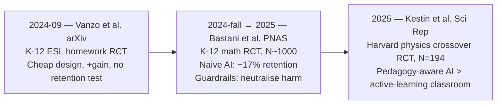

# LLM tutoring — the 2024-2025 causal-evidence arc

> Cross-paper synthesis weaving the three RCT-grade papers currently
> ingested into this domain
> ([[2024-vanzo-gpt4-homework-tutor-summary|Vanzo 2024]] /
> [[2024-bastani-generative-ai-guardrails-summary|Bastani 2024]] /
> [[2025-kestin-ai-tutoring-active-learning-summary|Kestin 2025]])
> into a single picture of what is *known*, what is *known-unknown*,
> and what should be tested next.

> [!important] 30-second TL;DR for researchers
> Three classroom RCTs (2024-2025) gave the AI-tutoring field its
> **first causal evidence**: naive ChatGPT during practice can
> *harm* retained skill (Bastani −17%); pedagogical guardrails
> *neutralise* the harm (Bastani GPT Tutor); deep pedagogy-aware
> design can *exceed* the best-practice active-learning classroom
> (Kestin 2025, single-site). **The load-bearing variable is
> design depth, not model strength.** **The dominant open gap is
> multi-term retention** — measured in only one of the three
> studies, and only at K-12 within-term scale.

## The arc in one paragraph

In the eighteen months from September 2024 to mid-2025, three
classroom RCTs were published that **for the first time give us
causal — not just correlational — evidence on whether LLMs help or
hurt learning**. Read in sequence they tell a coherent and
non-trivial story: cheap-design LLM homework tutors **improve
short-term engagement and narrow skill gains**
([[2024-vanzo-gpt4-homework-tutor-summary|Vanzo]]); naive in-class
deployments **measurably harm retained skill, while pedagogically
guardrailed prompts neutralise the harm without delivering uplift**
([[2024-bastani-generative-ai-guardrails-summary|Bastani]]); and
deeply pedagogy-aware prompts **can exceed the best-practice
active-learning classroom on matched learning outcomes**
([[2025-kestin-ai-tutoring-active-learning-summary|Kestin]]). The
load-bearing variable across all three is **design depth**, not
model strength.

## The evidence arc (timeline)

The papers are intentionally **non-redundant**: they vary along
multiple axes (level, subject, prompt-design depth, comparator,
measurement horizon). Reading any one in isolation overstates either
the harm or the promise.

## Cross-paper comparison

| Axis                                    | [[2024-vanzo-gpt4-homework-tutor-summary\|Vanzo 2024]] | [[2024-bastani-generative-ai-guardrails-summary\|Bastani 2024]]                 | [[2025-kestin-ai-tutoring-active-learning-summary\|Kestin 2025]]              |
| --------------------------------------- | --------------------------------------------------- | ------------------------------------------------------------------------------- | ------------------------------------------------------------------------------ |
| Sample                                  | 4 classes, Italian high school (ESL)                | ~1,000 students, Turkish high school (math)                                     | N=194 Harvard undergrads (physics)                                             |
| Randomisation unit                      | Class                                               | Classroom (clustered SEs)                                                       | Within-subject crossover                                                       |
| Comparator                              | Business-as-usual homework                          | Textbook+notes (control); also a no-guardrails AI arm                            | Best-practice **active learning** classroom                                    |
| Prompt-design depth                     | Minimal (teacher-supplied topic line)               | Medium (hint + verified solution + misconception list, per problem)             | Deep (active learning + cognitive-load + growth mindset)                       |
| Pre-registered primary outcome          | Pre/post grammar gain                               | **Unassisted exam after withdrawal**                                            | Matched post-test                                                              |
| Measures retention under withdrawal     | No                                                  | **Yes** — the load-bearing design choice                                        | No                                                                             |
| Headline result                         | Significant grammar gain; high engagement; "want to keep using" | Naive AI **−17%**; guardrailed AI ≈ control on exam (+127% during practice)     | AI tutor > active-learning classroom on post-test; more learning in less time   |
| `evidence_quality` (per L2 schema)      | rct                                                 | rct                                                                             | rct                                                                            |
| `replicated`                            | partial                                             | partial                                                                         | no                                                                             |
| Authoring cost                          | Very low                                            | High (per-problem solutions + misconception templates)                          | High (pedagogy-design expertise; written by physics-education researchers)     |

## What we now know

1. **Naive ChatGPT-style access during practice is empirically a
   net negative for skill acquisition**, at least in K-12
   mathematics within one term. The
   [[2024-bastani-generative-ai-guardrails-summary|Bastani −17% exam penalty]]
   is the strongest single causal estimate in the programme.
2. **Pedagogical [[learning-guardrails|guardrails]] reliably
   neutralise the harm** of naive access — this is the most robust
   positive finding when read across Bastani and Kestin together.
3. **Engagement and "willingness to keep using" are real**, across
   contexts and design depths. These are not the same as learning
   gains, but they are not nothing either.
4. **Subjective learning is decoupled from objective learning.**
   Bastani §3.4 directly shows this for naive AI; the general
   pattern fits the long-standing metacognitive-illusion literature.
5. **Design depth dominates model strength.** All three studies use
   GPT-4 generation models; the variance in outcomes is driven by
   prompt and curriculum design, not by which frontier model is
   loaded.
6. **Deep pedagogical design**
   ([[2025-kestin-ai-tutoring-active-learning-summary|Kestin's pedagogy-aware prompt]])
   can move LLM tutoring from "match-the-control" to "exceed the
   best classroom" — at least within a single-site, two-topic,
   two-week test.

## What we don't yet know

1. **Multi-term retention.** Every positive learning effect in this
   arc is measured within weeks. The cleanest within-term harm
   measurement comes from a single school. The multi-term answer
   is genuinely open. See [[llm-tutoring-cognitive-offload]].
2. **Cross-site replication.** Each anchor paper is single-site.
   2026-2027 multi-site replications will decide whether the
   effects are robust or context-bound. LearnLM/Eedi UK (2025)
   is a step in this direction but not yet ingested.
3. **Cross-domain generalisation.** All three are in well-
   structured domains (grammar, math, physics). The
   open-form-task question (essay, design, philosophy) is empirically
   blank.
4. **Whether guardrail authoring cost can be amortised.** The
   positive results depend on expert prompt design; the
   cheap-design positive
   ([[2024-vanzo-gpt4-homework-tutor-summary|Vanzo]])
   is also the one most exposed to the missing-retention-test
   critique. See [[llm-tutoring-equity-impact]].
5. **The Bastani–Kestin reconciliation.** Bastani's GPT Tutor only
   matches control; Kestin's tutor exceeds best-classroom. Is the
   gap (a) population (HS vs. undergrad), (b) prompt depth
   (verification vs. full pedagogy), or (c) comparator (textbook vs.
   active learning)? The clean experiment to disambiguate has not
   been published.
6. **Whether students can be made aware of the trade-off.** The
   awareness gap in Bastani §3.4 is striking; whether UI signals or
   explicit instruction can close it is an obvious mitigation lever
   that no published RCT has tested.

## Replication budget

How much weight should each finding carry in current policy thinking?

- **Naive AI harm direction.** **Robust.** Multiple independent
  observations (Bastani in math, Khanmigo-line nulls / negatives,
  productivity-vs-learning split in workplace literature) point the
  same way. Specific magnitudes (−17%) are single-study.
- **Guardrails neutralise harm.** **Moderately robust.** Bastani is
  the clean RCT; Kestin uses guardrails as one component of a
  larger pedagogical design. No other clean RCT isolates the
  guardrail effect.
- **Pedagogy-aware AI exceeds best classroom.** **Single-study.**
  Kestin 2025 is currently the high-water mark; awaits multi-site
  replication.
- **Engagement / satisfaction gains.** **Robust.** All three studies
  report this; consistent with broader EdTech literature.
- **2-Sigma uplift via LLM tutoring.** **Not yet supported.**
  Kestin's effect size is the closest move, but is single-site
  short-horizon. Treat strong "LLMs reproduce Bloom's 2σ" claims
  as **unsupported by evidence in this wiki**.

## Evidence so far (extended ledger, including TODOs)

| Date    | Source                                                                                       | What it adds                                                                          |
| ------- | -------------------------------------------------------------------------------------------- | ------------------------------------------------------------------------------------- |
| 2024-09 | [[2024-vanzo-gpt4-homework-tutor-summary]]                                                  | Cheap-design positive; K-12 ESL; no retention test                                    |
| 2024-fall → 2025 | [[2024-bastani-generative-ai-guardrails-summary]]                                   | Pre-registered, large-N; naive AI harm + guardrails neutralise; awareness gap          |
| 2025    | [[2025-kestin-ai-tutoring-active-learning-summary]]                                          | Within-subject crossover; pedagogy-aware AI exceeds active learning                    |
| TODO    | LearnLM / Eedi UK RCT (Google DeepMind 2025) — *not yet ingested*                            | Adds human-in-the-loop design; +5.5pp on novel-problem transfer                       |
| TODO    | Khanmigo Puerto Rico pilot (Digital Promise 2024) — *not yet ingested*                       | Equity-focused; positive engagement, mixed learning; infrastructure constraints        |
| TODO    | Khanmigo physics concepts RCT (Asuncion-Sapida et al. 2024) — *not yet ingested*             | Null on learning gains vs. Google search control; design-dependence echo               |
| TODO    | Hicke et al. CHATA (Cornell 2024) — *not yet ingested*                                        | Programming-tutor RCT; closer to the CS-tutoring literature                            |

## What should be tested next (concrete proposals)

1. **A retention probe on the Kestin design.** Run the same crossover
   tutor with a 4-week and 12-week retention exam. This is the
   single most informative follow-on.
2. **A head-to-head Bastani-vs-Kestin prompt depth comparison.**
   Same population, same subject; arms differ only in prompt-design
   depth. Reconciles the most important open contradiction in the
   programme.
3. **A multi-site replication of Bastani's GPT Base −17%.**
   If the harm direction is robust across institutional contexts,
   policy guidance can be issued with confidence. If not, the result
   needs scoping.
4. **A guardrail-cost amortisation study.** Compare per-problem
   hand-authored guardrails (Bastani) against retrieval-augmented
   guardrails (LLM pulling verified solutions from a curriculum
   database). Does the cheap version preserve the safety effect?
5. **An open-form domain test** (writing or coding) — does any of
   the above survive when "the correct answer" is not a clean
   target?

## Related wiki pages

- Framework: [[llm-tutoring-systems]]
- Concepts: [[two-sigma-problem]], [[intelligent-tutoring-system]],
  [[cognitive-offloading]], [[learning-guardrails]]
- Open questions: [[llm-tutoring-cognitive-offload]],
  [[llm-tutoring-equity-impact]]
- Companion reading guide: [[ai-education-2024-2025-researcher-guide]]
