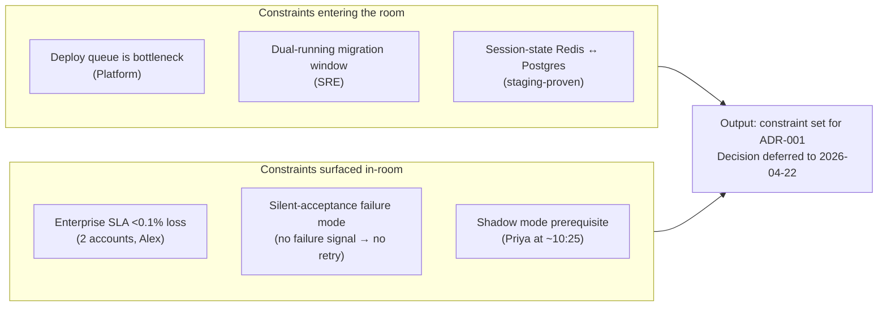

# Q2 platform planning — analysis

> [!important]
> **30-second TL;DR.** Platform proposes extracting `identity` +
> `webhooks` from the monolith for Q2. The scoping meeting reshapes
> the rollout from 4-phase to 5-phase after
> [[stakeholder-alex-cs]] surfaces the silent-acceptance webhook
> failure mode (routing layer 202s without enqueueing) — invisible
> to standard retry logic. Shadow mode + queue-depth assertion +
> rollback-as-runbook adopted as cutover prerequisites. **The
> single most important deferral** is to the 2026-04-22 ADR
> review; what the meeting commits is the *constraints the ADR
> must satisfy*, not the decision itself.

## At-a-glance

| Field                       | Content |
| --------------------------- | ------- |
| **Working subject**         | Q2 monolith → microservices split scoping (identity + webhooks first) |
| **Meeting type**            | planning |
| **Attendees**               | [[team-platform]] (Maya, Priya); Devon Park (Product); Tom Becker (SRE); [[stakeholder-alex-cs]] (Customer Success — enterprise SLA exposure) |
| **Decision produced**       | none — decision deferred to ADR review on or before 2026-04-22 |
| **Reversibility**           | n/a — no decision yet committed |
| **Load-bearing constraint** | enterprise webhook delivery SLA (<0.1% loss for two accounts); the silent-acceptance failure mode named by Alex |
| **Residual risks accepted** | none yet — the meeting *adds* mitigation requirements (shadow mode + queue-depth assertion + step-by-step rollback) rather than accepting deferrals |
| **Owners assigned**         | Maya → ADR-001 draft (2026-04-18); Priya → session-state dual-write staging validation (2026-04-17); Tom → rollback runbook (2026-04-18); [[stakeholder-alex-cs]] → ADR-001 webhook-section reviewer |

## Decision-shape diagram

## Cast and stakes

| Stakeholder                    | Stake                                                  | Position                                                                        | Outcome                                                                |
| ------------------------------ | ------------------------------------------------------ | ------------------------------------------------------------------------------- | ---------------------------------------------------------------------- |
| Maya Chen ([[team-platform]])  | Deploy-frequency unlock; team throughput               | Proposes identity + webhook split as the two cleanest bounded contexts          | Accepted in principle; constraints from Alex reshape the rollout shape |
| Devon Park (Product)           | Q3 deploy-frequency gain vs Q2 no-customer-visible-upside | Accepts the Q2-as-plumbing framing                                              | Time-pressured but agreeable                                           |
| Tom Becker (SRE)               | Rollback discipline; operability                       | Insists rollback be a runbook with state reconciliation, not `kubectl rollout undo` | Accepted by Maya                                                       |
| Priya Shah ([[team-platform]]) | Session-state dual-write feasibility                   | Reports staging dual-write works; proposes shadow mode at ~10:25                | Both accepted as cutover prerequisites                                 |
| [[stakeholder-alex-cs]]        | Enterprise webhook delivery SLA <0.1% loss             | Names the silent-acceptance failure mode; demands shadow + zero-tolerance       | Granted named-reviewer status on ADR-001 webhook section               |

## Context

First scoping meeting of the Q2 platform-migration arc (see
[[q2-platform-migration]]). The Platform team enters the room with
a fully formed proposal — extract `identity` and `webhooks` from
the monolith — and a target ADR date two weeks out. Product is
sympathetic; SRE is in favour; engineering has prototyped the
hardest part (session-state dual-write) on staging. The risk
surface from the platform side is well-mapped on entry.

The room contains exactly one stakeholder whose risk surface is
**not** captured by the platform side's prep: [[stakeholder-alex-cs]],
representing enterprise customers with contractual webhook
delivery SLAs. Alex's concern dominates the second half of the
meeting and reshapes the proposal from a 4-phase rollout into a
5-phase rollout with a shadow-mode prerequisite.

## Key claims

- **Maya** (Platform lead): the deploy queue is the single biggest
  source of friction; identity and webhooks are the two cleanest
  bounded contexts to extract first. Q3 deploy-frequency target
  2–3×.
- **Tom** (SRE lead): the dual-running migration window is the
  fragile surface; rollback must be a runbook with state
  reconciliation, not a deploy revert.
- **Alex** (Customer Success): two enterprise accounts carry
  contractual <0.1% delivery-loss SLAs; the load-bearing failure
  mode is *silent acceptance* — the routing layer returns 202 but
  never hands off to the worker pool. Retry logic does not catch
  this because no failure signal is emitted.

## Tensions surfaced

- **Tom vs Alex on retry-logic adequacy** (~10:18). Tom: "the
  retry logic should catch that." Alex: "retry-on-failure only
  works if the request *fails*." Resolution: Maya commits to
  adding a queue-depth assertion specifically for the silent-
  acceptance case.
- **Phase boundaries vs SLA exposure**. Alex pushes for shadow
  mode + zero-tolerance for silent-drop incidents as cutover
  prerequisites, not as monitoring goals. The team accepts.
- **Reviewer authority vs reviewer-as-cc**. Alex explicitly asks
  to be a named reviewer on the ADR's webhook section, not on
  cc. Maya accepts immediately; no pushback. This is recorded
  here because the postmortem six weeks later (see
  [[2026-05-06-meeting-incident-postmortem-analysis]]) revisits
  whether *named-reviewer* status was sufficient authority for
  the SLA-exposure risk Alex was representing.

## Decisions deferred

No final decision in this meeting. The decision to proceed with
the split is deferred to the ADR review on or before 2026-04-22
(see [[2026-04-22-decision-microservices-split-analysis]]). What
*was* decided here are the constraints the ADR must satisfy:

- Phased rollout, hard gates between phases.
- Shadow mode on the webhook routing layer ≥ 2 weeks before any
  traffic shift.
- Rollback plan as a runbook with state reconciliation.
- Queue-depth assertion at the routing layer for the silent-
  acceptance case.

## Action items

- Maya — Draft ADR-001 by 2026-04-18.
- Priya — Validate session-state dual-write on staging at
  production-equivalent load by 2026-04-17.
- Tom — Define rollback runbook structure by 2026-04-18.
- Alex — Reviewer on ADR-001 webhook section; sign-off required
  before cutover.

## Cross-references

- [[q2-platform-migration]] — the project this meeting opens.
- [[stakeholder-alex-cs]] — the stakeholder whose concern dominates
  the second half and shapes the rest of the arc.
- [[team-platform]] — the team proposing the split.
- [[microservices-split]] — the canonical decision page that
  ADR-001 will populate.
- [[2026-04-22-decision-microservices-split-analysis]] — next page
  in the causal arc.
- [[decision-delay-from-skipped-stakeholder]] — the pattern this
  meeting *almost* avoids by bringing CS into the room early, and
  that the postmortem will eventually re-validate as a near-miss
  (the structural mitigation surfaced here was the right one;
  the follow-through gap is what later breaks).
- [[engineering-decision-style]] — the planning meeting establishes
  most of the positive pattern's shape (pre-read deck, constraint-
  owners in the room, stress-testing). Where the arc later breaks
  is steps 5-6 (exit triggers + owner-on-mitigation), not in this
  meeting.
- [[engineering-decisions-retrospective-may-2026]] — cross-arc
  synthesis comparing this arc's failure mode against the May
  decisions' success.

## Notes

This meeting is the **best-behaviour** anchor of the arc — the
stakeholder with the load-bearing concern is in the room, gets
floor time, gets named-reviewer status, and reshapes the
proposal. Six weeks later the postmortem will surface that
named-reviewer status was not actually sufficient authority for
the residual risk that broke. The lesson is not "Alex was right";
the lesson is that *being in the room and getting documented
agreement on a residual risk is not the same as that risk being
treated as blocking*.
