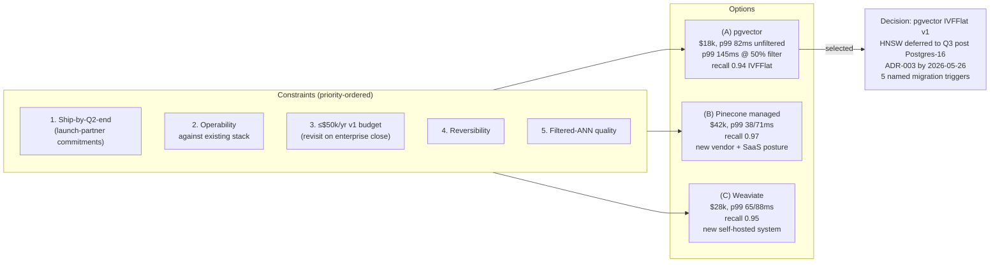

# Vector DB selection (semantic search v1) — analysis

> [!important]
> **30-second TL;DR.** The team selected **pgvector with IVFFlat
> indexing** for semantic search v1 over the 12M-vector launch corpus,
> with HNSW migration deferred to Q3 post Postgres 15 → 16 upgrade.
> The load-bearing trade-off was filtered-ANN p99 headroom (pgvector
> at 145ms vs 150ms budget at 50% selective; degrading to 220ms at
> 10% selective) vs operability against the existing Postgres stack
> (overwhelmingly familiar to SRE and on-call) and cost ($18k/yr at
> launch scale vs $42k for Pinecone). Five named migration triggers
> were committed before the decision was signed. The single most
> important deferral is the 30M-vector enterprise pre-sales tenant
> mitigation, which is *contingent on close* — if the enterprise
> closes, per-tenant Postgres replica isolation kicks in ($8k/year
> per isolated tenant; acceptable for $1.2M ACV).

## At-a-glance

| Field                       | Content |
| --------------------------- | ------- |
| **Working subject**         | Vendor selection for vector DB v1 of the new semantic search service (3 options, 12M vectors at launch, +1M/quarter growth) |
| **Meeting type**            | decision (cross-team vendor selection meeting) |
| **Attendees**               | [[stakeholder-hiro-ml]] (owner), [[stakeholder-marcus-api]] (cross-team API surface), Priya Shah ([[team-platform]], operations perspective), Devon Park (Product), Yuki Nakamura ([[team-ml-platform]], benchmark owner) |
| **Decision produced**       | pgvector with IVFFlat v1; ADR-003 by 2026-05-26; HNSW migration deferred to Q3 post Postgres-upgrade |
| **Reversibility**           | high (vectors in Postgres rows; migration to any other vector DB is "dump → re-embed if needed → load") |
| **Load-bearing constraint** | operability against existing Postgres stack outranked even the thin filtered-ANN headroom — Priya's "second-most-expensive-database" argument was decisive |
| **Residual risks accepted** | (a) filtered-ANN p99 145ms is barely inside the 150ms budget at 50% selective; degrades at lower selectivity; (b) v1 ships on IVFFlat recall 0.94 instead of HNSW 0.96-0.97 due to Postgres-15-on-prod constraint; (c) "managed-cheap-tier" sales objection risk for enterprise pre-sales |
| **Owners assigned**         | [[stakeholder-hiro-ml]] → ADR-003 (2026-05-26) + per-tenant replica isolation (contingent on close); Yuki → per-tenant tuning profile (2026-06-02); Priya → Postgres 15→16 upgrade (Q3 start); [[stakeholder-marcus-api]] → API surface design (2026-06-09); Devon → enterprise sales coordination |

## Decision-shape diagram

## Cast and stakes

| Stakeholder                       | Stake                                                              | Position                                                                                   | Outcome                                                                          |
| --------------------------------- | ------------------------------------------------------------------ | ------------------------------------------------------------------------------------------ | -------------------------------------------------------------------------------- |
| [[stakeholder-hiro-ml]]           | ML stack architecture for the next 12-18 months                    | Recommended (A) in pre-read; defended on cost, operability, ship-by-Q2                     | Decision committed as recommended                                                |
| Priya Shah ([[team-platform]])    | Operational cost of running an additional database                 | Strongly against (B) and (C) on ops grounds — "second-most-expensive-database" framing     | Accepted; her framing became decisive                                            |
| [[stakeholder-marcus-api]]        | API surface stability + reversibility at v2 horizon                | Argued reversibility row matters more than client-library row (the API hides the choice)   | Accepted; added Trigger 5 (graph-shaped query mix) before the decision was signed |
| Devon Park (Product)              | Cost vs sales-narrative + enterprise pre-sales                     | Pushed back on $50k cap as too tight if enterprise closes; flagged sales-objection risk     | $50k → "≤$50k at launch; revisit on close"; sales coordination action item       |
| Yuki Nakamura ([[team-ml-platform]]) | Index-quality tuning + Postgres-version dependency             | Surfaced IVFFlat-vs-HNSW + Postgres 15 → 16 dependency at ~10:28                          | IVFFlat for v1, HNSW post-upgrade; per-tenant tuning profile owned by Yuki       |

## Context

The 2026-05-19 meeting opens the [[data-platform-vector-search]]
project's decision-phase. Unlike the 2026-05-13 API decision meeting
which served the in-flight Q2 platform migration, this is a
freshly-scoped project owned by [[team-ml-platform]] with its own
budget and product driver. [[stakeholder-hiro-ml]] convened the
meeting against a 6-page pre-read containing benchmark results from
the 12M-vector real-customer-corpus snapshot Yuki Nakamura had
collected on 2026-04-30 — the same shape of pre-read that
[[stakeholder-marcus-api]] brought to the 2026-05-13 API decision
meeting.

The room was deliberately small (5 attendees including the scribe);
the cross-team members — Marcus and Priya — were invited precisely
because the choice has downstream consequences (API surface design;
Postgres-cluster ops + Q3 upgrade dependency). This is the
**cross-team-bookkeeping-as-decision-input** shape: cross-team
stakeholders are not in the room as reviewers, they are in the room
as **dependency owners** whose constraints the decision must satisfy.

## Key claims

- **Hiro** (~10:14): pgvector's filtered-ANN p99 of 145ms is *barely*
  inside the 150ms budget at 50% selective filters; at 10% selective,
  p99 climbs to 220ms. The 30M-vector enterprise tenant will hit
  harder filter cases.
- **Priya** (~10:16-10:18): the operational cost of "another system
  to run" is real and easy to underweight in a six-month horizon. SRE
  on-call is already at-budget; a new self-hosted system (Weaviate)
  without a 6-month onboarding plan is a "phase-2 incident waiting to
  happen". (B) Pinecone is a black box — when it breaks, file a ticket
  and wait.
- **Marcus** (~10:20-10:21): the API surface in the service will hide
  the vector DB choice from internal callers, so reversibility matters
  more than client-library quality. pgvector's reversibility is the
  strongest of the three (vectors in Postgres rows; dump-and-load
  migration).
- **Devon** (~10:07-10:08): the $50k cap is too tight if any
  enterprise tenant closes; reframed as "≤$50k at launch; revisit on
  enterprise close". This is a budget-conditioning meta-decision.
- **Yuki** (~10:28): HNSW requires Postgres ≥16 with the extension at
  ≥0.7; production is on Postgres 15. v1 ships on IVFFlat (recall
  0.94); HNSW (recall ~0.96-0.97) post-upgrade.

> [!quote]
> Priya (~10:18): "A new self-hosted system without a 6-month
> onboarding plan is a phase-2 incident waiting to happen."

The quote is load-bearing because it converts the abstract "ops cost"
trade-off into a concrete incident-shaped argument that the room
recognised (the room had just lived through
[[2026-05-06-meeting-incident-postmortem]]'s phase-2 incident 13 days
earlier). The argument carried disproportionate weight in the room
because the cost type was *recently visible*.

## Tensions surfaced

- **Cost ceiling vs sales-narrative.** Devon's pushback on the $50k
  cap (~10:07) opened the question of whether "we run on
  managed-cheap-tier" is itself a sales-side cost. Hiro's response
  (~10:34) — that the customer-facing branding is "we manage your
  search index" rather than "we use pgvector" — defused the tension
  but did not fully resolve it; the residual risk is logged in the
  at-a-glance row and the project page.
- **Filtered-ANN headroom vs ops simplicity.** The 145ms-at-50%-
  selective number is the load-bearing number in the entire decision.
  If the room had not had Priya's "second-most-expensive-database"
  framing available, the decision plausibly tips toward Weaviate
  (35ms more headroom, only $10k more cost). Priya's argument did the
  work the headline numbers couldn't have done on their own.
- **HNSW vs IVFFlat for v1.** Yuki's surfacing of the Postgres-
  version constraint at ~10:28 was the moment the v1 recall ceiling
  got locked at 0.94 instead of 0.96-0.97. The team accepted this
  trade-off rapidly — "real but small for v1" — but it is worth
  flagging that the team did not stress-test whether 0.94 recall
  produces customer-visible quality issues at launch scale.

## Decisions taken

- **pgvector with IVFFlat** selected for v1; ADR-003 by 2026-05-26
  formalises. Will populate a canonical decision page only when the
  ADR text stabilises (deferred per §"Decision-page creation").
- **Per-tenant Postgres replica isolation** for the 30M-vector
  enterprise pre-sales tenant — contingent on close. $8k/year per
  isolated tenant; acceptable for $1.2M ACV.
- **Per-tenant IVFFlat tuning profile** committed; Yuki owns the
  per-tenant profile (lists, probes, index build parameters) for
  varying corpus sizes and filter-selectivity profiles.

## Decisions deferred

- **HNSW migration** — deferred to Q3 post Postgres 15 → 16 upgrade.
  This is a structurally-named deferral with an explicit dependency
  (Priya's Q3 upgrade work) and explicit cost (recall ceiling stays
  at 0.94 instead of 0.96-0.97 for ~3 months).
- **Migration to Weaviate or Pinecone** — deferred per five named
  exit triggers (see the project page
  [[data-platform-vector-search]] for the full list). Each trigger
  has a measurable condition.
- **API surface design for search endpoint** — deferred to Marcus
  ([[stakeholder-marcus-api]]); due 2026-06-09. Not blocking ADR-003.

## Action items

- [[stakeholder-hiro-ml]] — Draft ADR-003 covering pgvector decision
  + migration triggers + per-tenant tuning. Due 2026-05-26.
- [[stakeholder-hiro-ml]] — Stand up per-tenant Postgres replica for
  30M-vector enterprise pre-sales account, contingent on close.
- Yuki Nakamura — Per-tenant IVFFlat tuning profile (lists, probes,
  index build parameters). Due 2026-06-02.
- Priya Shah ([[team-platform]]) — Coordinate Postgres 15 → 16
  upgrade for Q3; ensure HNSW indexes are part of upgrade
  validation.
- [[stakeholder-marcus-api]] — API surface design for search
  endpoint. Due 2026-06-09.
- Devon Park (Product) — Communicate decision posture to sales for
  the enterprise pre-sales account.

## Cross-references

- [[data-platform-vector-search]] — the project this meeting is the
  decision-phase of.
- [[stakeholder-hiro-ml]] — decision owner.
- [[team-ml-platform]] — owning team.
- [[team-platform]] — sibling team; Postgres-cluster ownership +
  Q3 upgrade dependency.
- [[team-api-platform]] — sibling team; will own the search API
  surface.
- [[stakeholder-marcus-api]] — cross-team attendee; added Trigger 5
  before the decision was signed.
- [[2026-05-13-meeting-api-style-decision-analysis]] — sibling
  decision meeting (6 days earlier); same engineering-decision-style
  pattern (pre-read trade-off matrix + meeting-as-stress-test +
  named exit triggers).
- [[engineering-decision-style]] — positive pattern this meeting is
  an instance of (3rd of 3 currently filed).
- [[engineering-decisions-retrospective-may-2026]] — synthesis
  braiding this decision with the Q2 migration ADR-001 and the
  API style decision.

## Notes

The 2026-05-19 meeting is **structurally identical** to the
2026-05-13 API decision meeting six days earlier despite being owned
by a different team in a different domain. Both meetings exhibit the
positive [[engineering-decision-style]] pattern:

1. Pre-read with fully-derived trade-off matrix and benchmark data.
2. Constraints declared in priority order; constraint prioritisation
   itself is open to challenge at the start of the meeting (Devon
   challenged Hiro's #3 just as he challenged Marcus' #3 six days
   earlier).
3. Meeting time spent on stress-testing the recommendation rather
   than re-deriving it.
4. Cross-team dependency owners (Priya for Postgres ops; Marcus for
   API surface) in the room as constraint-owners, not as reviewers.
5. Exit triggers / migration triggers named before the decision is
   signed.
6. Owner + due-date on every action item.

This is the **second confirmed instance** of the pattern; together
with the API-style decision it lifts [[engineering-decision-style]]
from N=1 to **N=2-provisional**. ADR-001 (the microservices split)
remains a near-miss / partial instance: same six-step shape, but
step 6 (owner + date on every action item) was skipped on the
deferred CS mitigation — the very defect that produced the May
incident.

The contrast to [[decision-delay-from-skipped-stakeholder]] (the
negative N=1 pattern) is the synthesis
[[engineering-decisions-retrospective-may-2026]]'s organising
thesis: the team has a working *positive* template for engineering
decisions; the failure mode in ADR-001 was a workflow-seam defect
*downstream* of the decision (the deferred mitigation lacking owner
+ date), not a defect in the decision-making process itself.
