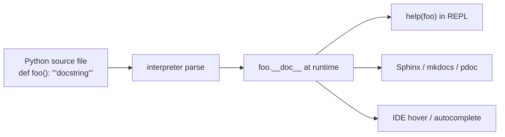

# Summary — "What is a docstring?"

> Per-source summary (1:1 with [[source]]). Compresses the
> single-page introduction into a discoverable record + cross-links.

## Claim

A docstring is the load-bearing public surface of a Python object —
discoverable at runtime, parsed by tooling, and indexed by IDEs in
ways a `# comment` is not. The choice of docstring style (PEP 257 /
Google / NumPy) is project-wide and worth enforcing mechanically.

## Mechanism

Comments (`# …`) are discarded by the parser; docstrings are attached
to the object as the `__doc__` attribute and survive into runtime,
which is what makes them visible to every downstream tool.

## Headline points

| Point | Detail | Cite |
|---|---|---|
| **Discoverability** | `help(foo)` shows docstrings, ignores `# comments` | [[source]] §"Why docstrings beat comments" |
| **Tooling consumption** | Sphinx / mkdocs / pdoc all parse `__doc__` | [[source]] §"Why docstrings beat comments" |
| **Three canonical formats** | PEP 257, Google, NumPy | [[source]] §"Conventions worth following" |
| **Enforce mechanically** | `pydocstyle` or `ruff`'s `D` rules | [[source]] §"Conventions worth following" |
| **Skip on trivial helpers** | name + signature beat redundant docstring | [[source]] §"When to skip" |

## Cross-references

Concepts surfaced by this summary:

- [[docstring]] — the core concept defined here.
- [[docstring-style]] — the convention-choice dimension (PEP 257 /
  Google / NumPy).

## Open questions

- How does this interact with `dataclasses` and `Pydantic` models,
  whose docstrings often duplicate field-level descriptions?
- Where do `typing.Annotated[..., "..."]` annotations sit relative to
  docstrings on the same parameter? (Out of scope for this source;
  flag for a follow-up ingest.)
