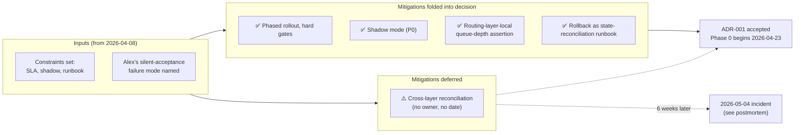

# ADR-001 microservices split

> [!important]
> **30-second TL;DR.** ADR-001 formalises a 4-phase rollout for
> extracting `identity` + `webhooks` from the monolith with hard
> gates between phases, shadow mode as a P0 line item, and a
> rollback runbook with state reconciliation. The ADR materially
> satisfies the 2026-04-08 planning meeting's constraints. The
> load-bearing trade-off is **routing-layer-local assertion as
> immediate mitigation vs cross-layer reconciliation as residual
> risk**. [[stakeholder-alex-cs]] partial-signed on this exact
> seam, predicting in writing that the cross-layer gap was the
> one to close before phase 3. **The single most important
> deferral**: cross-layer reconciliation is filed as "phase-2
> follow-up monitoring work" with **no owner and no date** — this
> is the workflow defect that the postmortem will diagnose.

## At-a-glance

| Field                       | Content |
| --------------------------- | ------- |
| **Working subject**         | ADR-001: extract `identity` + `webhooks` from the monolith |
| **Meeting type**            | decision-doc (ADR) |
| **Attendees**               | Maya Chen ([[team-platform]], author); Devon Park (Product, approver); Tom Becker (SRE, conditional approver); [[stakeholder-alex-cs]] (webhook-section reviewer, partial sign-off) |
| **Decision produced**       | Accepted: 4-phase rollout, identity + webhook extraction, shadow mode P0, rollback as runbook |
| **Reversibility**           | partial — phases 0-2 reversible via flag flip; phase 3 (Redis decommission) requires snapshot restore (~90 min) |
| **Load-bearing constraint** | Enterprise SLA exposure during cutover ([[stakeholder-alex-cs]]'s constraint, inherited from 2026-04-08) |
| **Residual risks accepted** | (a) **cross-layer reconciliation deferred** to phase-2 follow-up monitoring without owner / date — [[stakeholder-alex-cs]] partial-signed with on-record prediction; (b) phase-3 rollback complexity (90 min minimum); (c) cutover window risk addressed via doubled on-call |
| **Owners assigned**         | Maya → ADR + phase shepherding; Tom → rollback runbook (approved same-day); Priya → dual-write validation (done 2026-04-17); **cross-layer reconciliation → unassigned, undated** |

## Decision-shape diagram

## Cast and stakes

| Stakeholder                    | Stake                                                            | Position                                                                                  | Outcome                                                                                                       |
| ------------------------------ | ---------------------------------------------------------------- | ----------------------------------------------------------------------------------------- | ------------------------------------------------------------------------------------------------------------- |
| Maya Chen ([[team-platform]])  | Q2 delivery; Platform throughput unlock                          | Authors ADR-001 mirroring 2026-04-08 constraints; phased + shadow + runbook all included  | ADR accepted as written                                                                                       |
| Devon Park (Product)           | Q3 deploy-frequency gain                                         | Approves 2026-04-21                                                                       | Approved                                                                                                      |
| Tom Becker (SRE)               | Rollback discipline                                              | Conditional approval pending rollback runbook sign-off                                    | Resolved same day; approved                                                                                   |
| [[stakeholder-alex-cs]]        | Enterprise SLA <0.1% loss (Northbridge + Riverdale)              | Approves local-assertion mitigation; **does NOT** approve the cross-layer reconciliation deferral but does not block | **Partial sign-off**; on-record comment: "Recording this for the postmortem record in case we need it"        |

## Context

Two weeks after the 2026-04-08 planning meeting (see
[[2026-04-08-meeting-q2-planning-summary]]), the Platform team
returns with ADR-001 formalising the identity + webhook split.
This is the **decision crystallisation** point of the
[[q2-platform-migration]] arc.

The ADR materially reflects the 2026-04-08 discussion:
phased rollout is in, shadow mode is in, the queue-depth assertion
is named as the mitigation for the silent-acceptance failure
mode, and the rollback plan is a runbook rather than a deploy
revert. The structural shape of the rollout is everything Alex
asked for at planning.

What the ADR does **not** fully satisfy is the *adequacy of the
mitigation*. The queue-depth assertion is local to the routing
layer; cross-layer reconciliation between the routing layer and
the worker pool is acknowledged as a residual risk and deferred
to phase-2 follow-up monitoring work. This becomes the load-
bearing gap that the postmortem will surface (see
[[2026-05-06-meeting-incident-postmortem-summary]]).

## Key claims

- **The decision is phased, with hard gates.** Each phase has an
  exit criterion that must pass before promotion.
- **Shadow mode is P0**, not a phase-2 follow-up. This directly
  reflects Alex's planning-meeting ask.
- **Cross-layer reconciliation is deferred.** The ADR is explicit:
  "the routing layer's local view ... cross-layer reconciliation
  is deferred to phase-2 follow-up monitoring work." This
  deferral is named, dated, and signed off.
- **Rollback complexity grows by phase.** Phase 3 rollback is
  estimated at 90 minutes minimum because Redis decommissioning
  by that point is irreversible without snapshot restore.

## Tensions surfaced

- **Alex's partial sign-off** is the load-bearing tension in this
  ADR. Quoting the ADR's reviewer section directly: Alex
  approved the routing-layer-local assertion but did "*not* sign
  off on the decision to defer cross-layer reconciliation to
  phase-2, but did not block the ADR over it." The recorded
  comment — "Recording this for the postmortem record in case we
  need it" — is the explicit prediction that becomes load-bearing
  in May.
- **Tom's conditional approval** on the rollback runbook is
  noted but resolved same-day.

## Decisions taken

- **ADR-001 accepted.** Phased rollout, shadow mode included,
  cross-layer reconciliation deferred. This decision now exists
  as the canonical wiki page [[microservices-split]].
- Phase 0 starts 2026-04-23 (staging).
- Phase 1 (production shadow) targeted for 2026-04-29.

## Decisions deferred

- **Cross-layer reconciliation as blocking phase 3.** Mentioned
  in passing in Alex's written comment ("the gap is the one I'd
  push to close before phase 3, not after") but not committed in
  the ADR. The postmortem on 2026-05-06 ends up assigning it
  exactly this status.
- **Process question — what is a partial-sign-off?** Alex's
  partial approval has no defined semantics in the ADR template.
  Is it equivalent to approval-with-noted-concern? To soft
  approval? To approval-with-veto-on-phase-3? The ADR doesn't
  say. This unresolved process question is what
  [[should-we-revisit-cs-veto-power]] later asks.

## Action items

(All inherited from ADR-001; this section is the analysis-side
mirror.)
- Phase 0 staging soak — begins 2026-04-23.
- Phase 1 shadow mode — targeted 2026-04-29.
- Cross-layer reconciliation — backlogged under "phase-2 follow-
  up monitoring". **No owner. No date.** This is the project-
  management defect that later contributes to the incident.

## Cross-references

- [[2026-04-08-meeting-q2-planning-summary]] — the meeting whose
  constraints this ADR formalises.
- [[microservices-split]] — canonical decision page populated by
  this ADR.
- [[q2-platform-migration]] — the project this ADR moves into
  execution phase.
- [[stakeholder-alex-cs]] — the partial-sign-off reviewer.
- [[team-platform]] — the deciding team.
- [[2026-05-06-meeting-incident-postmortem-summary]] — where the
  deferred mitigation breaks.
- [[engineering-decision-style]] — the positive pattern; ADR-001
  is documented there as the **partial-instance / near-miss**
  (steps 1-4 exemplary; steps 5-6 the failure point).
- [[engineering-decisions-retrospective-may-2026]] — cross-arc
  synthesis comparing ADR-001 against the May decisions that
  closed the steps-5-6 gap.

## Notes

The ADR is, by the standards of architecture decision records,
**well-written**. It names its residual risks, dates its phase
gates, and records its reviewers' partial concerns. The defect is
not in the document — it is in the workflow downstream of the
document, which treated an explicit residual risk acknowledgement
as a substitute for a phase-blocking mitigation. The analysis on
[[2026-05-06-meeting-incident-postmortem-summary]] makes this
distinction concrete; the pattern page
[[decision-delay-from-skipped-stakeholder]] generalises it.
