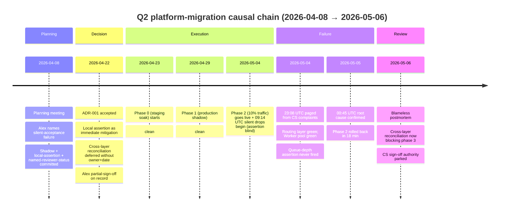

# Webhook delivery incident postmortem

> [!important]
> **30-second TL;DR.** Phase-2 of ADR-001 ran for 6 days before a
> 14-hour silent-drop incident affected ~1.7M deliveries on 8% of
> customer endpoints; two enterprise SLA accounts impacted
> (Northbridge triggered service credits at 0.71% monthly loss).
> Root cause: the routing-layer-local queue-depth assertion was
> structurally blind under sharded traffic at <10% rollout — the
> exact failure mode [[stakeholder-alex-cs]] described on
> 2026-04-08. Rollback worked (18 min). The load-bearing trade-off
> the postmortem surfaces is **the workflow gap between
> "documented residual risk" and "scheduled mitigation work"**.
> Single most important deferral: CS sign-off authority — partial
> vs blocking — parked into [[should-we-revisit-cs-veto-power]].

## At-a-glance

| Field                       | Content |
| --------------------------- | ------- |
| **Working subject**         | 2026-05-04 webhook silent-drop incident postmortem (phase-2 of ADR-001 rollout) |
| **Meeting type**            | postmortem |
| **Attendees**               | Maya Chen, Priya Shah, Tom Becker, Jordan Liu (on-call), Sam Okafor (CS), [[stakeholder-alex-cs]], Devon Park |
| **Decision produced**       | Phase-2 rolled back to 0%; cross-layer reconciliation now blocking phase 3 (owner: Priya, due 2026-05-20) |
| **Reversibility**           | n/a — postmortem decisions are remediation-shaped |
| **Load-bearing constraint** | The 2026-04-22 ADR's deferred residual risk landed exactly as forecast; phase 3 cannot proceed until the structural mitigation is in place |
| **Residual risks accepted** | (a) CS sign-off authority question deferred to a separate meeting (parked into [[should-we-revisit-cs-veto-power]]); (b) Riverdale's request for formal CS veto on phase progression not yet committed |
| **Owners assigned**         | Priya → cross-layer reconciliation (blocking phase 3, due 2026-05-20); Tom + Devon → "blocking vs deferrable risks" one-pager (due 2026-05-13); Maya → Northbridge + Riverdale postmortems (2026-05-08); Maya + Alex → joint review of partial-sign-off process (2026-05-15) |

## Causal-chain timeline

## Cast and stakes

| Stakeholder                    | Stake                                                              | Position                                                                                | Outcome                                                                                              |
| ------------------------------ | ------------------------------------------------------------------ | --------------------------------------------------------------------------------------- | ---------------------------------------------------------------------------------------------------- |
| Tom Becker (SRE)               | Postmortem discipline; cross-team learning                         | Runs blameless format; pulls Alex's reframe forward                                     | Action items capture the structural lesson, not blame                                                |
| Jordan Liu (on-call)           | Timeline accuracy from on-call view                                | Reports assertion was clean throughout; escalated to Priya at 23:30                     | Establishes the assertion was not just slow — it was blind                                           |
| Priya Shah                     | Technical root-cause clarity                                       | Names that the assertion checked global queue depth, dominated by 90% monolith traffic  | Cross-layer reconciliation taken as owner, blocking phase 3                                          |
| Maya Chen ([[team-platform]])  | Decision-process accountability                                    | "Owning that. It was my call to ship phase 2 without cross-layer monitoring in place." | Names the cognitive shape of the failure (shadow data couldn't have answered the deferred question)  |
| [[stakeholder-alex-cs]]        | Future SLA exposure; process change                                | **Declines "Alex was right" framing**; reframes to "what authority would have made this P0?" | The reframe becomes the postmortem's organising question                                             |
| Sam Okafor (CS, account mgr)   | Northbridge + Riverdale customer relationship                      | Reports Riverdale formally asking for CS veto on phase progression                      | Action item: schedule Riverdale follow-up on phase-3 conditions                                      |
| Devon Park (Product)           | Process design across CS-flagged risks                             | Takes the action on "when CS-flagged risks block a phase gate" one-pager with Tom       | Drafted as a generalisable process artifact, due 2026-05-13                                          |

## Context

Phase 2 of ADR-001 (see [[microservices-split]]) had been live for
six days when the 2026-05-04 incident occurred. Roughly 3.2% of
deliveries routed to the new layer were silently dropped over a
14-hour window. The exact failure mode is the one Alex Rivera
described on 2026-04-08 (see
[[2026-04-08-meeting-q2-planning-summary]]) and on which Alex
issued a partial sign-off in ADR-001 (see
[[2026-04-22-decision-microservices-split-summary]]).

This postmortem is the **closing beat** of the Q2-platform-
migration causal arc covered in [[q2-platform-arc-may]].

## Key claims

- **Root cause.** The routing-layer-local queue-depth assertion
  was structurally unable to detect silent acceptance-without-
  enqueue under sharded traffic at <10% rollout. A 3% drop on
  10% of traffic is below the noise floor of global queue depth,
  which is what the assertion was inspecting.
- **The cross-layer reconciliation gap deferred in ADR-001 was
  exactly the gap that broke.** This is stated explicitly by
  Maya on the record at ~14:11.
- **Phased rollout limited blast radius.** Two enterprise
  accounts impacted instead of the entire customer base; one
  triggered a contractual service credit, one stayed below the
  contractual threshold.
- **Rollback worked.** Mean time to remediate after root cause
  confirmed: 18 minutes.

## Tensions surfaced

- **"Alex was right" framing risk** (~14:20). Alex explicitly
  declines this framing on the record: "I don't want this to
  become 'Alex was right.' That's not useful." Recording this
  because it would have been easy for the postmortem to land on
  the wrong takeaway. Alex's reframe — "what would have made the
  team treat it as P0 instead of P1?" — is the load-bearing
  question and reshapes the action items.
- **CS sign-off authority** (~14:32). The Riverdale account
  manager (Sam) reports that one of the impacted enterprise
  customers is asking for a formal CS veto on phase progression,
  not just review. Alex confirms reconsidering whether the
  partial-sign-off on ADR-001 was the right call.
- **Documented residual risk vs blocking mitigation.** Maya's
  on-record statement at ~14:17 — "I weighed it as low-
  probability ... and I didn't fully internalise that the shadow
  data couldn't tell us about this specific failure mode either"
  — names the cognitive shape of the failure: shadow mode
  satisfied a different question than the one Alex was asking.

## Decisions taken

- **Phase 2 rolled back to 0% on new routing layer.** Confirmed
  18 minutes after root cause; phase 2 will not resume until
  the cross-layer reconciliation work lands.
- **Cross-layer reconciliation is now blocking phase 3.** Owner:
  Priya. Due 2026-05-20. (This is the action item that, six
  weeks earlier, the ADR deferred without owner or date.)

## Decisions deferred

- **CS sign-off authority — partial vs blocking.** Parked for a
  separate meeting per Devon's request (~14:37). The open
  question is filed as [[should-we-revisit-cs-veto-power]].
- **Customer-facing communication to Riverdale.** Sam to schedule
  follow-up; conditions for resuming phase 3 not yet committed.

## Action items

- Tom & Devon — "Blocking risks vs deferrable risks" one-pager
  for CS-flagged SLA exposures. Due 2026-05-13.
- Priya — Cross-layer reconciliation. **Blocking phase 3.** Due
  2026-05-20.
- Maya — Send postmortem to Northbridge and Riverdale by
  2026-05-08.
- Sam — Schedule follow-up with Riverdale on phase-3 conditions.
- Tom — Schedule meeting on CS sign-off authority.
- Maya & Alex — Joint review of ADR-001 partial-sign-off
  process; recommend a future-state convention for ADR-002+.
  Due 2026-05-15.

## Cross-references

- [[2026-04-08-meeting-q2-planning-summary]] — where the concern
  was first surfaced.
- [[2026-04-22-decision-microservices-split-summary]] — where the
  concern was acknowledged but the mitigation was deferred.
- [[microservices-split]] — the canonical decision page; status
  to be updated to reflect phase-2 rollback.
- [[q2-platform-migration]] — the project arc.
- [[stakeholder-alex-cs]] — the stakeholder whose concern was
  load-bearing across all three raws.
- [[team-platform]] — the team owning the rollout.
- [[decision-delay-from-skipped-stakeholder]] — the pattern this
  postmortem confirms; an instance of the broader failure mode
  of *under-empowering* a stakeholder rather than skipping them.
- [[q2-platform-arc-may]] — the cross-raw synthesis.
- [[should-we-revisit-cs-veto-power]] — the open question this
  postmortem opens.
- [[engineering-decision-style]] — the positive pattern documenting
  the workflow shape (including steps 5-6) whose absence in
  ADR-001 contributed to this incident.
- [[engineering-decisions-retrospective-may-2026]] — cross-arc
  synthesis braiding this postmortem with the May decisions that
  closed the steps-5-6 gap.

## Notes

The interesting structural observation in this postmortem is
that the standard "did we listen to the stakeholder?" question
has the wrong shape. The team **did** listen: Alex was in the
planning meeting, got floor time, got named-reviewer status on
the ADR, got the silent-acceptance failure mode documented in
both the ADR and the partial-sign-off, and got the local
assertion as the immediate mitigation. The team listened, and
the failure mode still happened.

The right question is the one Alex asks at ~14:20: what level
of authority would have caused the team to treat the residual
risk as blocking rather than deferrable? This question generalises
beyond this one stakeholder and beyond this one ADR — it is what
[[decision-delay-from-skipped-stakeholder]] tries to capture as a
recurring pattern, and what [[should-we-revisit-cs-veto-power]]
tracks as an open process question.
