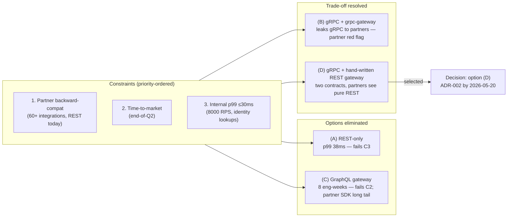

# API style decision (identity service)

> [!important]
> **30-second TL;DR.** The team selected **option (D) hybrid** — gRPC
> native for internal callers (8000 RPS, ≤30ms p99 budget) plus a
> **hand-written REST gateway** (not grpc-gateway) for the 60+ partner
> integrations and SDK surfaces. The load-bearing trade-off was
> partner backward-compat vs internal latency, decided in favour of
> serving each surface natively at the cost of maintaining two
> contracts (OpenAPI + proto). Three named exit triggers were
> committed before the decision was signed. The single most important
> deferral is GraphQL gateway evaluation for the analytics surface,
> pushed to Q4.

## At-a-glance

| Field                       | Content |
| --------------------------- | ------- |
| **Working subject**         | API style for the new post-Q2 identity service (4 options, ~14 internal callers, 60+ partner integrations) |
| **Meeting type**            | decision (cross-team design meeting with explicit decision goal) |
| **Attendees**               | [[stakeholder-marcus-api]] (owner), [[team-platform]] (Maya), [[stakeholder-inez-dx]], [[stakeholder-bram-partner]], Devon Park (Product), Tom Becker (SRE), Priya Shah |
| **Decision produced**       | Option (D) hybrid: gRPC internal + hand-written REST gateway external; ADR-002 by 2026-05-20 |
| **Reversibility**           | partial (gRPC adoption is partially reversible; the REST gateway is a hand-written abstraction layer that could later be retargeted) |
| **Load-bearing constraint** | partner backward-compat (1st priority) outranked internal latency (3rd) but the latter still eliminated option (A) REST-only |
| **Residual risks accepted** | (a) two-surface contract drift if SDK release cadence slips; (b) operational dual-surface overhead (per-surface SLOs, on-call runbook split); (c) GraphQL deferred to Q4 — exit Trigger 2 names the revisit condition |
| **Owners assigned**         | [[stakeholder-marcus-api]] → ADR-002 + trace correlation spec (2026-05-20); [[stakeholder-bram-partner]] → partner pre-notification (2026-05-20); Tom Becker → dual-surface ops posture (2026-05-25); Marcus + [[stakeholder-inez-dx]] → biweekly coupled SDK release |

## Decision-shape diagram

## Cast and stakes

| Stakeholder                        | Stake                                                       | Position                                                                  | Outcome                                                                          |
| ---------------------------------- | ----------------------------------------------------------- | ------------------------------------------------------------------------- | -------------------------------------------------------------------------------- |
| [[stakeholder-marcus-api]]         | API contract surface for the next 18-24 months              | Proposed (D) in pre-read; defended internal latency budget                | Decision committed as proposed                                                   |
| [[team-platform]] (Maya)           | Platform-team consistency; phase-2 unblock                  | Pushed back on cost (7 eng-weeks) but accepted on Priya's parallelisation | Accepted; identity team starts (D) work in parallel with cross-layer recon       |
| [[stakeholder-inez-dx]]            | SDK quality across 4 internal + long-tail partner languages | Strongly against (B) grpc-gateway on Ruby/PHP/.NET SDK quality grounds    | (D)'s hand-written gateway adopted; biweekly coupled-release commitment landed   |
| [[stakeholder-bram-partner]]       | 60+ partner integrations; procurement security teams        | Two enterprise partners flagged gRPC as red flag; hard constraint         | Hand-written REST gateway (no gRPC concept leakage) adopted as structural mitig. |
| Devon Park (Product)               | Time-to-market; constraint prioritisation                   | Reordered the constraint list: backward-compat #1, time-to-market #2      | Accepted; 7-week timeline confirmed compatible with end-of-Q2                    |
| Tom Becker (SRE)                   | Operability of two surfaces; debuggability                  | Conditional acceptance pending REST↔gRPC trace correlation as phase-1     | Trace correlation committed as phase-1 deliverable (action item)                 |
| Priya Shah (Platform)              | Critical-path engineering capacity                          | Confirmed cross-layer recon is webhook-side, not blocking identity work   | Identity team unblocked; parallel work approved                                  |

## Context

The 2026-05-13 meeting is the **first major decision of the
[[api-platform-evolution]] arc**, scheduled at a deliberate
intersection: the [[q2-platform-migration]] arc is mid-rollback after
the [[2026-05-06-meeting-incident-postmortem]] but
[[stakeholder-marcus-api]] needs to commit to an API style before
the new identity service can go live behind any traffic. Marcus
walked into the room with a 6-page pre-read containing a fully-
derived 4-option × 7-dimension trade-off matrix; the meeting was
**scheduled to land the decision, not to re-derive it**.

The room contained two external-contractual stakeholders —
[[stakeholder-bram-partner]] for the 60+ partner integrations and
[[stakeholder-inez-dx]] for the long-tail partner-SDK surface. Both
brought concrete language-level and customer-level evidence to the
discussion. The 2026-04-08 anchor of bringing the load-bearing
external stakeholder into the room early (see
[[2026-04-08-meeting-q2-planning-summary]]) is repeated here, with
the structural improvement that the resulting mitigation was
**accepted as part of the decision**, not deferred to follow-up
work.

## Key claims

- **Marcus** (~14:09): the four options are REST-only, gRPC + gateway,
  GraphQL gateway, and hybrid. (A) REST-only fails the internal
  latency budget (38ms p99 measured vs 30ms target) and is eliminated
  before the discussion gets to DX or partners.
- **Inez** (~14:17): grpc-gateway leaks gRPC concepts to the long-tail
  partner languages (PHP, .NET, Java, Ruby) where gRPC client maturity
  is uneven. The hand-written REST gateway in (D) is the structural
  fix.
- **Bram** (~14:19): two enterprise partners explicitly told Partner
  Engineering in Q1 that gRPC was a procurement-security red flag.
  They will accept grpc-gateway *only if* it presents as plain REST.
  Adopting (D)'s hand-written gateway is the only option whose surface
  is *guaranteed* to avoid leakage.
- **Devon** (~14:08): reordered the constraint list to put
  time-to-market at #2 and treat engineering budgets (latency, schema
  contracts, observability) as #3-5. This is a meta-decision about
  decision criteria.
- **Tom** (~14:23): two surfaces means two sets of SLOs, two dashboards,
  two on-call runbooks. Manageable, but only if REST↔gRPC trace
  correlation is built — without it, "an hour of debugging the wrong
  half" is a real failure mode.
- **Priya** (~14:33): cross-layer reconciliation work for webhooks is
  not blocking identity engineering. Identity team can start (D) in
  parallel.

## Tensions surfaced

- **Two-surface contract drift vs two-surface latency win.** (D) buys
  internal latency by committing the team to maintain two contracts
  (OpenAPI for partners, proto for internal). The mitigation
  (biweekly coupled SDK release) is committed but is a process
  artifact — if release discipline slips, drift returns. Logged as a
  residual risk in the at-a-glance row.
- **GraphQL deferral vs higher-ceiling option.** (C) GraphQL has the
  highest ceiling (single endpoint, federation, partners pick what
  they want) but the 8-week timeline and federation novelty kill it
  for Q2. The deferral was made explicit via Trigger 2 — if Q4's
  analytics surface GraphQL gateway lands cleanly and ≥3 internal
  callers want graph-shaped identity queries, revisit. The structure
  here is the **opposite** of the
  [[decision-delay-from-skipped-stakeholder]] failure mode: the
  deferral has a named condition, a target date, and a follow-on
  surface to validate against.
- **Engineering cost (7 weeks) vs Q2 deadline.** Maya pushed back on
  the cost; Priya's confirmation that webhook work doesn't block
  identity work resolved the concern. The meeting could have ended
  on this tension if Priya hadn't been in the room.

## Decisions taken

- **Option (D) hybrid** selected: gRPC native for internal service-
  to-service identity calls; **hand-written REST gateway** (not
  grpc-gateway) for partner integrations and SDK surfaces. To be
  formalised as ADR-002 by 2026-05-20; reviewed by 2026-05-22. The
  decision will populate a canonical decision page once ADR-002
  lands (the canonical page is intentionally deferred per the
  §"Decision-page creation" rule — we wait for the ADR's text to
  stabilise before minting a page the rest of the wiki cites).
- **REST↔gRPC trace correlation as phase-1 must-have.** Tom's
  ~14:24 ask becomes an action item, not a phase-2 follow-up.
- **Biweekly coupled SDK release.** Internal proto-generated SDK and
  external REST SDK ship on the same cadence; if either slips, both
  slip.

## Decisions deferred

- **GraphQL gateway for the analytics surface** — deferred to Q4.
  Named Trigger 2 specifies the conditions under which identity
  would be reconsidered for GraphQL federation. This is a
  **structurally-named deferral** (a deferred decision with explicit
  revisit conditions), in contrast to a structurally-unstable
  deferral (acknowledged-without-owner-or-date — the failure mode of
  [[2026-04-22-decision-microservices-split-summary]]).
- **ADR-002 partial-sign-off semantics.** The 2026-05-13 meeting
  doesn't try to resolve the partial-sign-off question that
  [[should-we-revisit-cs-veto-power]] tracks. Bram's role here is
  reviewer-with-blocking-mitigation (the hand-written gateway is the
  mitigation), not "partial signer" in the ADR-001 sense.
  Independently, Tom and Devon's "blocking vs deferrable risks"
  one-pager (due 2026-05-13 per the postmortem) is becoming
  relevant for ADR-002 review on 2026-05-22.

## Action items

- [[stakeholder-marcus-api]] — Draft ADR-002 covering option (D) with
  phase gates and exit criteria; include REST↔gRPC trace correlation
  as phase-1 deliverable. Due 2026-05-20.
- [[stakeholder-bram-partner]] — Notify the two named partners about
  the upcoming API style; collect any blocking objections before
  ADR-002 review. Due 2026-05-20.
- Tom Becker — Define operational dual-surface monitoring posture
  (per-surface SLOs, trace correlation, on-call runbook split). Due
  2026-05-25.
- [[stakeholder-marcus-api]] + [[stakeholder-inez-dx]] — Commit to
  biweekly coupled SDK release; document the coupling rule in the
  SDK release runbook.

## Cross-references

- [[api-platform-evolution]] — the project this meeting is the first
  decision of.
- [[stakeholder-marcus-api]] — decision owner.
- [[team-api-platform]] — owning team.
- [[stakeholder-inez-dx]], [[stakeholder-bram-partner]] —
  load-bearing external-contractual reviewers.
- [[team-platform]] — sibling team; identity service implementation.
- [[q2-platform-migration]] — the upstream project providing the
  identity service this API style decision configures.
- [[2026-05-06-meeting-incident-postmortem-summary]] — prior
  meeting establishing the partial-sign-off process question
  ADR-002 review will inherit.
- [[engineering-decision-style]] — positive pattern this meeting is
  an instance of (2nd of 3, after the ADR-001 micro-instance and
  before the vector DB decision).
- [[engineering-decisions-retrospective-may-2026]] — synthesis
  braiding this decision with the Q2 migration and vector DB
  decisions.

## Notes

This meeting is the **counter-anchor** to the Q2 arc's failure mode.
Compare to [[2026-04-22-decision-microservices-split-summary]]:

| Dimension                                          | ADR-001 (Q2)                                                                    | This meeting (API style)                                                                 |
| -------------------------------------------------- | ------------------------------------------------------------------------------- | ---------------------------------------------------------------------------------------- |
| External-contractual stakeholder in the room?      | yes ([[stakeholder-alex-cs]])                                                   | yes ([[stakeholder-bram-partner]])                                                       |
| Their load-bearing concern named?                  | yes (silent acceptance under retry-blind failure)                               | yes (gRPC concepts leaking to partners)                                                  |
| Mitigation accepted **as part of the decision**?   | partially — routing-layer-local assertion accepted; cross-layer recon deferred  | fully — hand-written REST gateway adopted as the structural mitigation                   |
| Deferral named with condition + owner + date?      | no — "phase-2 follow-up monitoring" with no owner, no date                      | yes — Trigger 2 names the GraphQL revisit condition; partner pre-notify has owner + date |
| Outcome at the next downstream raw                 | incident matching the deferred residual risk (2026-05-04)                       | TBD — ADR-002 review 2026-05-22                                                          |

The structural shift between these two decision meetings is the
single most teachable observation for an intern reading the wiki:
**bringing the stakeholder into the room is necessary but not
sufficient**; the difference between the two meetings is whether the
mitigation for their load-bearing concern is *accepted as part of
the decision* or *deferred as follow-up*. This generalises into the
positive [[engineering-decision-style]] pattern (3 instances now)
and stands in load-bearing contrast to the negative
[[decision-delay-from-skipped-stakeholder]] pattern (1 instance).
