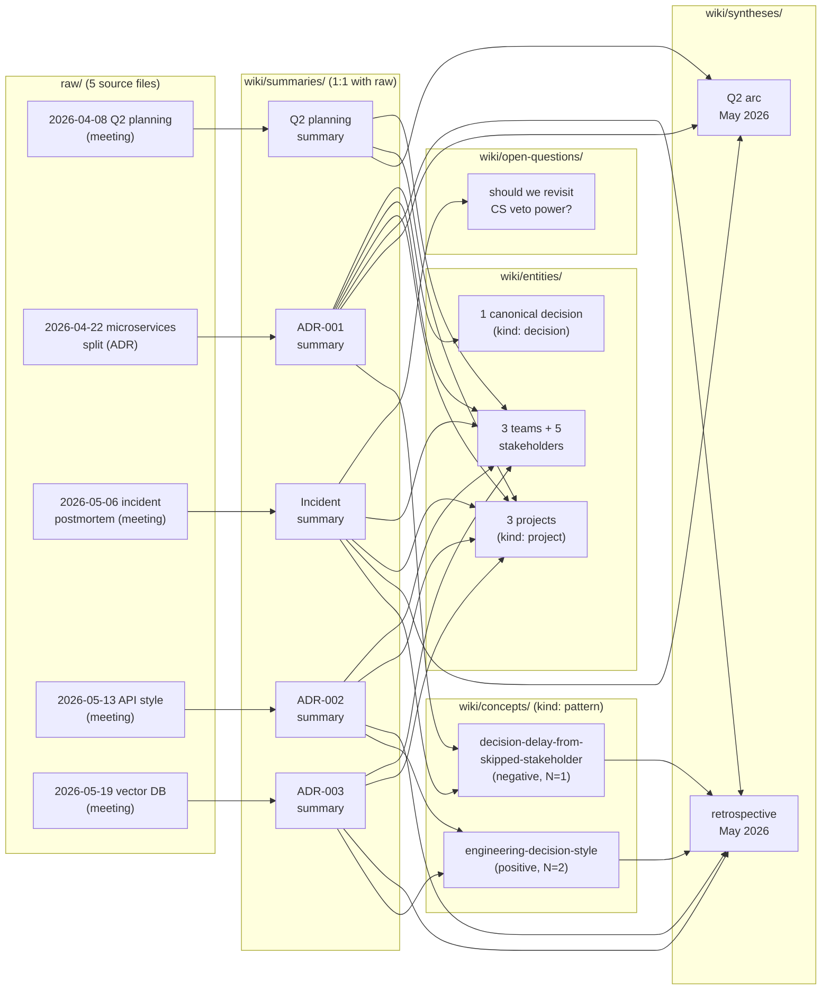

# How to read this domain — a navigator for new teammates and interns

> [!important] If you remember one thing
> This domain is a **worked example** of how the LLM-wiki pattern
> compresses the narrative of cross-team engineering decisions into
> a navigable graph. Five raws (four meetings + one ADR, all
> synthetic / fictional) were ingested as full primary sources, and
> their five `summary` pages now back the team's positive
> [[engineering-decision-style]] pattern, the matching negative
> [[decision-delay-from-skipped-stakeholder]] pattern, and the
> cross-decision retrospective
> [[engineering-decisions-retrospective-may-2026]]. You can re-trace
> any wiki claim back to a specific moment in a specific meeting
> transcript or ADR in under 60 seconds.

This page exists because the depth of the wiki is *not* obvious on
first contact — the natural failure mode is to bounce off
[`overview.md`](../overview.md), read one summary end-to-end, and
miss the graph structure that gives the wiki its compounding value.
Use the time-budgeted paths below in order; each one builds on the
previous.

## A map of what's here

Five raws, five summaries, two patterns, two syntheses, twelve
entities, one open question — **about 21 wiki pages from five
ingests**. The graph is what carries the cross-cutting signal a
single meeting summary cannot.

## The four reading paths

> [!faq]- Path A — 5 minutes (the elevator pitch)
>
> 1. Read this callout (≤30 s).
> 2. Read the **TL;DR callout** at the top of
>    [[engineering-decisions-retrospective-may-2026#TL;DR]]
>    (≤90 s). It gives you the three-decision headline and the one
>    structural defect (residual risks named without owner + date)
>    that produced the May incident.
> 3. Skim the **"The three decisions at a glance"** table on the
>    same page (≤90 s). Each row contrasts ADR-001 (partial
>    instance, one incident) against ADR-002 + ADR-003 (full
>    instances, no incident).
> 4. Read the **six-step list** at
>    [[engineering-decision-style#Pattern description]]
>    (≤90 s). This is the team's positive decision-making shape;
>    once you can see the shape, you can recognise when a new
>    decision is missing a step.
>
> **Three-decision minimum fact set** (read once, quote forever):
>
> | Axis | ADR-001 (Q2 migration) | ADR-002 (API style) | ADR-003 (Vector DB) |
> | --- | --- | --- | --- |
> | Date decided | 2026-04-22 | 2026-05-13 | 2026-05-19 |
> | Steps 1-4 (pre-read, priority, stress-test, constraint-owners) | all present | all present | all present |
> | Step 5 (exit triggers) | **weak** | strong (3 named) | strong (5 named) |
> | Step 6 (owner+date on mitigations) | **failed** | strong | strong |
> | Downstream incident? | **yes (2026-05-04)** | TBD | TBD |
> | Pattern instance | [[decision-delay-from-skipped-stakeholder]] (N=1) | [[engineering-decision-style]] (1/2) | [[engineering-decision-style]] (2/2) |
>
> **You now know**: (a) what a "healthy" engineering decision in
> this team looks like, (b) which step's absence reliably
> predicts an incident three weeks downstream, (c) why the
> retrospective frames the seam between "decision documented" and
> "mitigation owned" as the load-bearing workflow boundary, and
> (d) that the negative pattern has N=1 (one instance) while the
> positive pattern has N=2 — neither is yet load-bearing without a
> third independent confirmation.

> [!faq]- Path B — 30 minutes (one decision, fully)
>
> Path A first, then read **one summary end-to-end** —
> [[2026-05-13-meeting-api-style-decision-summary]] is the
> recommended choice because it is the cleanest worked example
> of the positive pattern (full pre-read + 60+-partner stakeholder
> in the room + 3 named exit triggers + every mitigation with
> owner+date, all in one ~9 KB page).
>
> Time budget while reading:
>
> 1. ~3 min — TL;DR + at-a-glance table. These are the *epistemic
>    interface*: they tell you what sections of the *raw meeting*
>    would be load-bearing if you went deeper.
> 2. ~5 min — Mermaid diagram + cast-and-stake table. Notice that
>    every stakeholder row carries their constraint, not their
>    approval (step 4 of the pattern).
> 3. ~10 min — Context → Key claims → Tensions → Decisions. These
>    are the summary's spine; once you read them you can quote
>    the meeting without misrepresenting it.
> 4. ~7 min — Action items + Cross-references. Notice that every
>    action item has an owner + date (step 6 of the pattern); the
>    cross-references panel shows which wiki pages this summary
>    feeds into.
> 5. ~5 min — Click through to
>    [[engineering-decision-style]] and notice that the page has
>    an **Instances** table at the bottom — the audit trail of
>    every summary that confirmed the pattern.
>
> **You now know**: the full shape of one healthy decision, every
> stakeholder's load-bearing constraint, the three exit triggers
> committed before sign-off, and where this meeting sits in the
> wider graph.

> [!faq]- Path C — 2 hours (the cross-decision picture)
>
> Path B first, then read the other four summaries (in the
> recommended order below), both syntheses, both concept pages,
> and the open question.
>
> Reading order matters:
>
> 1. **[[2026-04-22-decision-microservices-split-summary]]** (~20 min) —
>    the partial-instance / negative anchor. Read this *after*
>    Path B's positive instance so the contrast is sharp: ADR-001
>    has steps 1-4 in exemplary form but skips step 6, and that
>    one omission is what the May incident is downstream of.
> 2. **[[2026-05-06-meeting-incident-postmortem-summary]]** (~15 min) —
>    the consequence of ADR-001's step-6 omission. Notice that
>    the postmortem is *not* "engineering team made a bad
>    decision" — it is "engineering team made a *mostly* good
>    decision but didn't close the residual-risk loop".
> 3. **[[2026-04-08-meeting-q2-planning-summary]]** (~10 min) —
>    the upstream of ADR-001. Useful as a *positive*
>    counter-evidence: the planning meeting itself was textbook
>    healthy; the seam that failed was post-ADR, not pre-ADR.
> 4. **[[2026-05-19-meeting-vector-db-selection-summary]]** (~15 min) —
>    the second confirmed positive instance. Reading this
>    after the API meeting makes the pattern click — two
>    different teams, two different domains (API design + ML
>    infra), same six-step shape.
> 5. **[[q2-platform-arc-may]]** (~20 min) — the six-week arc
>    synthesis tying planning → ADR → incident together. Read
>    this before the cross-decision retrospective so you have
>    the full single-arc narrative before zooming out.
> 6. **[[engineering-decisions-retrospective-may-2026]]** (~25 min) —
>    the intern-facing cross-decision synthesis. The "three
>    decisions at a glance" table you skimmed in Path A is the
>    spine; now read the per-decision narrative and the closing
>    "What to take away" section in full.
> 7. **[[decision-delay-from-skipped-stakeholder]]** (~10 min) —
>    the negative pattern's mechanism page. Reading this last
>    means you've already seen its one confirmed instance; the
>    mechanism description should now read as obvious, which is
>    the point.
> 8. **[[should-we-revisit-cs-veto-power]]** (~5 min) — the
>    surviving open question. Notice that the open question is
>    not "did we make the wrong call on Alex's veto?" — it is
>    "should we revisit the veto-power *structure* in light of
>    the incident?". Open questions in this L2 track structural
>    re-evaluations, not retrospective second-guessing.
>
> **You now know**: enough to chair a review of any of the team's
> ADR drafts, name the specific step that is missing if any, and
> identify the structural risk that the open question is tracking.

> [!faq]- Path D — half a day (you're going to do work here)
>
> Path C first, then **read one raw end-to-end** alongside its
> summary, using the summary's section anchors as a reading guide.
>
> The point of this path is to **falsify the wiki**:
>
> 1. Open [[2026-05-13-meeting-api-style-decision]] (the actual
>    meeting transcript) side-by-side with
>    [[2026-05-13-meeting-api-style-decision-summary]] (the
>    summary). Pick three claims from the summary (the
>    constraint-owner role Inez plays, the three exit triggers
>    committed at the end, the per-mitigation owner+date on the
>    SDK side) and verify each against the corresponding moment
>    of the raw meeting. The raw retains the meeting's chronology
>    so timestamp-anchor citations resolve cleanly.
> 2. Repeat for **[[2026-04-22-decision-microservices-split]]**.
>    The ADR is structurally good — Steps 1–4 present — but the
>    "Residual risks" section names cross-layer reconciliation
>    without an owner or a date. Find that exact gap in the raw
>    ADR text; this is the discrepancy the May incident lands on.
> 3. **Find one place where the wiki is too confident or too
>    hedged** and write it down. The wiki is meant to compound
>    human + LLM review; this is exactly the loop the L2
>    sub-prompt
>    ([_system/prompts/domains/workspace-meeting-analysis.md](../../../../../_system/prompts/domains/workspace-meeting-analysis.md))
>    expects.
> 4. **Pick the open question** in
>    [[should-we-revisit-cs-veto-power]] and write the
>    minimum-viable next step that would let the team decide
>    whether the veto-power structure should change. The wiki is
>    meant to be a launchpad for the team's next process
>    iteration, not a destination.
>
> **You now know**: the meetings, the decisions, the patterns,
> their open question, and where your own next contribution
> (chairing a meeting / drafting an ADR / running a process
> review) could fit. You have also stress-tested the wiki
> itself — the next ingest should be cheaper because the graph
> is bigger.

## How to extend this wiki with your own meetings

Once you internalise the four paths above, the next move is to
**ingest a meeting of your own**. The procedure is encoded in the
L2 sub-prompt
[`_system/prompts/domains/workspace-meeting-analysis.md`](../../../../../_system/prompts/domains/workspace-meeting-analysis.md);
the short version:

1. Drop the transcript into
   `domains/workspace/raw/meetings/<YYYY-MM-DD>-meeting-<slug>.md`
   (or `raw/decisions/<YYYY-MM-DD>-decision-<slug>.md` for an
   ADR, `raw/threads/<YYYY-MM-DD>-thread-<slug>.md` for an async
   thread). See the five current raws as worked examples of the
   target shape.
2. Invoke `ingest domains/workspace/raw/meetings/<slug>.md`. The
   LLM produces:
   - **One** new `summary` page at
     `wiki/summaries/<raw-slug>-summary.md` (1:1 with raw), with
     Context / Key claims / Tensions surfaced / Decisions taken
     or deferred / Action items / Cross-references.
   - **Appended Appearances rows** on every stakeholder /
     project / team entity the meeting touches.
   - **Updated Instances tables** on any pattern this meeting
     instantiates (e.g.
     [[engineering-decision-style#Instances]] gains a row if
     the meeting follows the six-step shape).
   - **Possibly a new entity with `kind: decision`** if the
     meeting crystallises an ADR; the canonical decision page is
     distinct from both the raw ADR and the summary.
   - **Possibly a new `synthesis` page** if the meeting closes
     or reframes a multi-meeting arc.
3. Domain `log.md` and global `log.md` each get a one-line entry
   recording the ingest. The graph has grown by ~3–8 nodes.

The *compounding* property is the point: meeting N+1 takes less
work to ingest than meeting N because the stakeholder / project /
team / pattern pages it would touch already exist. By meeting 10
the wiki carries more cross-cutting signal than any quarter's
worth of meeting notes.

## What this domain does *not* try to do

To save you wandering paths that aren't here:

- **No ticket / task tracking.** Action items live in summaries
  inline, not in a `wiki/actions/` folder. Issue trackers do
  this better. See L2 [`AGENTS.md` §"What's intentionally
  missing"](../../AGENTS.md) for the rationale.
- **No performance review material.** Per-stakeholder pages list
  appearances, concerns raised, and decisions reviewed — they are
  not subjective ratings of the person.
- **No company-wide org chart.** Team pages list members but
  don't attempt to be the authoritative org chart — that lives
  in HRIS.
- **No protocol / experiment subgraph.** This L2 tracks
  decisions, not measurable interventions. If your work crosses
  into "we ran an A/B test" territory, consider standing up a
  separate L2 modelled on `self-optim`-style protocol pages.
- **No retrospective second-guessing.** Open questions in this
  L2 track structural re-evaluations (e.g.
  [[should-we-revisit-cs-veto-power]]), not "did we make the
  wrong call in retrospect?".

## Where to go next

- **If you're a new teammate or intern landing on the domain
  cold:** [[engineering-decisions-retrospective-may-2026]] is
  the right follow-on; it is designed as a single-page
  intern-onboarding read that gives you the team's
  decision-making mental model in ~25 minutes.
- **If you're about to chair your first decision meeting:**
  read [[engineering-decision-style]] (the positive pattern's
  six-step shape) and then scan any one of
  [[2026-05-13-meeting-api-style-decision-summary]] or
  [[2026-05-19-meeting-vector-db-selection-summary]] (full
  instances of the shape in action).
- **If you're reviewing an ADR draft:** scan the at-a-glance
  table in [[engineering-decisions-retrospective-may-2026]],
  then read [[decision-delay-from-skipped-stakeholder]] —
  step 6 (owner + date on residual-risk mitigations) is the
  single load-bearing checkpoint to validate before sign-off.
- **If you're evaluating this showcase as a starting template
  for your own work domain:** read the L2
  [`AGENTS.md`](../../AGENTS.md) (persona / ingest flow / lint
  rules) and the global [`AGENTS.md`](../../../../../AGENTS.md)
  (L1 schema) to see the contract that produced everything you
  just read. The sub-prompt
  [`_system/prompts/domains/workspace-meeting-analysis.md`](../../../../../_system/prompts/domains/workspace-meeting-analysis.md)
  is the executable procedure that turns one raw meeting into
  the cluster of wiki pages above.
- **If you want the deeper PKM design philosophy:**
  [`GUIDE.md`](../../../../../GUIDE.md) explains why the
  architecture looks like it does (why raw is immutable, why
  L1+L2 schemas, why `summary` is 1:1 with raw, etc.). GUIDE
  and AGENTS disagree only at the level of "explanation vs.
  contract"; AGENTS is normative.

## Sources

- [[engineering-decisions-retrospective-may-2026]] — the
  intern-onboarding cross-decision synthesis; the single
  highest-leverage page in the domain and the natural follow-on
  to this navigator.
- [[q2-platform-arc-may]] — the single-project arc synthesis
  covering planning → ADR → incident over six weeks.
- [[engineering-decision-style]] — the positive pattern's
  six-step mechanism page, N=2 provisional.
- [[decision-delay-from-skipped-stakeholder]] — the negative
  pattern's mechanism page, N=1.
- [[2026-04-22-decision-microservices-split-summary]] — the
  partial-instance / negative anchor summary; central to the
  retrospective's organising contrast.
- [[2026-05-13-meeting-api-style-decision-summary]] — the
  cleanest worked example of the positive pattern; the
  recommended deep-read in Path B.
- [[2026-05-19-meeting-vector-db-selection-summary]] — the
  second confirmed positive instance, demonstrating
  cross-domain (ML infra) and cross-team
  ([[team-ml-platform]]) generalisation of the pattern.
